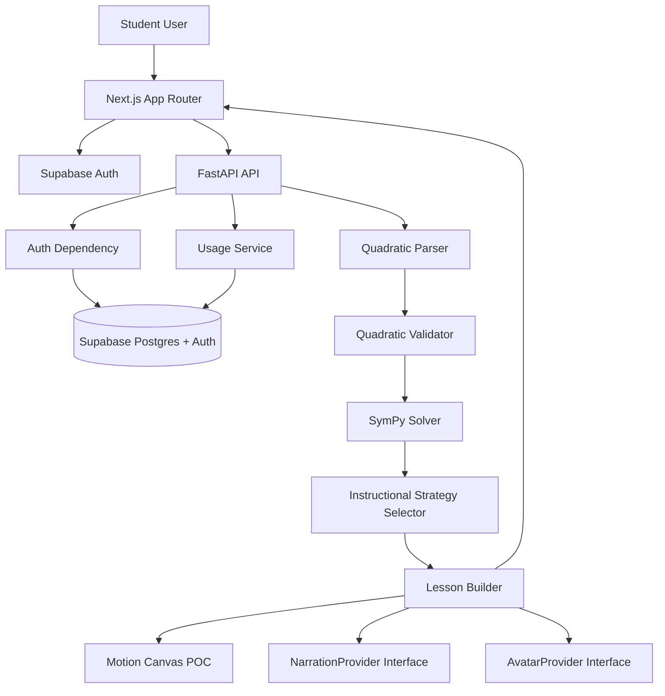
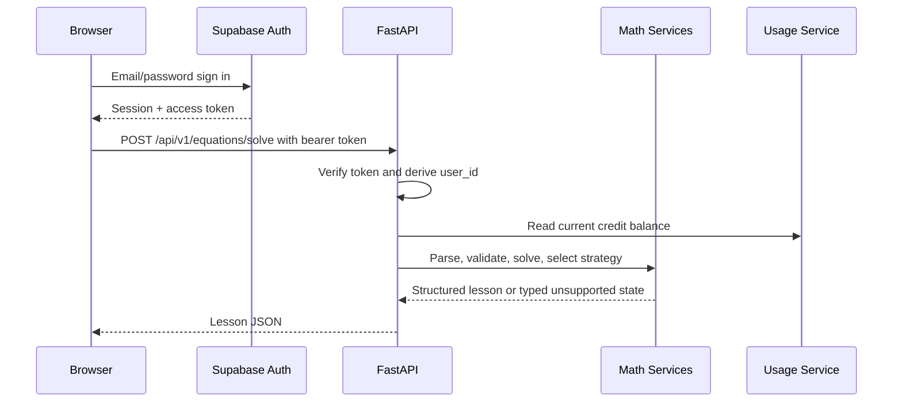
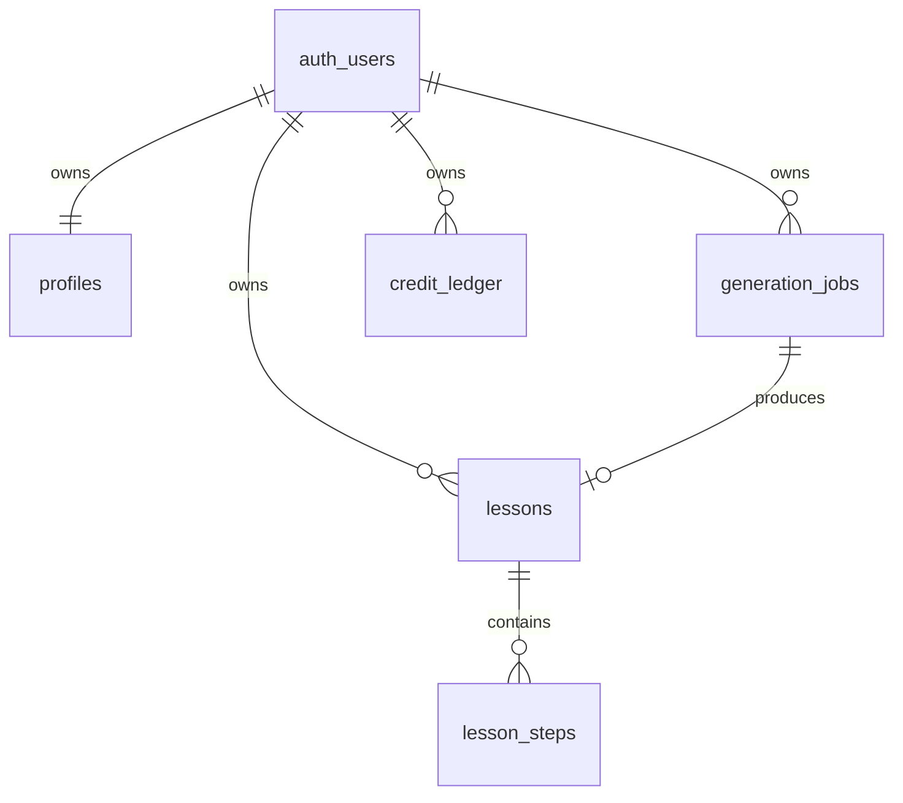

# Quadratics Initial Scaffold - Plan

## Goal Capsule

| Field | Value |
|---|---|
| Objective | Establish the first implementation-ready scaffold for `quadratics`, with authentication, usage accounting, deterministic quadratic solving, lesson contracts, Motion Canvas proof-of-concept rendering, documentation, and validation gates that prove the factoring lesson is instructionally useful enough to preserve. |
| Means | Build a pnpm/Turborepo and uv monorepo with `apps/web`, `apps/api`, `apps/video`, shared TypeScript packages, Supabase migrations, and one authenticated solve-to-lesson vertical slice. |
| Authority | The Product Contract and Key Technical Decisions in this plan own scope. Implementation units own sequencing. Execution-time details may adjust if they preserve the contract. |
| Stop Conditions | Stop after the scaffold and factoring vertical slice work. Do not continue into billing, real media generation, queues, arbitrary algebra, or broader lesson strategies. |
| Execution Profile | Deep greenfield scaffold with security, database, cross-runtime contracts, and multi-app developer experience. |
| Tail Ownership | `ce-work` should implement units in dependency order, run the Verification Contract, and leave follow-up phases documented instead of expanding this scaffold. |

---

## Product Contract

### Summary

`quadratics` generates short educational explanations for solving quadratic equations. This scaffold supports only quadratic equations in `x`, authenticates users through Supabase, validates and solves equations deterministically with SymPy, builds typed lesson steps for factorable equations, and proves that structured lesson data can drive a Motion Canvas board animation. The v0 teaching experience is a factoring lesson generator: valid quadratics that need another method are solved mathematically but return a clear unsupported-instructional-method state. Expensive media generation is out of scope, but the architecture must make narration, avatars, caching, and future rendering providers easy to add behind adapters.

### Problem Frame

The project starts from an almost empty repository. Future agents need a clear architecture before product scope expands. The highest-risk early mistakes are making an LLM the source of mathematical truth, trusting frontend-only auth, modeling generation credits as an unaudited mutable balance, coupling provider SDKs into domain code, or building a video pipeline that cannot reuse deterministic lesson data.

### Requirements

**Repository and Developer Experience**

- R1. The repository must be a pnpm/Turborepo and uv monorepo with `apps/web`, `apps/api`, `apps/video`, `packages/types`, `packages/config`, `infra/supabase`, and `docs`.
- R2. Root commands must cover local development, linting, type checking, tests, and app-specific development for web, API, and video.
- R3. The scaffold must include `README.md`, root `AGENTS.md`, `.env.example` files, architecture docs, domain docs, video pipeline docs, auth-and-usage docs, and concise ADRs.
- R4. The scaffold must use current stable dependency versions at implementation time, verified against official docs or package metadata before installation.

**Authentication and Authorization**

- R5. The web app must use Supabase Auth email/password sign-in, sign-out, persistent sessions, and no public app access except `/login`.
- R6. The `/app` route must be protected server-side, not only hidden with client-side checks.
- R7. FastAPI endpoints under `/api/v1` that expose user data or solve equations must require a Supabase access token and derive `user_id` from verified auth claims.
- R8. Browser-exposed environment variables must be limited to public Supabase/API configuration. Supabase service-role credentials must never be exposed client-side.

**Profiles, Usage, and Generation Ownership**

- R9. The database must include minimal `profiles`, `generation_jobs`, `credit_ledger`, `lessons`, and `lesson_steps` tables with UUID primary keys, timestamps, direct or parent-owned ownership enforcement, and small non-JSON columns where fields are stable.
- R10. Supabase RLS must protect user-owned tables so users can only access their own profiles, generation jobs, credit ledger entries, lessons, and lesson steps.
- R11. Generation credits must be modeled as an auditable ledger, with derived balance as the source of truth for v0.
- R12. New user provisioning must have a clear mechanism to create a profile and grant configurable default credits.
- R13. Generation jobs must belong to authenticated users and capture equation input, normalized equation, hash, instructor, status, credits used, result, and error details.
- R14. The scaffold must document the cost distinction between solving an equation, generating a lesson, and generating expensive media.

**Deterministic Math and Lesson Domain**

- R15. SymPy and deterministic Python code must be the source of mathematical truth.
- R16. The API must accept an equation string, reject malformed input, non-equations, unsupported variables, linear equations, cubic or higher equations, and ambiguous inputs without using Python `eval`.
- R17. Valid equations must normalize to `ax^2 + bx + c = 0`, preserve exact `a`, `b`, `c`, and return exact roots without unnecessary floating-point conversion.
- R18. The system must represent `FACTORING`, `SQUARE_ROOT`, `COMPLETING_THE_SQUARE`, and `QUADRATIC_FORMULA`, but v0 instructional lessons must fully support only factoring.
- R19. Factoring must be selected only when the quadratic factors cleanly over rational values. Other valid quadratics must return an explicit unsupported instructional method state rather than fake steps.
- R20. Lesson output must separate teaching steps from math lines. Teaching steps are the unit for future narration, animation timing, avatar composition, and video segments.
- R21. Lesson JSON must include machine-readable IDs, exact math values, structured math fields, and renderable representations such as expression text and LaTeX.

**API and Web Vertical Slice**

- R22. `GET /health` must return `{ "status": "ok" }`.
- R23. `POST /api/v1/equations/solve` must be protected and return structured lesson JSON for `2*x^2 - 7*x + 3 = 0`, with roots equivalent to `1/2` and `3` and method `factoring`.
- R24. `GET /api/v1/me` must be protected and return authenticated user information plus current generation credit balance.
- R25. `/login` must provide a minimal email/password auth form.
- R26. `/app` must let an authenticated user enter an equation, choose male or female instructor placeholders, call the protected solve endpoint, and display normalized equation, method, coefficients, roots, instructional steps, math lines, and credit balance.
- R32. `/app` must define idle, submitting, factoring success, validation error, unsupported-method, auth/API error, retry, and reset states for the solve form.

**Motion Canvas and Provider Boundaries**

- R27. `apps/video` must be a Motion Canvas TypeScript project with a proof-of-concept 16:9 board scene driven by serializable lesson step data.
- R28. The scene must render a dark board background, a step title, equations arranged clearly, and one-line-at-a-time reveal animation.
- R29. Narration and avatar capabilities must be represented as provider abstractions only. Do not call ElevenLabs, HeyGen, Veo, Kling, Seedance, or other media providers in this scaffold.
- R30. Instructor placeholders must be represented as data/config with `male` and `female` IDs and extension points for future voice and avatar provider IDs.
- R31. The future media cache key must be documented as deterministic over normalized equation, method, instructor, voice configuration, render version, and template version rather than raw user input alone.

**Teaching Quality**

- R33. The factoring lesson must target a student who can read basic algebra notation but needs help understanding how factoring leads to roots.
- R34. Each teaching step must include a human-meaningful title and math lines that support that title, not only raw symbolic transformations.
- R35. The final answer must state both roots and preserve exact values.

### Key Decisions

- KD1. **Quadratics only governs R15, R16, R18, R19.** The product scope does not broaden to arbitrary algebra in this scaffold.
- KD2. **Application-level initial credit provisioning governs R11, R12.** Use a clear app-owned provisioning path for default credits in v0 instead of a database trigger, because it is easier to debug locally and can be replaced later if needed.
- KD3. **Solve is not expensive media generation governs R11, R14, R23.** The deterministic solve endpoint may report credits but should not deduct generation credits unless implementation creates a separate lesson or media-generation path.

### Actors

- A1. Student user: signs in, enters a quadratic equation, selects an instructor placeholder, and views the lesson result.
- A2. FastAPI service: verifies Supabase tokens, enforces ownership, computes math truth, and returns typed contracts.
- A3. Supabase: owns authentication, user identity, Postgres persistence, migrations, and RLS policy enforcement.
- A4. Future media pipeline: consumes lesson steps, narration data, animation scenes, avatar clips, and cache keys after this scaffold.

### Key Flows

- F1. Authenticated solve flow
  - **Trigger:** A student submits `2*x^2 - 7*x + 3 = 0` from `/app`.
  - **Actors:** A1, A2, A3
  - **Steps:** The browser sends a Supabase access token, FastAPI verifies it, the math service parses and validates the equation, the solver computes exact roots, the strategy selector chooses factoring, the lesson builder creates three teaching steps, and the web app renders the result.
  - **Covered by:** R5, R6, R7, R16, R17, R19, R20, R21, R23, R26
- F2. User profile and credit balance flow
  - **Trigger:** A signed-in user opens `/app`.
  - **Actors:** A1, A2, A3
  - **Steps:** The web app obtains the session, calls `GET /api/v1/me`, the API provisions or reads the profile, derives the ledger balance, and returns safe user data.
  - **Covered by:** R5, R7, R9, R11, R12, R24, R26
- F3. Motion Canvas proof flow
  - **Trigger:** A developer runs the video app.
  - **Actors:** A4
  - **Steps:** The Motion Canvas scene loads serializable sample step data and reveals each equation line on a deterministic board scene.
  - **Covered by:** R27, R28

### Acceptance Examples

- AE1. Given an authenticated user with a valid session, when they submit `2*x^2 - 7*x + 3 = 0`, then the API returns method `factoring`, coefficients `2`, `-7`, `3`, exact roots `1/2` and `3`, and three teaching steps.
- AE2. Given an unauthenticated request to `POST /api/v1/equations/solve`, when no bearer token is provided, then the API rejects the request.
- AE3. Given `2*x + 3 = 0`, when the solver validates the input, then it rejects the equation as non-quadratic.
- AE4. Given `x^3 + 2*x + 1 = 0`, when the solver validates the input, then it rejects the equation as higher than quadratic.
- AE5. Given `hello world`, when the solver parses the input, then it rejects the input as malformed or unsupported.
- AE6. Given positive and negative credit ledger entries for one user, when the balance is requested, then the balance equals the sum of that user's ledger entries only.
- AE7. Given a sample "Solve each factor" lesson step, when the Motion Canvas project runs, then the scene displays the title and reveals math lines one at a time.
- AE8. Given the example factoring lesson, when a student reads the returned steps, then each step title names the teaching purpose and the grouped math lines show why the roots follow from the factors.

### Scope Boundaries

#### In Scope

- Greenfield monorepo scaffold, app structure, environment examples, migrations, tests, docs, and one authenticated solve vertical slice.
- Deterministic parsing, validation, coefficient extraction, exact roots, factoring selection, and typed lesson construction for factorable quadratics.
- Placeholder instructor configuration for `male` and `female`.
- Provider abstractions for narration and avatars without real provider calls.

#### Deferred to Follow-Up Work

- Paid plans, Stripe, subscriptions, pricing tiers, admin dashboards, organizations, teams, social login, and production billing.
- Queue workers, background rendering infrastructure, full media cache implementation, production video stitching, and monitoring.
- ElevenLabs, HeyGen, generative video providers, avatar compositing, narration timestamps, audio synchronization, and realistic chalk or handwriting effects.
- Completing the square, square-root, and quadratic-formula instructional strategies.
- Broader algebra support and arbitrary symbolic problem solving.
- UI polish, analytics, and production observability.

### Sources and Research

- Official Supabase guidance for Next.js App Router auth currently points to `@supabase/ssr`, server-side session checks, cookie-safe middleware, and strict public/private environment variable separation.
- Official FastAPI guidance supports reusable bearer-token dependencies through `fastapi.security.HTTPBearer` and `Depends`.
- Official Motion Canvas guidance supports a Vite-based TypeScript project with scene registration through `makeProject` and generator scenes that animate text/code content over time.
- Local repository research found no existing implementation patterns beyond an empty root `AGENTS.md` and empty `docs/` directory, so this plan establishes initial conventions.

---

## Planning Contract

### Key Technical Decisions

- KTD1. **Use SymPy behind a FastAPI math service boundary.** SymPy owns equation parsing, normalization, coefficients, and exact roots; route handlers only orchestrate request validation and response serialization. This satisfies R15 through R21.
- KTD2. **Use Supabase Auth and verify tokens in FastAPI.** The web app owns sign-in and session persistence through Supabase, while FastAPI validates bearer tokens before protected work. This satisfies R5 through R8 and R23 through R24.
- KTD3. **Use a ledger as the credit source of truth.** `credit_ledger` is append-only from the application perspective; current balance is derived by summing entries for the user, and ledger entries that must be idempotent carry a unique idempotency key. This satisfies R11 and R24.
- KTD4. **Provision profiles and default credits from application code for v0.** On first authenticated `/api/v1/me` access or equivalent provisioning call, the API ensures a profile exists and inserts the default credit grant through an upsert or transaction guarded by a unique initial-grant idempotency key. This satisfies R12 and KD2.
- KTD5. **Persist generation and lesson ownership separately from solve response construction.** The scaffold should create the schema foundations for `generation_jobs`, `lessons`, and `lesson_steps`, but the protected solve endpoint can return computed lesson JSON without consuming credits. This satisfies R13, R14, and KD3.
- KTD6. **Define shared lesson contracts in TypeScript and mirror them in Pydantic schemas.** `packages/types` owns frontend/video-facing types, while FastAPI Pydantic schemas own runtime validation and OpenAPI output. This satisfies R21, R26, and R27.
- KTD7. **Keep providers behind domain interfaces.** Narration and avatar modules expose neutral base interfaces only, while core lesson and math code cannot import provider SDK types or named provider placeholder modules. This satisfies R29 and R30.
- KTD8. **Drive Motion Canvas from serializable step data.** The video app reads local sample lesson data shaped like the API contract rather than coupling directly to FastAPI. This satisfies R27 and R28.
- KTD9. **Use strict local validation before adding generated media.** Math and API security tests are required in the scaffold because they guard product truth and auth boundaries. This satisfies R15 through R24.
- KTD10. **Make FastAPI schemas the runtime contract authority.** Pydantic schemas and OpenAPI output are authoritative for API responses; TypeScript types must be checked against golden lesson fixtures exported from API tests so web and video cannot drift silently. This satisfies R21, R27, and R33 through R35.

### High-Level Technical Design







### Output Structure

```text
.
├── AGENTS.md
├── README.md
├── package.json
├── pnpm-workspace.yaml
├── turbo.json
├── pyproject.toml
├── uv.lock
├── .env.example
├── apps/
│   ├── web/
│   ├── api/
│   └── video/
├── packages/
│   ├── types/
│   └── config/
├── infra/
│   └── supabase/
└── docs/
    ├── architecture.md
    ├── auth-and-usage.md
    ├── domain-model.md
    ├── video-pipeline.md
    ├── decisions/
    └── plans/
```

### Database Policy Notes

- `lesson_steps` ownership should be enforced through its parent `lessons` row: RLS policies check that `lesson_steps.lesson_id` belongs to a lesson whose `user_id = auth.uid()`.
- `credit_ledger` should include an optional `idempotency_key` column with a uniqueness constraint that prevents duplicate one-time grants such as `initial_credit_grant:{user_id}`.
- Profile creation and default credit insertion should run in one transaction or equivalent idempotent upsert flow.
- Email addresses and stored equation history are user data. The API must not log bearer tokens, service-role keys, or raw request bodies by default.
- Account and data deletion workflows are deferred, but `docs/reference/auth-and-usage.md` must state that retention and deletion need a follow-up decision before production launch.

### UI State Contract

- `/login` redirects already-authenticated users to `/app`, redirects successful sign-ins to `/app`, shows failed sign-in errors without revealing credential details, and keeps any local-testing signup control inside `/login`.
- `/app` places equation input, instructor selection, and solve action first; credit/account status stays in a persistent utility area; successful results show an answer summary before ordered teaching steps.
- The solve form supports idle, submitting, factoring success, validation error, unsupported-method result, auth/API error, retry, and reset states. Submitting disables duplicate requests and clears stale errors.
- Unsupported-method results should display the exact mathematical solve result with a clear limitation notice, not as a fake factoring lesson.
- Web controls must have labels, keyboard submit support, visible focus, loading/status announcements, error focus handling, and a single-column mobile layout.

### Assumptions

- The initial scaffold can use Supabase local development plus hosted-project environment variables, but it should not require a remote Supabase project to run unit tests.
- FastAPI token verification should follow current Supabase JWT guidance during implementation. If Supabase's recommended verification path requires JWKS instead of a static JWT secret, the implementation should use that current path and document the choice.
- The web app can include minimal signup controls inside `/login` only if needed to test email/password auth locally. It must not expand into a separate public route, onboarding, or profile management.
- The Motion Canvas scene can use plain text math rendering in v0 if KaTeX integration would add unnecessary setup risk. The lesson data must still include LaTeX fields for later rendering.

### System-Wide Impact

- Authentication touches both web route protection and API authorization. The API remains authoritative for protected data.
- Usage credits are persistent accounting data. Tests must prevent balance leakage across users.
- Lesson contracts cross Python, TypeScript, and Motion Canvas. Contract drift is a material risk.
- The factoring lesson contract is the primary product proof in this scaffold. If the example lesson cannot explain why factoring yields the roots, future media layers should remain deferred.
- Provider boundaries must be enforced early because later SDK integrations can otherwise leak provider-specific types into the lesson domain.

### Risks & Dependencies

- Supabase auth verification guidance may change across versions. The implementation must verify current docs before choosing JWT secret or JWKS verification.
- Motion Canvas and Next.js may have current major-version defaults that differ from older examples. The scaffold should prefer official CLIs and generated project defaults where practical.
- SymPy parsing must avoid arbitrary evaluation. Implementation should use safe parsing utilities, a narrow accepted grammar, maximum input length, bounded exponent and term counts, and a parse/solve timeout or cancellation boundary.
- RLS policies can appear correct while service-role access bypasses them. API tests and docs must distinguish browser anon access from trusted server access.
- Cross-language type drift is likely. Keep the lesson JSON small and explicit for v0.

---

## Implementation Units

### U1. Root Monorepo and Tooling Scaffold

- **Goal:** Create the root workspace, package manager, Turborepo, uv Python configuration, shared package directories, environment examples, and baseline validation scripts.
- **Requirements:** R1, R2, R4
- **Dependencies:** None
- **Files:** `package.json`, `pnpm-workspace.yaml`, `turbo.json`, `pyproject.toml`, `uv.lock`, `.gitignore`, `.env.example`, `packages/types/package.json`, `packages/types/tsconfig.json`, `packages/types/src/index.ts`, `packages/config/package.json`, `packages/config/src/index.ts`
- **Approach:**
  1. Use pnpm workspace globs for `apps/*` and `packages/*`.
  2. Use Turborepo only for shared `dev`, `lint`, `typecheck`, `test`, and `build` orchestration.
  3. Use uv for the FastAPI workspace and Python development dependencies.
  4. Keep root scripts simple aliases to package/app scripts rather than a custom task runner.
- **Execution note:** This is mostly packaging and config; prefer install and smoke verification over unit coverage.
- **Patterns to follow:** There are no local patterns. Use official generated defaults where possible.
- **Test scenarios:** Test expectation: none -- this unit creates tooling and workspace configuration only.
- **Verification:** A developer can install dependencies, list workspace packages, and run root validation scripts without missing-script errors.

### U2. FastAPI Application Skeleton and Configuration

- **Goal:** Create the modular FastAPI app shape with health, config, route registration, schemas, and test harness.
- **Requirements:** R1, R2, R22
- **Dependencies:** U1
- **Files:** `apps/api/pyproject.toml`, `apps/api/app/main.py`, `apps/api/app/api/routes/health.py`, `apps/api/app/api/routes/__init__.py`, `apps/api/app/core/config.py`, `apps/api/app/schemas/user.py`, `apps/api/app/schemas/equation.py`, `apps/api/app/schemas/lesson.py`, `apps/api/app/schemas/generation.py`, `apps/api/tests/test_health.py`, `apps/api/tests/conftest.py`
- **Approach:**
  1. Keep route modules thin and register them from `app/main.py`.
  2. Use Pydantic settings for environment values.
  3. Add CORS only for configured local web origins.
  4. Return stable JSON from `GET /health`.
- **Patterns to follow:** FastAPI dependency injection and Pydantic schema conventions from official docs.
- **Test scenarios:**
  - Request `GET /health` and expect `200` with `{ "status": "ok" }`.
  - Start the FastAPI test app with missing optional provider keys and expect configuration to load.
- **Verification:** API tests pass and the app imports without side effects from provider or database modules.

### U3. Supabase Schema, RLS, and Environment Foundation

- **Goal:** Add Supabase migration files for profiles, credit ledger, generation jobs, lessons, lesson steps, RLS policies, and local setup documentation.
- **Requirements:** R8, R9, R10, R11, R13, R14
- **Dependencies:** U1
- **Files:** `infra/supabase/README.md`, `infra/supabase/migrations/0001_initial_schema.sql`, `apps/api/.env.example`, `apps/web/.env.example`
- **Approach:**
  1. Model stable fields as columns and flexible lesson/result payloads as `jsonb`.
  2. Reference `auth.users.id` from user-owned tables.
  3. Enable RLS on user-owned tables.
  4. Add owner policies using `auth.uid()` for browser/RLS access.
  5. Enforce `lesson_steps` access through an `exists` policy against the parent `lessons.user_id`.
  6. Add a unique ledger idempotency key for one-time provisioning grants.
  7. Document that trusted server service-role access belongs only in FastAPI.
- **Technical design:** Directional table shape: `profiles(id,email,display_name,created_at,updated_at)`, `credit_ledger(id,user_id,amount,reason,generation_job_id,idempotency_key,metadata,created_at)`, `generation_jobs(id,user_id,equation_input,normalized_equation,equation_hash,instructor_id,status,credits_used,result_json,error_code,error_message,created_at,updated_at)`, `lessons(id,user_id,generation_job_id,equation_input,normalized_equation,equation_hash,method,instructor_id,solution_json,created_at)`, `lesson_steps(id,lesson_id,step_index,step_type,step_json,created_at)`.
- **Patterns to follow:** Supabase migration and RLS policy conventions from official Supabase docs.
- **Test scenarios:**
  - Apply migration locally and verify all five tables exist.
  - Insert ledger entries for two different users and verify the balance query scopes to one user.
  - Insert duplicate initial grant ledger entries with the same idempotency key and expect the uniqueness constraint or upsert path to prevent a second grant.
  - Query lesson steps as a user who does not own the parent lesson and expect RLS denial where local tooling supports policy tests.
  - Attempt user-owned row access under a different `auth.uid()` context and expect RLS denial where local tooling supports policy tests.
- **Verification:** Supabase migration applies cleanly from an empty database and documents local setup commands.

### U4. API Authentication and User Provisioning

- **Goal:** Add reusable FastAPI authentication, Supabase token verification, current-user schema, `/api/v1/me`, profile provisioning, and credit balance derivation.
- **Requirements:** R7, R8, R11, R12, R24
- **Dependencies:** U2, U3
- **Files:** `apps/api/app/api/dependencies/auth.py`, `apps/api/app/core/security.py`, `apps/api/app/api/routes/users.py`, `apps/api/app/services/usage/credits.py`, `apps/api/app/services/users/provisioning.py`, `apps/api/app/schemas/user.py`, `apps/api/tests/test_auth.py`, `apps/api/tests/test_credits.py`, `apps/api/tests/test_users.py`
- **Approach:**
  1. Implement a `CurrentUser` dependency that extracts a bearer token and verifies it with the current Supabase-recommended mechanism.
  2. Keep service-role credentials server-only in API settings.
  3. Ensure a profile and default credit grant exist through idempotent application-level provisioning.
  4. Use the ledger idempotency key and transaction/upsert semantics to prevent duplicate default grants under concurrent first access.
  5. Derive credit balance from the ledger instead of mutating a cached field.
- **Patterns to follow:** FastAPI `HTTPBearer` dependencies and Supabase server-side auth guidance.
- **Test scenarios:**
  - Request `GET /api/v1/me` without `Authorization` and expect unauthorized.
  - Request a protected endpoint with a mocked valid Supabase user and expect user ID and email in response.
  - Provision the same user twice and expect only one default credit grant.
  - Simulate two concurrent provisioning calls for the same user and expect only one default credit grant.
  - Sum `+20`, `-1`, and `+10` ledger entries and expect balance `29`.
  - Create ledger entries for another user and verify they do not affect the first user's balance.
- **Verification:** Protected route tests pass without a live Supabase project by mocking token verification and persistence boundaries.

### U5. Deterministic Quadratic Math Engine

- **Goal:** Implement safe equation parsing, quadratic validation, normalization, coefficient extraction, exact roots, method enum, and factoring strategy detection.
- **Requirements:** R15, R16, R17, R18, R19
- **Dependencies:** U2
- **Files:** `apps/api/app/services/math/parser.py`, `apps/api/app/services/math/validator.py`, `apps/api/app/services/math/solver.py`, `apps/api/app/services/math/strategy.py`, `apps/api/app/schemas/equation.py`, `apps/api/tests/test_math_engine.py`, `apps/api/tests/test_math_safety.py`
- **Approach:**
  1. Accept equations with one equality sign and supported variable `x`.
  2. Parse both sides safely with SymPy utilities rather than Python `eval`.
  3. Move all terms to the left side and normalize polynomial form.
  4. Enforce maximum input length, allowed tokens, bounded exponents, bounded term counts, and parse/solve timeout or cancellation.
  5. Reject unsupported variables, non-polynomials, degree other than two, and malformed input.
  6. Use exact SymPy values for coefficients and roots.
  7. Detect rational clean factoring before selecting `factoring`.
- **Technical design:** Directional flow: `parse_equation -> normalize_to_polynomial -> validate_quadratic -> solve_roots -> select_method`.
- **Patterns to follow:** Keep math services pure and deterministic. Do not import FastAPI, Supabase, provider SDKs, or web types.
- **Test scenarios:**
  - Parse `2*x^2 - 7*x + 3 = 0` and expect coefficients `a=2`, `b=-7`, `c=3`.
  - Solve `2*x^2 - 7*x + 3 = 0` and expect exact roots `{1/2, 3}`.
  - Parse a second factorable quadratic, such as `x^2 - 5*x + 6 = 0`, and expect roots `{2, 3}` with factoring support.
  - Reject `2*x + 3 = 0` as linear.
  - Reject `x^3 + 2*x + 1 = 0` as cubic.
  - Reject `hello world` as malformed.
  - Reject `x^2 + y = 0` as unsupported variables.
  - Reject oversized input before SymPy parsing.
  - Reject expressions with unsupported tokens, excessive exponent values, or excessive term counts.
  - Abort or reject parse/solve work that exceeds the configured timeout boundary.
  - Return unsupported instructional method for a valid non-rational-factorable quadratic.
- **Verification:** Math tests prove exact values and typed rejections without network or database dependencies.

### U6. Lesson Domain Builder and Solve API

- **Goal:** Build typed lesson output, factoring teaching steps, math lines, protected solve route, generation job schema integration points, and unsupported-method responses.
- **Requirements:** R19, R20, R21, R23, R26, R33, R34, R35
- **Dependencies:** U4, U5
- **Files:** `apps/api/app/services/lessons/builder.py`, `apps/api/app/api/routes/equations.py`, `apps/api/app/schemas/lesson.py`, `apps/api/app/schemas/equation.py`, `apps/api/app/services/jobs/generation_jobs.py`, `apps/api/tests/fixtures/factoring_lesson.json`, `apps/api/tests/test_solve_api.py`, `apps/api/tests/test_lesson_builder.py`
- **Approach:**
  1. Convert solver output into a lesson schema with original equation, normalized equation, method, coefficients, solutions, and steps.
  2. Represent each math line with stable IDs, expression text, LaTeX, and optional structured fields for future rendering.
  3. Build the factoring lesson as three teaching steps: factor, solve factors, final answer.
  4. Keep generation job persistence ready but avoid charging credits for deterministic solve per KD3.
  5. Return explicit unsupported state for valid quadratics without v0 instructional support.
  6. Export a golden factoring lesson fixture from the API schema tests for TypeScript contract validation.
- **Patterns to follow:** Domain logic stays in services; route handlers perform auth, call services, and serialize responses.
- **Test scenarios:**
  - Covers AE1. Authenticated `POST /api/v1/equations/solve` with `2*x^2 - 7*x + 3 = 0` returns method `factoring`, roots `1/2` and `3`, and three teaching steps.
  - Covers AE8. Example factoring lesson steps have human-meaningful titles and math lines grouped under the teaching purpose.
  - Covers AE2. Unauthenticated solve request is rejected.
  - A non-factorable but valid quadratic returns an explicit unsupported instructional method state.
  - Factoring lesson step IDs are machine-readable and stable.
  - Math lines include both expression text and LaTeX fields.
  - Route handler does not mutate credit ledger for solve-only requests.
- **Verification:** API tests prove protected solve behavior and lesson shape from request through response.

### U7. Next.js Web Auth and App Vertical Slice

- **Goal:** Create the Next.js App Router web app with Supabase email/password login, server-side route protection, API client, instructor selection, solve form, lesson rendering, and credit balance display.
- **Requirements:** R5, R6, R8, R25, R26, R32
- **Dependencies:** U1, U4, U6, U8
- **Files:** `apps/web/package.json`, `apps/web/next.config.ts`, `apps/web/tsconfig.json`, `apps/web/app/layout.tsx`, `apps/web/app/globals.css`, `apps/web/app/login/page.tsx`, `apps/web/app/app/page.tsx`, `apps/web/app/auth/actions.ts`, `apps/web/middleware.ts`, `apps/web/lib/supabase/client.ts`, `apps/web/lib/supabase/server.ts`, `apps/web/lib/api.ts`, `apps/web/components/equation-form.tsx`, `apps/web/components/lesson-result.tsx`, `apps/web/components/credit-balance.tsx`, `apps/web/tests/equation-form.test.tsx`
- **Approach:**
  1. Use Next.js App Router and Tailwind CSS with minimal utilitarian UI.
  2. Use Supabase SSR helpers for server/client auth boundaries.
  3. Redirect unauthenticated users from `/app` to `/login` on the server path.
  4. Send FastAPI requests with the Supabase access token in the bearer header.
  5. Render backend lesson JSON without inventing client-side math.
  6. Implement the UI State Contract for auth transitions, solve states, content hierarchy, accessibility, and mobile layout.
- **Patterns to follow:** Official Supabase Next.js App Router guidance for middleware/cookie handling.
- **Test scenarios:**
  - Login form submits email/password and surfaces auth failure without exposing secrets.
  - Already-authenticated `/login` access redirects to `/app`.
  - Successful sign-in redirects to `/app`, and sign-out from `/app` redirects to `/login`.
  - Unauthenticated `/app` access redirects to `/login`.
  - Authenticated `/app` renders equation input, instructor selector, button, and credit balance placeholder.
  - Solving the example equation renders method, coefficients, roots, step titles, and math lines from API JSON.
  - Submitting shows a loading state, disables duplicate submit, and preserves accessible status announcements.
  - Malformed input and unsupported-method responses display distinct messages and do not leave stale successful results in primary position.
  - Keyboard users can operate login, sign-out, equation submit, instructor selection, retry, and reset.
  - Mobile layout keeps controls and lesson steps in a readable single-column flow.
  - API client includes bearer token and does not send service-role credentials.
- **Verification:** Web lint/typecheck pass, and a local browser smoke test can complete login-to-solve when Supabase and API env vars are configured.

### U8. Shared Types and Cross-App Contract Alignment

- **Goal:** Publish TypeScript lesson, instructor, usage, API response contracts, and placeholder instructor config for the web and video apps, aligned with FastAPI schemas.
- **Requirements:** R21, R26, R27, R30, R33, R34, R35
- **Dependencies:** U1, U6
- **Files:** `packages/types/src/lesson.ts`, `packages/types/src/instructor.ts`, `packages/types/src/usage.ts`, `packages/types/src/api.ts`, `packages/types/src/index.ts`, `packages/config/src/instructors.ts`, `packages/types/package.json`, `packages/types/tsconfig.json`, `packages/types/tests/fixtures/factoring_lesson.json`, `packages/types/tests/lesson-contract.test.ts`
- **Approach:**
  1. Define serializable TypeScript types that match Pydantic output names.
  2. Keep instructor placeholders as shared data, not hard-coded UI branches.
  3. Treat FastAPI Pydantic/OpenAPI output as the runtime authority per KTD10.
  4. Validate TypeScript types against golden JSON fixtures produced from API tests.
  5. Export shared types for web and Motion Canvas without depending on either app.
  6. Add lightweight type tests or compile-time assertions where practical.
- **Patterns to follow:** Type-only shared package with no runtime provider dependencies.
- **Test scenarios:**
  - A sample factoring lesson object satisfies the exported lesson type.
  - The API golden factoring lesson fixture satisfies the exported lesson type.
  - Instructor config accepts `male` and `female` IDs with future provider fields optional.
  - Video step sample data can be typed as a lesson step without importing web code.
- **Verification:** `packages/types` typecheck passes and both web and video import the types without circular dependencies.

### U9. Motion Canvas Proof-of-Concept Video App

- **Goal:** Create the Motion Canvas app and a data-driven board scene that reveals lesson math lines one at a time.
- **Requirements:** R27, R28
- **Dependencies:** U1, U8
- **Files:** `apps/video/package.json`, `apps/video/tsconfig.json`, `apps/video/vite.config.ts`, `apps/video/src/project.ts`, `apps/video/src/scenes/solve-step.tsx`, `apps/video/src/data/sample-step.ts`, `apps/video/src/styles/board.ts`
- **Approach:**
  1. Use the official Motion Canvas TypeScript project shape.
  2. Load local sample step data shaped like the lesson contract.
  3. Render a 16:9 dark board, title, and math lines.
  4. Use simple reveal timing that can later align with narration timestamps.
  5. Avoid direct FastAPI calls from the renderer.
- **Patterns to follow:** Motion Canvas `makeProject` scene registration and generator scene animation.
- **Test scenarios:**
  - Typecheck verifies the sample step data matches the shared lesson step type.
  - Build or Motion Canvas smoke command compiles the scene.
  - Manual preview shows the "Solve each factor" title and line-by-line equation reveal.
- **Verification:** The video app starts or builds from the root scripts and does not require API or Supabase env vars.

### U10. Narration, Avatar, and Instructor Extension Points

- **Goal:** Add provider interfaces, API instructor configuration, and documentation hooks without real provider calls.
- **Requirements:** R29, R30
- **Dependencies:** U2, U8
- **Files:** `apps/api/app/services/narration/base.py`, `apps/api/app/services/avatars/base.py`, `apps/api/app/services/instructors/config.py`, `apps/api/app/schemas/instructor.py`, `apps/api/tests/test_provider_boundaries.py`
- **Approach:**
  1. Define abstract provider protocols around domain inputs and outputs.
  2. Keep provider-specific modules out of the scaffold until a real provider integration task exists.
  3. Mirror the shared `male` and `female` instructor config in API application data as needed.
  4. Ensure domain services do not import ElevenLabs or HeyGen modules.
- **Patterns to follow:** Ports/adapters boundary with core domain modules depending only on base interfaces.
- **Test scenarios:**
  - Instructor config returns `male` and `female` placeholders.
  - Provider boundary test verifies lesson/math services do not import provider-specific packages.
- **Verification:** Provider abstractions import cleanly without API keys, third-party SDK packages, or provider-specific modules.

### U11. Documentation, ADRs, and Agent Context

- **Goal:** Create durable project context for humans and future coding agents.
- **Requirements:** R3, R14, R29, R31
- **Dependencies:** U1 through U10
- **Files:** `README.md`, `AGENTS.md`, `docs/reference/architecture.md`, `docs/reference/domain-model.md`, `docs/reference/video-pipeline.md`, `docs/reference/auth-and-usage.md`, `docs/decisions/001-deterministic-math-engine.md`, `docs/decisions/002-motion-canvas-renderer.md`, `docs/decisions/003-provider-adapters.md`, `docs/decisions/004-supabase-auth.md`, `docs/decisions/005-credit-ledger.md`
- **Approach:**
  1. Document the architecture flow from web auth to deterministic math to lesson data to future media.
  2. Define equation, method, lesson, teaching step, math line, instructor, generation job, and credit transaction.
  3. Explain auth, API JWT validation, RLS assumptions, generation ownership, ledger credits, and v0 data-handling posture.
  4. Explain future video pipeline and deterministic cache key inputs.
  5. Write `AGENTS.md` as operational guidance for future agents, including product boundaries and validation commands.
- **Patterns to follow:** Short ADRs with Decision, Context, Consequences.
- **Test scenarios:** Test expectation: none -- documentation is verified by review rather than automated behavior.
- **Verification:** Docs cover the requested topics and do not instruct future agents to broaden scope or use LLMs for math truth.

### U12. End-to-End Validation and Cleanup

- **Goal:** Wire root validation commands, run tests/lint/typecheck/builds, fix scaffold-caused failures, and verify the required vertical slice.
- **Requirements:** R2, R4, R22 through R28, R32 through R35
- **Dependencies:** U1 through U11
- **Files:** `package.json`, `turbo.json`, `apps/api/tests/test_solve_api.py`, `apps/web/tests/equation-form.test.tsx`, `packages/types/tests/lesson-contract.test.ts`, `README.md`
- **Approach:**
  1. Ensure root validation commands cover Python tests, TypeScript typechecks, linting, and app builds where practical.
  2. Verify the FastAPI protected solve endpoint with tests.
  3. Verify the web API client and rendering through lightweight tests and a local smoke run.
  4. Verify Motion Canvas starts or builds with sample data.
  5. Remove dead scaffold experiments and keep generated caches out of git.
- **Execution note:** Run validation after each major app is added, then run the full root gates before completion.
- **Patterns to follow:** Prefer small deterministic tests over broad UI automation for this scaffold.
- **Test scenarios:**
  - Full root test command runs API math/auth/credits tests and TypeScript contract tests.
  - Full root typecheck command validates web, video, and shared packages.
  - Full root lint command validates TypeScript and Python lint rules if configured.
  - Manual or automated smoke confirms API and web can run together locally.
- **Verification:** The Definition of Done is satisfied, validation results are summarized, and intentionally deferred work remains documented.

---

## Verification Contract

| Gate | Applies To | Done Signal |
|---|---|---|
| Dependency verification | U1, U2, U7, U9 | Current stable dependency versions are checked before installation and recorded in manifests. |
| Python tests | U2, U4, U5, U6, U10, U12 | Pytest covers health, auth rejection, credits, math engine, lesson builder, and protected solve API. |
| TypeScript typecheck | U1, U7, U8, U9, U12 | Web, shared packages, and video compile under strict TypeScript settings. |
| Lint | U1, U7, U9, U12 | Root lint command runs configured JS/TS and Python linting without scaffold-caused failures. |
| Supabase migration smoke | U3 | Initial migration applies from an empty local database and RLS policies are present. |
| API runtime smoke | U2, U4, U6 | FastAPI starts, `GET /health` works, and protected endpoints reject unauthenticated requests. |
| Web runtime smoke | U7 | Next.js starts, `/login` is public, `/app` is protected, and an authenticated solve request displays returned lesson data. |
| Motion Canvas smoke | U9 | Video app starts or builds and the sample scene renders typed step data. |
| Documentation review | U11 | README, AGENTS, architecture docs, and ADRs explain boundaries, commands, and deferred work. |
| Lesson quality proof | U6, U8, U9 | The example factoring lesson fixture has teaching-purpose step titles, exact roots, grouped math lines, and is consumed by API, web types, and video sample data without drift. |

---

## Definition of Done

- The repository contains a working pnpm/Turborepo and uv monorepo scaffold with `apps/web`, `apps/api`, `apps/video`, `packages/types`, `packages/config`, `infra/supabase`, and `docs`.
- Next.js, FastAPI, and Motion Canvas each have runnable local development commands.
- Supabase email/password auth is wired for the web app, `/app` is protected server-side, and FastAPI verifies bearer tokens for protected endpoints.
- Supabase migrations define `profiles`, `generation_jobs`, `credit_ledger`, `lessons`, and `lesson_steps` with RLS policies.
- The credit ledger derives balances and profile provisioning grants configurable default credits once.
- The deterministic math engine validates quadratics in `x`, rejects invalid/non-quadratic inputs, extracts exact coefficients, and returns exact roots.
- The example equation `2*x^2 - 7*x + 3 = 0` works through the protected API and returns factoring lesson steps with roots `1/2` and `3`.
- The web app renders the authenticated user's credit balance and returned lesson data.
- The Motion Canvas project renders the sample "Solve each factor" step from serializable data.
- Narration and avatar providers exist only as abstractions/placeholders.
- README, AGENTS, architecture docs, video pipeline docs, auth-and-usage docs, domain model docs, and five ADRs exist.
- Tests, linting, type checking, and relevant build/smoke gates pass or any environment-only skips are documented.
- Dead-end scaffold experiments, generated caches, and secrets are not left in the diff.
