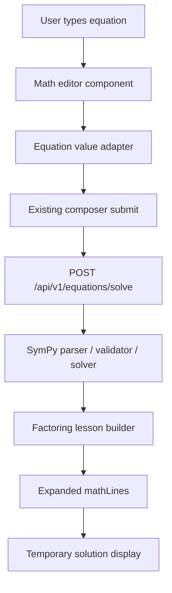

# Math Input and Step Display - Plan

## Goal Capsule

| Field | Value |
|---|---|
| Objective | Make the scaffold easier to inspect by giving users a math-friendly quadratic input and showing the deterministic solution lines directly under the composer. |
| Means | Add a MathLive-powered input component, submit a parser-friendly equation string to FastAPI, expand factoring lessons with intermediate algebra lines, and render a temporary line-by-line solution display. |
| Authority | The deterministic SymPy API remains the source of mathematical truth. The math editor is only an input affordance and must not decide correctness. |
| Stop Conditions | Stop after the temporary reasoning display and input UX work. Do not add video generation, narration, real HeyGen/ElevenLabs calls, or additional solving strategies. |
| Execution Profile | Standard UI/API contract slice with one new frontend dependency and backend lesson-line changes. |
| Tail Ownership | `ce-work` should implement the units in dependency order, keep the UI/debug output temporary and obvious, and run the Verification Contract. |

---

## Product Contract

### Summary

The current `/app` page has the right sparse layout, but the equation input still behaves like a plain text field and the solution display is not useful enough for checking the math reasoning.
This slice upgrades the input so typing exponent notation feels like math entry, changes the placeholder to "enter a quadratic equation", and temporarily renders the full deterministic solution line sequence under the box.
The backend should continue using SymPy for truth and should return factoring math lines that include intermediate algebra transformations, not only grouped teaching-step summaries.

### Problem Frame

The next product risk is not media rendering; it is whether the system can reliably take a student's quadratic input and expose the exact reasoning chain a future video will animate.
Typing `2x^2` should visually create an exponent after `^`, because a plain code-like input is awkward for the target user.
After submission, the screen should show the algebra sequence in a temporary inspection format so the team can validate the deterministic lesson builder before investing in narration or animation.

### Requirements

**Math Input**

- R1. The main equation control must show grey placeholder text reading `enter a quadratic equation` when empty.
- R2. The input must visually support exponent entry while typing; when the user enters `^`, the following character should appear as an exponent in the math field.
- R3. The input must still submit a deterministic, parser-friendly equation string to the existing solve endpoint.
- R4. The math editor must remain an input affordance only; it must not validate roots, choose strategies, or become a mathematical source of truth.
- R5. The input must preserve keyboard usability for the current example equation and common typed forms such as `2x^2 - 7x + 3 = 0`.
- R5a. Replacing the native text input must preserve accessibility basics: accessible name, visible focus state, predictable Tab order, Enter-to-submit behavior, no duplicate screen-reader exposure from hidden fields, and usable touch targets.

**Deterministic Solution Lines**

- R6. For v0-supported factorable quadratics, the API response must include enough math lines to display the full factoring solution sequence, including factor equations, intermediate isolation lines, and final roots.
- R7. For `2x^2 - 7x + 3 = 0`, the temporary display must include lines equivalent to `2x^2 - 7x + 3 = 0`, `(2x - 1)(x - 3) = 0`, `2x - 1 = 0`, `2x = 1`, `x = 1/2`, `x - 3 = 0`, `x = 3`, and `x = 1/2, 3`.
- R8. The display should use existing `mathLines` data rather than a separate hard-coded frontend list.
- R9. Each displayed line must preserve a machine-readable `expression` and a render-oriented `latex` value.
- R10. Non-factorable valid quadratics and factorable cases outside the current strategy selector, including repeated-factor quadratics, must continue returning `unsupported_instructional_method` without fake instructional lines.

**Temporary Inspection UI**

- R11. After a successful solve, the app must render the solution lines under the composer in a compact temporary inspection block.
- R12. The temporary display must be clearly separate from the permanent composer controls so it can later be replaced by a richer lesson or video preview.
- R13. Lightweight development console logs may be added for submit payload conversion and response status, method, and math-line count, but they must be gated to development or dev-auth mode, contain no secrets or bearer tokens, and be easy to remove.
- R14. Existing local auth bypass behavior must keep working so the UI can be tested before Supabase is configured.
- R15. Dev-auth bypass must remain server-side restricted to local/development environments, disabled by default in production, and covered by a production-mode rejection test for `Bearer dev`.
- R16. The backend parser boundary must enforce a maximum equation length and simple grammar/complexity checks before expensive SymPy work.

### Acceptance Examples

- AE1. Given an empty equation editor, when `/app` renders, then the placeholder reads `enter a quadratic equation` in muted text.
- AE2. Given the user types `2x^2`, when they type `^` and the next character, then the `2` appears visually as a superscript exponent in the editor.
- AE3. Given the user submits `2x^2 - 7x + 3 = 0`, when the solve endpoint receives the request, then it receives a parser-friendly equivalent accepted by the existing quadratic parser.
- AE4. Given `2x^2 - 7x + 3 = 0`, when solving succeeds, then the screen displays the full factoring solution line sequence under the composer.
- AE5. Given `x^2 + x + 1 = 0`, when solving succeeds mathematically but has no v0 factoring lesson, then the UI continues showing the unsupported-method state rather than invented steps.
- AE6. Given local dev auth bypass is enabled in a local/development environment, when a developer opens `/app`, then the composer renders without Supabase and submit still uses `Bearer dev`.
- AE7. Given production mode, when a request uses `Bearer dev`, then the protected solve endpoint rejects it.
- AE8. Given an oversized or intentionally pathological equation string, when it reaches the API, then validation rejects it before lesson generation.

### Scope Boundaries

#### In Scope

- MathLive-powered frontend equation editor or an equivalent proven mathfield package if implementation finds MathLive unusable.
- A small equation-input adapter that converts the mathfield value into the parser-friendly equation string sent to FastAPI.
- Backend factoring lesson line expansion for the existing factoring strategy.
- Backend request-size and grammar/complexity guards at the parser boundary.
- Temporary line-by-line solution display under the composer.
- Development-only console logging for inspection of submit and response data.

#### Deferred to Follow-Up Work

- Full MathJSON or Compute Engine integration.
- Rich KaTeX/MathLive-rendered solution-line output throughout the result panel.
- Non-factorable instructional strategies.
- Video generation, narration generation, avatar rendering, and Motion Canvas changes.
- Polished final lesson layout or step-by-step player interactions.

### Sources and Research

- Local code research found the current composer in `apps/web/components/equation-form.tsx`, the temporary result renderer in `apps/web/components/lesson-result.tsx`, and lesson-building logic in `apps/api/app/services/lessons/builder.py`.
- MathLive documentation shows a `math-field` web component, input events, direct value access, and `getValue(format)` support for textual exports. `math-json` requires the Compute Engine library, so this plan defers that heavier path.
- Existing backend tests already cover factorable solve output, unsupported-method output, and auth rejection. This slice should extend those tests rather than replacing them.

---

## Planning Contract

### Key Technical Decisions

- KTD1. **Use a proven mathfield for exponent input.** Add MathLive for the equation editor so exponent editing, cursor behavior, and math display are handled by a library built for math input rather than a custom contenteditable control. (session-settled: user-directed; rejected deferring MathLive because exponent-friendly entry is part of this requested slice.)
- KTD2. **Keep parser-friendly submission separate from display value.** The frontend editor may hold LaTeX or mathfield-native content, but `solveEquation` still receives a normalized plain equation string the FastAPI parser already understands. The implementation must choose one canonical MathLive export format for the adapter, test that real exported format, and cover common export shapes such as braced exponents, fractions, commands, and implicit multiplication.
- KTD3. **Expand backend `mathLines` instead of hard-coding frontend reasoning.** The backend lesson builder owns the line sequence because SymPy is the source of truth and the future Motion Canvas pipeline will consume the same lesson contract.
- KTD4. **Treat console logs as temporary development instrumentation.** Logs may show submit conversion, response status, selected method, and math-line count only in development or dev-auth bypass mode, and must not log access tokens, bearer values, Supabase keys, or other secrets.
- KTD5. **Do not widen the parser into arbitrary algebra.** The adapter may make user-friendly quadratic input acceptable, but the backend must continue rejecting unsupported variables, non-equations, malformed expressions, linear equations, and cubic or higher equations.
- KTD6. **Keep repeated-factor factoring deferred.** The current strategy selector only needs to support two distinct linear factors with power 1; repeated-factor quadratics remain explicitly unsupported until a follow-up adds that instructional path.
- KTD7. **Use a lightweight DOM test harness for the mathfield wrapper.** Add the minimum jsdom or happy-dom setup needed for component-level assertions instead of replacing the web test strategy.

### High-Level Technical Design

### Assumptions

- MathLive can be added to the Next.js client component without server-rendering it directly; if needed, it can be dynamically imported or wrapped in a client-only component.
- The current FastAPI parser can remain strict if the frontend adapter outputs explicit multiplication and exponent notation, such as `2*x^2 - 7*x + 3 = 0`.
- The temporary reasoning display can flatten `lesson.steps[].mathLines` in display order.

---

## Implementation Units

### U1. Mathfield Input Component

- **Goal:** Replace the plain equation `<input>` with a math-friendly editor that supports exponent entry and uses the requested placeholder.
- **Requirements:** R1, R2, R4, R5, R5a, AE1, AE2
- **Dependencies:** None
- **Files:** `apps/web/package.json`, `pnpm-lock.yaml`, `apps/web/components/math-equation-input.tsx`, `apps/web/components/equation-form.tsx`, `apps/web/tests/math-equation-input.test.tsx`
- **Approach:**
  1. Add the MathLive dependency.
  2. Add the minimum DOM component-test setup needed for the MathLive wrapper, such as jsdom or happy-dom, while keeping Vitest as the test runner.
  3. Create a client-only math equation input component that wraps the `math-field` element and owns placeholder, visual value, focus, reset, and exponent-friendly editing behavior.
  4. Keep parser-friendly hidden-field wiring out of this unit; U2 owns that once the adapter exists.
  5. Style the mathfield to match the current dark composer and render the muted placeholder text when empty.
  6. Keep the current submit button, instructor dropdown, video toggle, reset behavior, and local auth bypass behavior intact.
- **Patterns to follow:** Existing client component state and form action pattern in `apps/web/components/equation-form.tsx`.
- **Test scenarios:**
  - Covers AE1. Render the input component in an empty state and verify the placeholder copy is `enter a quadratic equation`.
  - Covers AE2. Exercise the component with input equivalent to `2x^2` and verify exponent entry is represented through the mathfield value/state.
  - Verify the mathfield has an accessible name, visible focus behavior, expected Tab order participation, Enter-to-submit behavior, and no duplicate screen-reader exposure from hidden form fields added later by U2.
  - Verify reset clears the editor value and returns the solve state to idle.
- **Verification:** The composer looks like the current centered box, but the equation field visually handles exponents and no longer defaults visible text over the placeholder when empty.

### U2. Equation Value Adapter

- **Goal:** Convert mathfield content into the strict equation string accepted by the FastAPI parser.
- **Requirements:** R3, R4, R5, R14, AE3, AE6
- **Dependencies:** U1
- **Files:** `apps/web/lib/equation-input.ts`, `apps/web/tests/equation-input-adapter.test.ts`, `apps/web/components/math-equation-input.tsx`, `apps/web/components/equation-form.tsx`
- **Approach:**
  1. Add a small adapter module that accepts the mathfield textual value and returns parser-friendly text.
  2. Choose one canonical MathLive export format for the adapter and test against actual values produced by MathLive for exponent and fraction input.
  3. Normalize common user forms: implicit multiplication around coefficients and `x`, exponent markers, braced exponents, fraction text, whitespace, and equality.
  4. Wire the adapter output into a hidden form field named `equation` or equivalent submit path so the API receives parser-friendly text.
  5. Keep unsupported conversion cases explicit so errors surface through the existing API validation path.
  6. Add development-only console logging for converted submit payloads when `NEXT_PUBLIC_DEV_AUTH_BYPASS=true` or `NODE_ENV=development`.
- **Patterns to follow:** Existing `solveEquation` request boundary in `apps/web/lib/api.ts` and dev-auth flag in `apps/web/lib/env.ts`.
- **Test scenarios:**
  - Convert `2x^2 - 7x + 3 = 0` to `2*x^2 - 7*x + 3 = 0`.
  - Preserve already explicit input `2*x^2 - 7*x + 3 = 0`.
  - Preserve rational text such as `1/2` when it appears in user input.
  - Cover real MathLive export examples for exponent and fraction input, including braced exponents or command-shaped output if that is the selected export format.
  - Verify unsupported variables, non-equations or malformed expressions, linear equations, and cubic-or-higher equations are not converted into accepted quadratic submissions and still surface through the existing API validation path.
  - Verify the hidden `equation` submit value is parser-friendly while the visible mathfield value remains exponent-friendly.
  - Do not include auth tokens, Supabase keys, or bearer values in any development log payload.
- **Verification:** Submitting the editor's visible `2x^2 - 7x + 3 = 0` value calls the existing solve endpoint successfully in dev-auth bypass mode.

### U3. Expanded Factoring Math Lines

- **Goal:** Make the backend return the full deterministic factoring solution line sequence for the example equation.
- **Requirements:** R6, R7, R8, R9, R10, R16, AE4, AE5, AE8
- **Dependencies:** None
- **Files:** `apps/api/app/services/math/parser.py`, `apps/api/app/services/math/validator.py`, `apps/api/app/services/lessons/builder.py`, `apps/api/tests/test_lesson_builder.py`, `apps/api/tests/test_solve_api.py`, `packages/types/tests/fixtures/factoring_lesson.json`
- **Approach:**
  1. Add backend validation for maximum equation length and simple allowed grammar/complexity before invoking SymPy parsing or lesson generation.
  2. Extend the factoring lesson builder so solving each supported linear factor includes the intermediate isolation step when there is a non-unit coefficient or non-zero constant movement.
  3. Keep teaching-step grouping intact: factor, solve factors, final answer.
  4. Ensure each added line has stable IDs, expression text, and LaTeX.
  5. Preserve unsupported-method behavior for non-factorable quadratics and repeated-factor cases outside the current two-distinct-linear-factor strategy.
- **Patterns to follow:** Existing `_equation_line`, `_assignment_line`, and grouped `TeachingStep` construction in `apps/api/app/services/lessons/builder.py`.
- **Test scenarios:**
  - Covers AE4. For `2*x^2 - 7*x + 3 = 0`, assert flattened math lines include the standard form, factored form, both factor equations, `2*x = 1`, both root assignments, and final answer.
  - For an additional supported factorable quadratic, such as `x^2 - 5*x + 6 = 0`, assert the line sequence includes factoring, both factor solves, intermediate lines where needed, and final roots.
  - Verify the response contract still has exactly the existing three teaching steps.
  - Covers AE5. For `x^2 + x + 1 = 0`, assert `status` remains `unsupported_instructional_method` and no fake steps are returned.
  - For repeated-factor input such as `x^2 - 2*x + 1 = 0`, assert it remains explicitly unsupported unless the implementation deliberately adds repeated-factor strategy support and tests it.
  - Covers AE8. Oversized or unsupported-complexity input is rejected before lesson generation.
  - Verify every returned math line has non-empty `id`, `expression`, and `latex`.
- **Verification:** API tests prove the expanded line sequence and the example still returns exact roots `1/2` and `3`.

### U4. Temporary Solution-Line Display

- **Goal:** Render the deterministic math lines under the composer after solve success.
- **Requirements:** R8, R9, R11, R12, R13, AE4
- **Dependencies:** U3
- **Files:** `apps/web/components/lesson-result.tsx`, `apps/web/lib/lesson-view.ts`, `apps/web/tests/lesson-view.test.ts`
- **Approach:**
  1. Flatten `lesson.steps[].mathLines` in order for a temporary display block below the composer.
  2. Define the temporary result-state transitions: idle shows no solution block, loading/resubmitting dims or replaces stale lines with a loading state, success shows fresh flattened lines, unsupported-method shows the existing unsupported state without fake lines, error shows the error state without presenting stale lines as current, editing after success keeps the last result only until a new submit begins, and reset returns to idle.
  3. Keep the existing answer metadata visible enough for debugging, but make the math-line sequence the primary temporary inspection artifact.
  4. Add development-only console logging for response status, method, and math-line count, without logging auth material.
  5. Keep unsupported-method and error states visibly distinct from a completed solution.
- **Patterns to follow:** Existing `LessonResult` rendering and `stateForLesson` result-state handling.
- **Test scenarios:**
  - Given a completed fixture lesson, verify the flattened line list renders in original step order.
  - Verify final-answer line appears after factor-solving lines.
  - Given an unsupported fixture lesson, verify no fake line list appears and the unsupported reason remains visible.
  - Verify the line-display helper returns stable values from `lesson.steps` rather than using a hard-coded equation-specific list.
- **Verification:** The UI shows the temporary line sequence directly under the composer after solving the example equation.

### U5. Local Bypass Smoke and Documentation Update

- **Goal:** Keep the local development workflow obvious while Supabase remains optional.
- **Requirements:** R13, R14, R15, AE6, AE7
- **Dependencies:** U1, U2, U4
- **Files:** `README.md`, `.env.example`, `apps/web/.env.example`
- **Approach:**
  1. Document the local dev-auth bypass flags next to the equation editor workflow.
  2. Document that dev-auth bypass is accepted only in local/development server environments and is disabled by default in production.
  3. Add or update an API auth test proving production-mode `Bearer dev` is rejected.
  4. Clarify that the API must be running for submit to work, otherwise the UI will show fetch failure.
  5. Note that `localhost:9000` is Motion Canvas and not the web app.
- **Patterns to follow:** Current README local-dev section.
- **Test scenarios:** Production-mode API auth rejects `Bearer dev`; docs/env examples remain consistent with the implemented flags.
- **Verification:** A developer can follow the README to open `/app` without Supabase and submit the example equation when FastAPI is running.

---

## Verification Contract

| Gate | Scope | Done Signal |
|---|---|---|
| `uv run --project apps/api pytest` | Backend lesson and API behavior | API tests pass, including expanded factoring line assertions. |
| `uv run --project apps/api ruff check` | Backend formatting/static checks | Ruff reports no issues. |
| `pnpm --filter @quadratics/web typecheck` | Web input/result contracts | TypeScript passes with MathLive wrapper types and hidden input wiring. |
| `pnpm --filter @quadratics/web test` | Web adapter, mathfield component, and display helpers | Vitest passes with the chosen DOM test harness, adapter normalization, accessibility checks, and line flattening. |
| `pnpm build` | Monorepo integration | Web, shared packages, and Motion Canvas still build. |
| Local smoke | Dev-auth bypass vertical slice | With API and web running in bypass mode, opening `/app`, entering `2x^2 - 7x + 3 = 0`, and submitting shows the solution lines. |

---

## Definition of Done

- The app route displays a math-friendly equation editor with placeholder `enter a quadratic equation`.
- Typing exponent notation visually creates exponent-style entry in the editor.
- The submitted equation string is accepted by the existing FastAPI parser for the example user input.
- The backend returns expanded factoring math lines with exact values and LaTeX.
- The frontend renders the temporary solution-line sequence under the composer.
- Unsupported valid quadratics continue to return an explicit unsupported-method state.
- Development console logs, if present, are gated and contain no secrets or bearer tokens.
- Local auth bypass remains usable before Supabase setup.
- Verification Contract gates pass.
- No unrelated Motion Canvas metadata, build output, or generated local files are committed.
