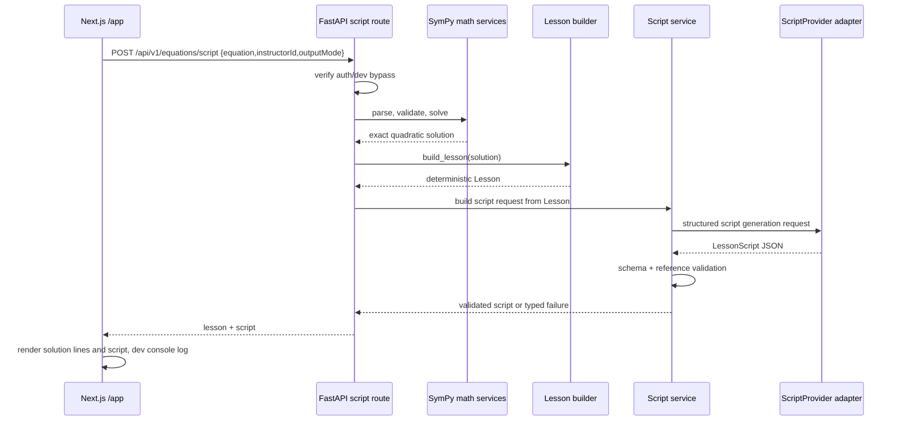

# Factoring Script Generation Plan

## Goal Capsule

| Field | Value |
| --- | --- |
| Objective | Add the next pipeline step after deterministic factoring lessons: generate a short Algebra 1 teacher script from the existing solution steps. |
| Means | Keep `/solve` deterministic, add a script-generation contract and protected API path that uses a provider-isolated LLM adapter, and display the returned script in the web app for development review. |
| Stop Conditions | Stop after script text is generated, validated, returned, displayed, and logged in development. Do not generate ElevenLabs audio, HeyGen avatars, Motion Canvas timing, video files, queues, billing, or new solving strategies. |
| Execution Profile | Standard API/web contract slice with one provider adapter, schema validation, fake-provider tests, and docs updates. |

## Product Contract

### Context

Quadratics already accepts a quadratic expression, solves it deterministically with SymPy, and returns a factoring lesson for clean factorable equations. The current lesson model separates teaching steps from math lines. That is the right foundation for media: teaching steps become narration/audio/video units, while math lines remain deterministic board-rendered transformations.

The next missing object is a script. For clean factoring lessons, the script should sound like a concise high-school Algebra 1 teacher explaining the three current teaching steps:

1. Factor the quadratic.
2. Solve each factor.
3. State the final answer.

The script must help prepare the future ElevenLabs and Motion Canvas pipeline, but this task does not create audio, timestamps, or rendered video.

### Requirements

- R1. Script generation must be available only after deterministic equation validation, solving, strategy selection, and lesson construction have completed.
- R2. The LLM must never determine whether the math is correct. It may only turn the already-built lesson into instructional narration.
- R3. The existing protected `/api/v1/equations/solve` endpoint must remain deterministic and must not call an LLM.
- R4. Add an explicit protected script-generation API path for the development workflow.
- R5. Script generation is initially supported only for completed factoring lessons. Unsupported/non-factorable lessons must return a typed unsupported state or no script; they must not receive a fake explanation.
- R6. The script must be structured by teaching step, not by every math line.
- R7. Every script segment must reference the `step.id` it explains and the `mathLine.id` values it expects the future renderer to show while that segment is spoken.
- R8. The script response must include enough metadata for future audio/rendering work: segment order, narration text, approximate word count, estimated duration seconds, and referenced math-line IDs.
- R9. Total narration should target less than one minute. Use a configurable word budget, initially around 130 to 150 words total.
- R10. Prompt instructions must live in a markdown file in the repository so they can be edited without rewriting route logic.
- R11. Provider-specific LLM code must live behind a script provider interface/adapter. Core math and lesson services must not import OpenAI SDK types.
- R12. The initial LLM provider should use the OpenAI Responses API with structured JSON output where available, but the model must be configurable through environment variables.
- R13. Do not expose OpenAI, ElevenLabs, HeyGen, or Supabase service credentials to the browser.
- R14. Tests must not call the live OpenAI API. Use a fake provider for deterministic API and service tests.
- R15. The web app must display both deterministic solution lines and the returned script underneath the composer.
- R16. The web app must console-log the script response in development/dev-auth-bypass mode for fast inspection.
- R17. The UI output-mode selector may pass `video_audio` or `audio`, but this task should only store/echo that intent for future pipeline stages. It must not change generated media behavior yet.
- R18. Documentation must explain that script text sits between lesson representation and narration audio in the future pipeline.

### Acceptance Examples

- AE1. Given `2*x^2 - 7*x + 3`, when the script endpoint is called by an authenticated/dev-bypass user, then the API returns the completed factoring lesson plus a script with three ordered segments mapped to `factor`, `solve_factors`, and `final_answer`.
- AE2. Given the returned script for AE1, each segment references only math-line IDs that exist in the returned lesson.
- AE3. Given AE1, the script narration mentions the same factors and roots as the deterministic lesson and does not introduce extra roots, methods, equations, or unverifiable claims.
- AE4. Given `x^2 + x + 1`, when the deterministic solver returns an unsupported instructional method, then the script response is absent or explicitly unsupported.
- AE5. Given an unauthenticated request with dev auth disabled, when calling the script endpoint, then the API returns 401.
- AE6. Given a fake script provider in tests, when the route returns data, then the frontend/shared types can represent the lesson and script without provider-specific types.
- AE7. Given the web form receives a script response in development, then the page displays the script below the solution lines and logs the script payload in the console.

### Non-Goals

- No ElevenLabs audio generation.
- No HeyGen avatar generation.
- No Motion Canvas changes or animation synchronization.
- No timestamps beyond rough estimated duration fields.
- No generation credit deduction for script creation unless a future billing plan explicitly decides that.
- No queue, worker, generation job persistence, caching, or retry system.
- No support for square-root method, completing the square, quadratic formula scripts, or arbitrary algebra.
- No polished final lesson player UI.

## Key Technical Decisions

- KTD1. **Keep `/solve` deterministic.** The LLM-backed script path must be separate from `/api/v1/equations/solve` so local math validation remains cheap, testable, and trusted. Governs R1, R2, R3, R4.
- KTD2. **Generate scripts from lesson data, not raw equation text.** The script input should contain the normalized lesson, teaching steps, math lines, exact roots, and instructor/output preferences. It should not ask the LLM to solve or infer the problem. Governs R1, R2, R6, R7.
- KTD3. **Use structured script segments as the media contract.** A `LessonScript` with `ScriptSegment[]` is the durable object that future ElevenLabs, Motion Canvas, and avatar work consume. Governs R6, R7, R8, R18.
- KTD4. **Use markdown prompt instructions plus JSON schema output.** The prompt file carries teaching style and guardrails; the provider asks the model for structured JSON matching the script schema. Governs R9, R10, R12.
- KTD5. **Provider isolation applies to LLM scripting too.** Add a neutral `ScriptProvider` interface and keep OpenAI-specific request/response handling in a provider module. Governs R11, R13, R14.
- KTD6. **Validate LLM output before returning it.** The API should reject or mark script generation failed if segment IDs, math-line references, word budgets, or required fields do not match the deterministic lesson. Governs R2, R7, R8, R14.
- KTD7. **Use current low-cost OpenAI model configuration, not a hardcoded stale model.** OpenAI’s current model docs list newer low-cost options such as GPT-5 mini/nano; implementation should configure `OPENAI_SCRIPT_MODEL` with a documented default and keep override support. Governs R12, R13.
- KTD8. **Display script in the existing temporary inspection UI.** The UI is still a development surface, so it should show deterministic solution lines and generated narration text clearly without creating a final player metaphor yet. Governs R15, R16, R17.

## Architecture



### Script Contract Shape

Use exact naming during implementation in Pydantic and TypeScript, but the contract should resemble:

```ts
export interface LessonScript {
  status: "completed" | "unsupported" | "failed";
  lessonId?: string;
  method: "factoring";
  totalEstimatedSeconds: number;
  totalWordCount: number;
  segments: ScriptSegment[];
  unsupportedReason?: string;
  providerMetadata?: Record<string, unknown>;
}

export interface ScriptSegment {
  id: string;
  stepId: string;
  title: string;
  narration: string;
  mathLineIds: string[];
  estimatedSeconds: number;
  wordCount: number;
  deliveryNotes?: string[];
}
```

Rules:

- `segments[].stepId` must match existing `lesson.steps[].id`.
- `segments[].mathLineIds` must all exist under that step.
- Segment count should match the current three factoring teaching steps for completed factoring lessons.
- `providerMetadata` may contain non-sensitive debugging metadata such as model name, not prompts, API keys, or raw provider responses.
- Future timestamps can be added without replacing this contract, for example `lineCues[]` or `wordTimestamps[]`.

### Prompt File Responsibilities

Create `apps/api/app/services/scripts/prompts/factoring_teacher_script.md`.

It should instruct the model to:

- Teach as a concise Algebra 1 teacher.
- Keep the total script under the configured word budget.
- Use the provided factors, roots, and math lines exactly.
- Explain factoring, zero-product property, and final roots in student-friendly language.
- Avoid saying unsupported methods were used.
- Avoid inventing new equations, roots, or visual actions.
- Return only structured JSON that matches the API schema.

## Implementation Units

### U1. Shared Script Domain Contracts

- **Goal:** Define script schemas in Python and TypeScript without provider-specific types.
- **Files:** `apps/api/app/schemas/script.py`, `packages/types/src/script.ts`, `packages/types/src/api.ts`, `packages/types/src/index.ts`, `packages/types/tests/script-contract.test.ts`
- **Steps:**
  1. Add Pydantic models for `LessonScript`, `ScriptSegment`, and script endpoint responses.
  2. Add matching TypeScript interfaces in `packages/types`.
  3. Add `ScriptEquationRequest` and `ScriptEquationResponse` API types. The response should include `{ lesson, script }`.
  4. Add fixtures covering the example factoring lesson and a matching three-segment script.
- **Tests:**
  - TypeScript fixture satisfies the exported script type.
  - Pydantic model rejects empty narration, missing step IDs, negative duration, and empty math-line reference arrays for completed segments.

### U2. Prompt Asset and Script Service

- **Goal:** Convert a deterministic factoring lesson into a provider request and validate provider output.
- **Files:** `apps/api/app/services/scripts/base.py`, `apps/api/app/services/scripts/builder.py`, `apps/api/app/services/scripts/validator.py`, `apps/api/app/services/scripts/prompts/factoring_teacher_script.md`, `apps/api/tests/test_script_builder.py`
- **Steps:**
  1. Add `ScriptProvider` protocol/abstract base with a method such as `generate_lesson_script(request)`.
  2. Add a `ScriptGenerationRequest` domain object containing lesson JSON, instructor ID, output mode, word budget, and prompt instructions.
  3. Load the markdown prompt from disk in the service layer.
  4. Build deterministic guardrail context from the `LessonResponse`; do not pass only raw equation text.
  5. Validate provider output against lesson step IDs, math-line IDs, segment count, total word budget, and required fields.
  6. Return typed unsupported script state when `lesson.status` is not completed factoring.
- **Tests:**
  - Fake provider receives lesson-derived math lines and not a route-handler-shaped object.
  - Mismatched `stepId` or unknown `mathLineId` is rejected.
  - Unsupported lesson does not invoke the provider.
  - Total word count and estimated duration are derived or validated consistently.

### U3. OpenAI Script Provider Adapter

- **Goal:** Add the first real LLM adapter behind the script provider boundary.
- **Files:** `apps/api/pyproject.toml`, `apps/api/app/providers/openai/script_provider.py`, `apps/api/app/providers/openai/__init__.py`, `apps/api/app/core/config.py`, `.env.example`, `apps/api/.env.example`, `apps/api/tests/test_provider_boundaries.py`
- **Steps:**
  1. Add the official OpenAI Python SDK dependency.
  2. Add settings: `OPENAI_API_KEY`, `OPENAI_SCRIPT_MODEL`, `SCRIPT_GENERATION_ENABLED`, and `SCRIPT_WORD_BUDGET`.
  3. Implement `OpenAIScriptProvider` using the Responses API and structured JSON output.
  4. Keep the model configurable. Prefer a current low-cost model from official OpenAI docs for the default.
  5. Ensure missing `OPENAI_API_KEY` produces a clear script-generation configuration error, not an import-time app crash.
  6. Keep provider metadata minimal and non-sensitive.
- **Tests:**
  - Importing FastAPI without OpenAI env vars still works.
  - Provider boundary test verifies math and lesson service modules do not import OpenAI provider modules or SDK types.
  - Adapter tests mock the OpenAI client; no live network calls.

### U4. Protected Script API Route

- **Goal:** Expose script generation through an authenticated API path without changing deterministic solve behavior.
- **Files:** `apps/api/app/api/routes/equations.py` or `apps/api/app/api/routes/scripts.py`, `apps/api/app/main.py`, `apps/api/app/schemas/equation.py`, `apps/api/tests/test_script_api.py`
- **Steps:**
  1. Add `POST /api/v1/equations/script`.
  2. Require `get_current_user`, matching `/solve`.
  3. Parse and solve using the existing deterministic services.
  4. Build the lesson with the existing lesson builder.
  5. Invoke the script service only for completed factoring lessons.
  6. Return `{ lesson, script }` where `script.status` is completed, unsupported, or failed.
  7. Do not deduct credits in this task.
  8. Keep `/api/v1/equations/solve` response and tests unchanged except for shared helper reuse.
- **Tests:**
  - Unauthenticated script request returns 401.
  - Dev-bypass authenticated request for `2*x^2 - 7*x + 3` returns lesson plus completed script using a fake provider.
  - Unsupported factoring request returns lesson plus unsupported script state and does not call provider.
  - `/solve` still returns only deterministic lesson data.

### U5. Web API Client and Temporary Script Display

- **Goal:** Let the development app request, show, and log generated script data.
- **Files:** `apps/web/lib/api.ts`, `apps/web/components/equation-form.tsx`, `apps/web/components/lesson-result.tsx`, `apps/web/lib/lesson-view.ts`, `apps/web/tests/lesson-view.test.ts`
- **Steps:**
  1. Add `generateEquationScript` client method that calls `/api/v1/equations/script`.
  2. Change the main form submission to call the script endpoint for this development workflow.
  3. Preserve the deterministic solution-line display.
  4. Add a script panel below the solution lines with one block per script segment.
  5. Show each segment title, narration, approximate duration, and the referenced math-line IDs or a compact cue list.
  6. Console-log the returned `script` object in development/dev-auth-bypass mode.
  7. If script generation is unsupported or failed, show a clear temporary message while still displaying the deterministic lesson.
- **Tests:**
  - View helper renders lesson-only unsupported state without script.
  - Completed script fixture renders all segment narration in step order.
  - Dev logging is gated to development/dev-bypass logic where practical.

### U6. Documentation Updates

- **Goal:** Preserve context for future audio and animation work.
- **Files:** `docs/domain-model.md`, `docs/video-pipeline.md`, `docs/architecture.md`, `AGENTS.md`, `README.md`
- **Steps:**
  1. Add `Script` and `ScriptSegment` to the domain model.
  2. Update the video pipeline to show `Lesson -> Script -> narration audio/timestamps -> Motion Canvas`.
  3. Document that scripts are LLM-assisted but math truth is deterministic.
  4. Document environment variables for script generation.
  5. Add agent guidance that script providers must not broaden math scope or import provider SDKs into math/lesson services.

## Verification Contract

| Command | Purpose | Expected Result |
| --- | --- | --- |
| `uv run --project apps/api pytest` | Backend schema, service, auth, route, and fake-provider tests | Passes without live OpenAI credentials. |
| `uv run --project apps/api ruff check` | Python lint | Passes. |
| `pnpm test` | TypeScript/shared/web tests | Passes. |
| `pnpm typecheck` | Cross-package TypeScript contract check | Passes. |
| `pnpm lint` | Frontend/workspace lint | Passes. |
| `pnpm build` | Integration build across web/shared/video packages | Passes or documents existing unrelated failures. |

Manual local check:

1. Run the API with `DEV_AUTH_BYPASS=true`.
2. Run the web app with `NEXT_PUBLIC_DEV_AUTH_BYPASS=true`.
3. Submit `2*x^2 - 7*x + 3`.
4. Confirm solution lines still render.
5. Confirm the script panel renders three segments.
6. Confirm the browser console logs the script payload.

## Definition of Done

- `POST /api/v1/equations/solve` remains deterministic and unchanged in response shape.
- `POST /api/v1/equations/script` is protected and returns `{ lesson, script }`.
- Clean factoring lessons receive three script segments mapped to current teaching-step IDs.
- Script segments reference valid math-line IDs from the deterministic lesson.
- Unsupported instructional methods do not produce fake narration.
- Script prompt instructions live in markdown.
- OpenAI-specific implementation lives behind a script provider adapter.
- No live provider calls run in automated tests.
- Web displays deterministic solution lines and generated script text.
- Web console logs the script payload in development/dev-bypass mode.
- Documentation explains where script generation fits before future ElevenLabs and Motion Canvas work.

## Assumptions

- The first implementation can require `OPENAI_API_KEY` only when script generation is enabled.
- The current local dev flow can use fake or disabled script generation in tests and real OpenAI only during manual development.
- A one-minute Algebra 1 explanation should stay near 130 to 150 spoken words.
- “Clean factoring” means the existing factoring lesson builder returns `status: completed` and `method: factoring`.
- The UI remains a temporary inspection surface; polish and final video-player design come later.

## External References Checked

- OpenAI quickstart and Responses API examples: https://platform.openai.com/docs/quickstart/make-your-first-api-request
- OpenAI model list for current low-cost model options: https://platform.openai.com/docs/models/o1%20.docx
- OpenAI structured output docs surfaced through API reference search: https://platform.openai.com/docs/api-reference/responses

## Planning QA

- Confidence check: passed. The plan preserves deterministic math boundaries, creates a narrow LLM-assisted script contract, isolates provider code, and defines fake-provider tests so verification does not depend on live OpenAI calls.
- Document review: not run. The host did not expose a nested `ce-doc-review` invocation primitive in this turn, so no automatic document-review fixes were applied.
