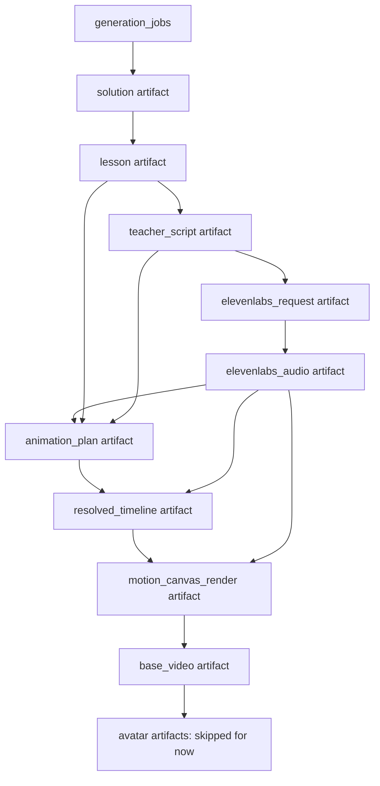
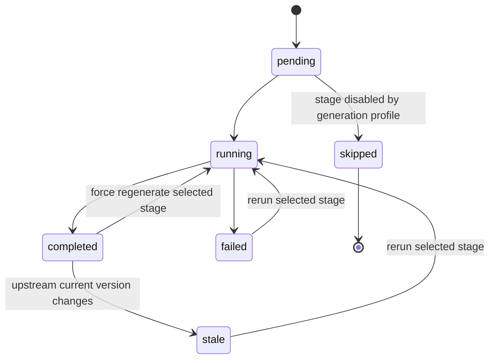
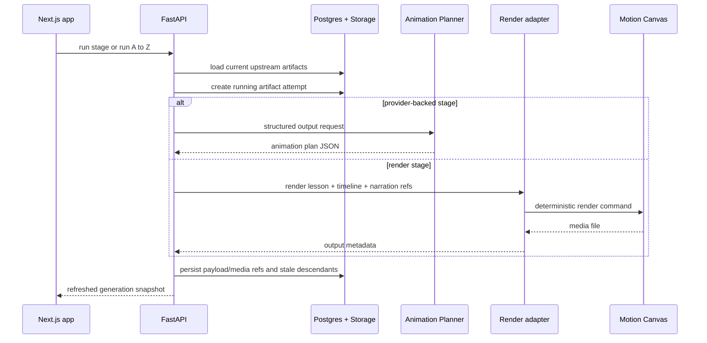

# Audio-Synchronized Video Pipeline Plan

## Goal Capsule

| Field | Value |
| --- | --- |
| Objective | Turn Quadratics into a rerunnable, artifact-based build pipeline that produces a base educational blackboard video synchronized to ElevenLabs narration and playable from the Lesson view. |
| Means | Persist every pipeline stage as a user-owned artifact, move generated media into private storage, add an animation-plan DSL plus deterministic timing resolver, refactor Motion Canvas into a data-driven renderer, and update the web UI to inspect, rerun, stale-label, and preview stages. |
| Authority | SymPy and deterministic lesson construction remain mathematical truth. ElevenLabs alignment remains timestamp truth. LLMs may write instructional language and semantic animation decisions only after deterministic artifacts exist. |
| Stop Conditions | Stop after the standard non-avatar flow can produce and replay a persisted base educational video with narration plus chalk SFX. Do not implement live HeyGen generation or avatar compositing. |
| Execution Profile | Deep cross-cutting feature across API, Supabase schema/storage, provider adapters, shared contracts, Next.js UI, Motion Canvas, fixtures, tests, and docs. |

---

## Product Contract

### Summary

This plan covers the full base educational video pipeline for quadratic factoring lessons: solve, lesson, teacher script, ElevenLabs-ready speech markup, ElevenLabs narration with alignment, semantic animation planning, deterministic timing resolution, Motion Canvas rendering, narration plus chalk SFX composition, stored base video, and Lesson-view playback.

The current "Audio only" user-facing mode must be treated as "no optional avatar" rather than "no video." The standard path still renders the chalkboard educational video; avatar generation and avatar compositing remain future optional stages.

### Problem Frame

The current app proves the early pipeline: deterministic solving, lesson construction, teacher script generation, speech markup, segmented ElevenLabs narration, character-level alignment, and transparent logs. It still behaves like transient request/response UI state rather than a build system. Regenerating later stages can force paid upstream calls, generated media is returned inline as base64, and the Motion Canvas app is still a hardcoded sample scene rather than a renderer for persisted lesson artifacts.

The next product step is making every stage inspectable and independently rerunnable. A user should be able to solve once, generate narration once, then iterate on animation planning and Motion Canvas rendering many times against the same stored audio and alignment without spending ElevenLabs credits again.

### Key Decisions

- KD1. **Base video is standard output** (session-settled: user-directed - chosen over treating "Audio only" as no visual output: the user clarified that "Audio only" means only the optional avatar is omitted). Governs R1, R2, R39.
- KD2. **Final video preview belongs in the Lesson view** (session-settled: user-directed - chosen over showing the finished video only in logs: logs demonstrate process, while the Lesson view is the student-facing product preview). Governs R31, R32.
- KD3. **ElevenLabs alignment is timestamp truth** (session-settled: user-directed - chosen over sending rendered audio to another model to rediscover timings: the existing provider already returns character alignment). Governs R12, R13, R14, R18.
- KD4. **LLM animation planning is semantic only** (session-settled: user-directed - chosen over asking an LLM to generate arbitrary Motion Canvas code or exact timings: deterministic code must validate IDs and resolve timestamps). Governs R15, R16, R17.

### Requirements

**Pipeline and Artifacts**

- R1. The generation pipeline must produce the standard base educational video for the current non-avatar mode.
- R2. The existing external `outputMode` values may remain for compatibility, but internal orchestration must use an avatar-inclusion concept so animation and Motion Canvas are not skipped in the non-avatar path.
- R3. Root stages must persist their request/generation inputs and produce artifacts; every downstream stage must consume persisted upstream artifacts and produce a persisted downstream artifact or persisted skipped/failed attempt.
- R4. Artifacts must record generation ownership, stage type, version, status, input hash, upstream artifact IDs, provider/model/config metadata, created time, completed time, cache-hit state, error details, and storage references where applicable.
- R5. Stage statuses must support at least `pending`, `running`, `completed`, `failed`, `stale`, and `skipped`. Existing `unsupported` product states may remain in lesson/script/narration payloads where they describe content support, not artifact lifecycle.
- R6. Rerunning a stage must not automatically rerun expensive upstream stages when required upstream artifacts already exist.
- R7. A normal rerun must reuse a completed artifact when the stage input fingerprint is identical and reusable.
- R8. A force regenerate action must create a new artifact version even when an identical completed artifact exists.
- R9. Regenerating an artifact must mark affected current downstream artifacts stale without deleting them.
- R10. Stale artifacts must remain inspectable, but stale video/timeline artifacts must not be presented as the current final output.
- R11. Narration must preserve existing per-segment retry where a single script/narration segment can be regenerated without replacing successful sibling segments.

**Narration and Timing**

- R12. ElevenLabs narration artifacts must preserve per-segment MP3 references, duration, raw alignment, normalized alignment, voice ID, model ID, speech text, script segment ID, teaching step ID, provider metadata, and storage object information.
- R13. The deterministic timing resolver must map animation-plan trigger phrases to ElevenLabs character alignment timestamps.
- R14. Timing resolution must handle punctuation, whitespace, repeated phrases, partial phrase matches, apostrophes, missing alignment, malformed arrays, and ambiguous matches with explicit errors or warnings.
- R15. Animation planning must use a constrained schema/DSL, not generated Motion Canvas source code.
- R16. Animation plan validation must reject unsupported primitives, invalid sync modes, unknown lesson step IDs, unknown math line IDs, malformed triggers, and hallucinated references.
- R17. Exact animation start/end times must live in a separate resolved timeline artifact derived from the semantic animation plan.
- R18. Multi-segment narration offsets must be derived from the decoded or concatenated narration asset used for render, and combined duration must match the timeline artifact within a documented tolerance.

**Video and Media**

- R19. Binary media must move from primary base64 response payloads to private Supabase Storage, with authenticated API access returning short-lived URLs or equivalent secure references.
- R20. The Motion Canvas renderer must consume lesson display data, resolved timeline data, and narration media references as inputs, not know how to solve quadratics.
- R21. Blackboard rendering must accumulate math vertically where space permits, preserving prior work while adding temporary highlights, circles, underlines, boxes, arrows, or annotations.
- R22. The first Motion Canvas renderer version must provide chalk-like writing behavior and chalk-writing SFX synchronized under intelligible narration.
- R23. Render failures must preserve upstream artifacts and leave animation plans/timelines inspectable.
- R24. Render-input assembly must verify every lesson, script, narration, timeline, and media reference belongs to the same user and generation before invoking Motion Canvas.
- R25. Render cache fingerprints must include immutable media identity such as checksum or storage object version, byte size, decoded duration, segment offsets, renderer version, and render config; missing media identity must bypass media-backed render cache.
- R26. Concurrent render attempts must use attempt-specific temp/output paths and promote a completed video to current only if it still matches the latest selected upstream artifact IDs and attempt identity.

**Developer Experience and UI**

- R27. The repo must include a golden development generation for a representative factoring equation that can render repeatedly without OpenAI or ElevenLabs calls.
- R28. The golden fixture must include provider-shaped ElevenLabs alignment data that preserves real response structure and timing edge cases, even if the audio bytes are synthetic or locally generated.
- R29. The UI must continue supporting deliberate manual progression plus a compact `Run A to Z` control after solving.
- R30. Applicable log cards must expose subtle per-stage rerun controls and stage-specific loading states.
- R31. Logs must include `animation_plan` and `motion_canvas_render` after `elevenlabs_audio`, showing human-readable synchronization rows and optional raw debug payloads.
- R32. The Lesson view must show the current final/base video preview when ready and sensible non-final states before render completion.
- R33. Stale artifacts must show a muted stale badge and, when possible, a reason such as which upstream artifact was regenerated.
- R34. The system must record enough observability metadata for debugging without logging bearer tokens, provider API keys, Supabase service-role keys, signed URLs, cookies, raw request bodies, or raw media payloads by default.
- R35. Icon-only stage controls must have accessible names, keyboard focus states, and touch-safe hit areas; live stage changes must be announced without overwhelming the page.
- R36. Force regeneration for provider-backed or credit-consuming stages must show an explicit warning or confirmation that names the stage and known downstream artifacts that will become stale.

**Compatibility and Scope**

- R37. Existing deterministic solve behavior must remain protected, cheap, and LLM-free.
- R38. Script and speech-markup providers must remain isolated behind provider interfaces.
- R39. Do not implement actual HeyGen generation or avatar compositing in this plan; only preserve skipped-state architecture for future avatar stages.
- R40. The v0 teaching scope remains quadratic factoring lessons. Valid non-factoring quadratics may be solved deterministically, but the lesson/video builder must remain explicit about unsupported instructional methods.

### Acceptance Examples

- AE1. Given `x^2 + 5x + 6 = 0`, when an authenticated user solves it, the API persists a generation and current solution/lesson artifacts without calling OpenAI or ElevenLabs.
- AE2. Given a completed lesson artifact, when the user runs teacher script, the API creates or reuses a script artifact keyed to the lesson and provider settings.
- AE3. Given a completed script artifact, when the user runs speech markup and narration, the API stores the ElevenLabs-ready request text, segment MP3s, durations, and alignments without embedding the primary media as base64 in the persisted contract.
- AE4. Given unchanged speech text, voice, model, and voice settings, when narration is run normally, the API returns the existing completed narration artifact instead of calling ElevenLabs.
- AE5. Given the same inputs as AE4, when narration is force regenerated, the API creates a new narration artifact and marks previous dependent animation/timeline/render artifacts stale.
- AE6. Given completed narration, when animation planning runs, the LLM returns only validated animation-plan JSON using supported primitives and existing script/lesson IDs.
- AE7. Given a completed animation plan and ElevenLabs alignment, when timing resolution runs, the API persists a resolved timeline showing narration phrase spans and animation windows.
- AE8. Given a phrase that appears multiple times, when the planner does not provide enough disambiguation, the resolver returns a clear ambiguous-match error instead of guessing.
- AE9. Given a completed timeline and stored narration, when render runs, Motion Canvas produces a blackboard video with persistent vertical math, chalk-like writing, and chalk SFX mixed under narration.
- AE10. Given a completed render, when the user opens the Lesson view, the base educational video is playable there; the logs only show stage completion and diagnostic information.
- AE11. Given "Audio only" selected, when the user runs A to Z, the system still produces the base educational video and marks only future avatar-related stages skipped or omitted.
- AE12. Given a failed animation planner call, narration remains completed and playable, the planner stage is failed, and the user can rerun only animation planning.
- AE13. Given a failed Motion Canvas render, the animation plan and resolved timeline remain inspectable, and the user can rerun only render without regenerating narration.
- AE14. Given the golden fixture workflow, a developer can render the same lesson/timeline/audio repeatedly with no OpenAI or ElevenLabs network calls.

### Scope Boundaries

#### Deferred for Later

- Live HeyGen avatar generation and avatar compositing.
- Non-factoring instructional methods for square-root, completing-the-square, or quadratic formula lessons.
- A full queue/worker fleet with distributed render scheduling. This plan creates a process boundary that can later move into a worker.
- Sophisticated video-editor controls. The timeline visualization is observability, not an editor.
- Long-term artifact retention policy automation beyond clear metadata and cleanup hooks.

#### Outside This Product's Identity

- Letting an LLM solve or verify the quadratic.
- Letting an LLM generate arbitrary Motion Canvas TSX as the primary animation strategy.
- Public-by-default generated media.
- Silent deletion of stale artifacts that the user may need to inspect.

### Sources

- `AGENTS.md`
- `README.md`
- `docs/architecture.md`
- `docs/auth-and-usage.md`
- `docs/domain-model.md`
- `docs/video-pipeline.md`
- `docs/decisions/002-motion-canvas-renderer.md`
- `docs/decisions/003-provider-adapters.md`
- `docs/decisions/005-credit-ledger.md`
- `docs/solutions/developer-experience/manual-provider-pipeline-controls.md`
- Motion Canvas documentation for audio synchronization and FFmpeg export.
- Supabase documentation for private storage, signed upload/download access, and user-folder storage policies.

---

## Planning Contract

### Key Technical Decisions

- KTD1. **Use a generic artifact table plus typed payloads.** Add one first-class `generation_artifacts` table rather than one SQL table per stage; the row owns lifecycle, dependencies, input hash, provider metadata, and storage references, while `payload_json` holds stage-specific typed data validated by API schemas. This keeps stage orchestration uniform without over-normalizing early.
- KTD2. **Keep existing `lessons` and `lesson_steps` as normalized lesson projections.** Lesson artifacts should reference the existing lesson rows where useful, not duplicate every relation into the artifact table. This preserves the current database model while letting the artifact graph become the pipeline source of truth.
- KTD3. **Represent dependencies with an explicit edge table.** Add `generation_artifact_dependencies` with `generation_id`, `upstream_artifact_id`, `downstream_artifact_id`, dependency hash/config metadata, and traversal indexes. Each artifact records its normalized input hash, while stale propagation follows dependency rows and cache reuse follows input fingerprints.
- KTD4. **Rerun this stage is the initial UI contract.** A stage rerun regenerates only that stage, reuses identical completed artifacts unless forced, and marks downstream current artifacts stale. `Run A to Z` may continue from the latest reusable artifacts, but the small card control is not a hidden cascade.
- KTD5. **Use private storage for media and large render inputs.** Store segment MP3s, optional combined narration, render-input JSON, timeline JSON, and MP4 outputs in a private Supabase Storage bucket configured by API settings, with paths scoped by `user_id/generation_id/stage/artifact_id`. API responses return metadata and signed URLs, not long-lived public URLs.
- KTD6. **Keep API request handlers orchestration-light.** Stage endpoints may run cheap deterministic stages inline, but Motion Canvas rendering should sit behind a render service/adapter that invokes a workspace render command with input/output file arguments and can later move to a worker without changing the API contract.
- KTD7. **Plan animation semantically, resolve timing deterministically.** The OpenAI animation planner produces validated cue decisions against lesson/script/narration references. A pure resolver maps phrase triggers to ElevenLabs alignment and writes a separate resolved timeline.
- KTD8. **Make narration segments the synchronization unit.** Continue generating ElevenLabs audio per script segment; combine or sequence those segments deterministically for render, with offsets recorded in narration/timeline artifacts.
- KTD9. **Prefer perceptual chalk writing over a universal handwriting engine.** Build reusable Motion Canvas primitives that reveal text/math along a directional mask or stroke-like progression. If exact glyph-path handwriting is too costly in the first version, the fallback must still visibly write across the expression rather than fade in a whole line.
- KTD10. **Use fixture-first video development.** Add committed JSON fixtures and a small checked-in or generated safe placeholder audio asset with alignment. Video work should be testable from fixture inputs before live providers are connected.
- KTD11. **Preserve external compatibility while fixing product semantics.** Keep accepting current `OutputMode` values, but map them into an internal generation profile with base video enabled and `include_avatar` false for the current "Audio only" option.
- KTD12. **Record failures as attempts, not as destroyed pipeline state.** Failed artifacts retain error metadata and logs. Latest successful upstream artifacts remain usable, and stale descendants remain visible but not current.

### High-Level Technical Design

#### Artifact Graph



#### Stage Rerun and Stale Propagation



Normal reruns consult cache first. Force regenerate bypasses cache for the selected stage. Stale propagation updates only the "currentness" of affected descendants; it does not remove stored payloads or media.

#### Request and Render Boundary



### Stage Catalog

| Stage | Produces | Expensive | Cache Basis | Notes |
| --- | --- | --- | --- | --- |
| `solution` | Parsed/validated deterministic solution | No | normalized equation and solver version | LLM-free. |
| `lesson` | Teaching steps and math lines | No | solution artifact and lesson builder version | Existing lesson rows remain useful projections. |
| `teacher_script` | Step-based script segments | Yes | lesson artifact, instructor, output profile, prompt version, model, word budget | OpenAI or deterministic dev provider. |
| `elevenlabs_request` | Per-segment conversational speech text/SSML | Yes | script segment, prompt version, model, speech settings | Log before audio starts. |
| `elevenlabs_audio` | MP3 segment media and alignment | Yes | speech text, voice, ElevenLabs model/settings | Never call ElevenLabs when cache hit unless forced. |
| `animation_plan` | Semantic cue DSL | Yes | lesson, script, narration text, supported primitives, prompt/model versions | No exact timing. |
| `resolved_timeline` | Timestamped cues and SFX spans | No | animation plan and narration alignment | Pure deterministic resolver. |
| `motion_canvas_render` | Render attempt metadata and MP4 storage object | Moderately | lesson display data, timeline, immutable narration media identity, segment offsets, renderer version, render config | Uses render adapter boundary; bypass cache when media checksum/version is missing. |
| `base_video` | Promoted current playable video pointer | No | render artifact | Product-facing final for non-avatar mode; separates completed attempts from the currently selected Lesson-view output. |
| `avatar` | Future avatar artifacts | Yes | base video plus avatar config | Skipped or omitted in this plan. |

### Storage and Usage Contract

- The first storage migration creates a private generated-media bucket and storage object policies or service-role-only access rules that enforce `user_id/generation_id/stage/artifact_id` path ownership.
- API settings name the generated-media bucket and signed URL lifetime.
- Storage object metadata records bucket, path, MIME type, byte size when known, checksum when available, and signed URL expiry when a URL is issued.
- Artifact rows and dependency rows are client-readable only for owned records. Artifact and dependency writes happen through the authenticated API service role or tightly scoped RPCs, not direct browser writes.
- Database constraints or triggers verify same-user and same-generation dependency edges and storage path prefixes.
- Signed URLs are treated as bearer credentials and are never persisted in artifact payloads, render logs, provider metadata, or raw debug UI.
- The temporary base64 compatibility path is disabled for new generation snapshot endpoints by default, uses authenticated ownership checks and `no-store` response headers when used, and is removed once storage-backed playback is fully covered.
- Paid provider stages create auditable attempt metadata linked to `generation_jobs`, `generation_artifacts`, and `credit_ledger` where charging is enabled.
- Cache hits must not debit credits.
- Failed attempts are recorded; whether they debit credits must be explicit per provider policy before production charging is enabled.
- Idempotency keys must include user ID, generation ID, stage, input hash, and attempt or force-regenerate identity so retries do not double-charge.

### Render Command Contract

The first render adapter should target a workspace command with this contract shape:

```bash
pnpm --filter @quadratics/video render -- --input <render-input-json> --output <output-mp4>
```

The exact script implementation is execution-time detail, but the contract must define input JSON path, output MP4 path, temp directory ownership, timeout behavior, nonzero exit handling, stdout/stderr metadata capture, FFmpeg/Motion Canvas prerequisites, and API upload of the resulting MP4 into private storage.

### Animation DSL Direction

The shared contract should contain typed primitives, not renderer code. The shape below is directional guidance, not an implementation prescription:

```ts
type AnimationAction =
  | "write_math"
  | "write_text"
  | "highlight"
  | "emphasize"
  | "circle"
  | "underline"
  | "box"
  | "arrow"
  | "erase_annotation"
  | "replace_fragment"
  | "pause"
  | "point"
  | "dim"
  | "restore";
```

Each cue needs stable IDs, lesson/script references, a trigger phrase with occurrence or segment disambiguation, a visual primitive with validated targets, and a synchronization mode such as `before_narration`, `with_narration`, `after_narration`, or `through_narration`.

### Assumptions

- The first render implementation can run through a local subprocess/adapter from the API service in development, then move to a separate worker later without changing persisted artifact contracts.
- Server-owned OpenAI and ElevenLabs settings remain the base pipeline provider source. User-owned provider keys remain HeyGen-only unless a later billing/provider task changes that model.
- Golden fixtures may use a safe placeholder audio asset, but the alignment fixture must preserve provider-shaped ElevenLabs alignment arrays and representative timing edge cases from a real or contract-faithful response.
- MP4 byte-for-byte snapshots are too brittle for first-pass tests; render verification should check artifact existence, duration/metadata, fixture timeline validity, and browser playback state.

### System-Wide Impact

- End users get resumable generation state, lower accidental credit burn, and a Lesson-view video preview instead of only logs.
- Developers get a fixture workflow for video iteration without paid providers.
- API code moves from transient route orchestration toward durable stage orchestration and storage access.
- Frontend state moves from client-only pipeline snapshots toward server-owned generation snapshots.
- Supabase gains new user-owned artifact records and private storage policies.
- Motion Canvas becomes a generic renderer for validated input data rather than a sample scene.

### Risk Analysis and Mitigation

| Risk | Mitigation |
| --- | --- |
| Artifact graph becomes too abstract before the product needs it. | Use one generic artifact table with typed payload validation and a small explicit stage catalog; avoid separate tables for every artifact until usage demands it. |
| Stale propagation accidentally hides or deletes useful work. | Mark stale by dependency edges and preserve historical artifacts by default. Test exact downstream sets. |
| ElevenLabs cache miss burns credits unexpectedly. | Include strict narration input fingerprints and UI-visible cache-hit metadata. Default normal reruns to reuse. |
| Storage URLs leak or become stale in the player. | Store private object paths, issue short-lived URLs through authenticated API reads, and refresh URLs from artifact metadata. |
| Phrase matching chooses the wrong repeated phrase. | Require segment/occurrence disambiguation and fail ambiguous matches instead of guessing. |
| Motion Canvas rendering blocks API requests or deployment. | Hide render execution behind a render adapter boundary and make the first implementation swappable for a worker. |
| Chalk writing slips into opacity fades. | Add fixture/browser verification that detects visible progressive reveal states, not only final frames. |
| Output-mode compatibility breaks existing UI/tests. | Preserve accepted external values and add internal generation profile mapping tests before expanding render behavior. |

### Documentation Plan

Update `docs/video-pipeline.md`, `docs/domain-model.md`, `docs/architecture.md`, `docs/auth-and-usage.md`, `README.md`, and a new developer fixture guide so future work remembers why artifacts, alignment, stale state, and non-avatar video semantics were introduced.

---

## Implementation Units

| Unit | Title | Primary Areas | Depends On |
| --- | --- | --- | --- |
| U1 | Artifact contracts and schema | API schemas, shared types, Supabase migration | None |
| U2 | Artifact repository and stage lifecycle | API services and tests | U1 |
| U3 | Persistent solve and lesson snapshots | API routes/services | U1, U2 |
| U4 | Persist speech markup and narration media | API narration, storage | U1, U2, U3 |
| U5 | Golden fixture workflow | fixtures, scripts, video data | U1, U3, U4 |
| U6 | AnimationPlan DSL and validation | API schemas, shared types | U1, U5 |
| U7 | Deterministic timeline resolver | API animation services | U4, U6 |
| U8 | Motion Canvas data-driven renderer | apps/video | U5, U6, U7 |
| U9 | Chalk writing and SFX | apps/video assets/components | U8 |
| U10 | Animation planner provider | OpenAI provider/service | U6 |
| U11 | Stage orchestration API | API routes/orchestrator | U2-U10 |
| U12 | Pipeline UI, logs, stale state, preview | web app | U11 |
| U13 | Documentation and cleanup | docs, README, dead artifacts | U1-U12 |

### U1. Artifact Contracts and Schema

- **Goal:** Introduce the durable artifact model, lifecycle states, dependency metadata, cache metadata, storage references, and shared API/TypeScript contracts.
- **Requirements:** R3, R4, R5, R9, R10, R19, R34.
- **Dependencies:** None.
- **Files:** `infra/supabase/migrations/0003_generation_artifacts.sql`, `apps/api/app/schemas/generation.py`, `apps/api/app/schemas/artifact.py`, `packages/types/src/generation.ts`, `packages/types/src/artifact.ts`, `packages/types/src/api.ts`, `packages/types/src/index.ts`, `packages/types/tests/artifact-contract.test.ts`, `packages/types/tests/fixtures/generation_snapshot.json`, `apps/api/tests/test_artifact_schema.py`.
- **Approach:** Add a generic artifact table with stage enum, status enum, version, user/job ownership, input hash, `is_current`, `stale_reason`, provider/model/config metadata, `payload_json`, `storage_objects`, `error_code`, `error_message`, timestamps, and cache metadata. Add `generation_artifact_dependencies` as the authoritative dependency edge table with indexes for downstream stale traversal and uniqueness constraints for each upstream/downstream pair. Add the private generated-media bucket and storage access policy in the same migration slice. Make artifact/dependency writes service-role-only or RPC-mediated so browser clients cannot forge completed artifacts. Keep stage payloads validated in Pydantic/TypeScript rather than trusting untyped JSON at API boundaries.
- **Patterns to follow:** Pydantic `ApiModel` camelCase aliases in `apps/api/app/schemas/common.py`; existing `generation_jobs`, `lessons`, `lesson_steps`, and `credit_ledger` RLS patterns in `infra/supabase/migrations/0001_initial_schema.sql`; shared contract fixtures in `packages/types/tests/fixtures`.
- **Test scenarios:**
  - A completed media artifact accepts storage object metadata and rejects missing required ownership fields.
  - A stale artifact remains valid only when `stale_reason` is present.
  - A failed artifact accepts error metadata without requiring media output.
  - TypeScript fixture represents a generation snapshot with completed, failed, stale, and skipped artifacts.
  - RLS policies allow a user to select only their own artifact rows while direct browser writes are denied or forced through scoped RPCs.
  - Dependency edges cannot connect artifacts from different generations or users.
  - Storage policies or service-role access rules deny cross-user generated-media object paths.
  - Database checks reject a storage object reference whose path prefix does not match the owning user, generation, stage, and artifact ID.
- **Verification:** Contracts compile in API and packages, and schema tests prove lifecycle/state invariants before orchestration code exists.

### U2. Artifact Repository and Stage Lifecycle

- **Goal:** Add server-side services for artifact creation, lookup, input hashing, cache reuse, dependency tracking, and stale propagation.
- **Requirements:** R3, R4, R6, R7, R8, R9, R10, R23, R34.
- **Dependencies:** U1.
- **Files:** `apps/api/app/services/artifacts/__init__.py`, `apps/api/app/services/artifacts/repository.py`, `apps/api/app/services/artifacts/lifecycle.py`, `apps/api/app/services/artifacts/hashing.py`, `apps/api/app/services/artifacts/stale.py`, `apps/api/tests/test_artifact_repository.py`, `apps/api/tests/test_artifact_hashing.py`, `apps/api/tests/test_stale_propagation.py`.
- **Approach:** Build a storage-agnostic repository interface with an in-memory test implementation and a Supabase implementation. Centralize canonical JSON hashing, stage version constants, cache lookup rules, attempt creation, completion/failure transitions, and downstream stale marking. Make "normal rerun" and "force regenerate" separate inputs to the lifecycle service.
- **Patterns to follow:** In-memory `CreditLedger` and `new_solve_job` are useful lightweight test patterns, but this unit should not extend client-only state. Use injected stores/providers like existing script and narration tests.
- **Test scenarios:**
  - Same stage inputs and config return a reusable completed artifact on normal rerun.
  - Force regenerate creates a new version despite identical inputs.
  - Regenerating `teacher_script` marks `elevenlabs_request`, `elevenlabs_audio`, `animation_plan`, `resolved_timeline`, `motion_canvas_render`, and `base_video` stale.
  - Regenerating narration marks `animation_plan`, `resolved_timeline`, `motion_canvas_render`, and `base_video` stale; if the semantic plan is reusable because normalized inputs are identical, reuse happens through normal cache lookup when rerunning `animation_plan`.
  - Failed attempts do not replace the latest successful current artifact unless no success exists.
- **Verification:** Lifecycle tests prove exact cache and stale behavior independently from providers, web UI, and Motion Canvas.

### U3. Persistent Solve and Lesson Snapshots

- **Goal:** Move the first deterministic stages from transient responses into generation-backed persisted artifacts while preserving the existing `/solve` response contract.
- **Requirements:** R3, R4, R37, R40, AE1.
- **Dependencies:** U1, U2.
- **Files:** `apps/api/app/api/routes/equations.py`, `apps/api/app/api/routes/generations.py`, `apps/api/app/services/jobs/generation_jobs.py`, `apps/api/app/services/lessons/builder.py`, `apps/api/app/services/artifacts/lifecycle.py`, `apps/api/tests/test_solve_api.py`, `apps/api/tests/test_generation_api.py`, `apps/api/tests/test_provider_boundaries.py`.
- **Approach:** Have solve/create-generation persist a generation job plus `solution` and `lesson` artifacts. Keep `/api/v1/equations/solve` returning the lesson for compatibility, while adding generation-aware endpoints that return a snapshot with artifact IDs. Store deterministic solver/lesson builder versions in input hashes so future logic changes can invalidate cache intentionally.
- **Patterns to follow:** Current `_lesson_from_equation` flow in `apps/api/app/api/routes/equations.py`; math and lesson provider-boundary tests in `apps/api/tests/test_provider_boundaries.py`.
- **Test scenarios:**
  - Existing `/solve` still returns only deterministic lesson fields and still requires auth.
  - Generation-aware solve creates current `solution` and `lesson` artifacts for a factorable equation.
  - Unsupported instructional method persists an unsupported lesson artifact without fake steps.
  - Math and lesson services still do not import OpenAI, ElevenLabs, render, or storage provider modules.
- **Verification:** Existing solve clients remain compatible, and new generation snapshots can be reloaded after process refresh.

### U4. Persist Speech Markup and Narration Media

- **Goal:** Convert script, speech markup, and ElevenLabs narration into reusable persisted artifacts with private storage-backed audio.
- **Requirements:** R4, R7, R8, R11, R12, R18, R19, R23, R34, R38, AE2, AE3, AE4, AE5.
- **Dependencies:** U1, U2, U3.
- **Files:** `apps/api/app/services/scripts/builder.py`, `apps/api/app/services/narration/builder.py`, `apps/api/app/services/narration/base.py`, `apps/api/app/services/narration/speech_markup.py`, `apps/api/app/providers/elevenlabs/narration_provider.py`, `apps/api/app/services/storage/__init__.py`, `apps/api/app/services/storage/media_store.py`, `apps/api/app/services/usage/credits.py`, `apps/api/app/core/config.py`, `apps/api/tests/test_script_api.py`, `apps/api/tests/test_openai_speech_markup_provider.py`, `apps/api/tests/test_elevenlabs_narration_provider.py`, `apps/api/tests/test_narration_artifacts.py`, `apps/api/tests/test_storage.py`, `apps/api/tests/test_provider_usage_ledger.py`, `packages/types/src/narration.ts`.
- **Approach:** Persist `teacher_script`, `elevenlabs_request`, and `elevenlabs_audio` artifacts. Store MP3 bytes in private storage and retain base64 only as a backward-compatible response option on legacy routes during transition. New generation snapshot endpoints should return storage references and signed playback URLs only. Include segment offsets for multi-segment narration. Add signed URL generation for playback with `no-store` headers on media-reference responses. The ElevenLabs cache hash must include speech text, voice ID, model ID, voice settings, output format, and provider parameters. Record paid-stage attempt metadata and ledger idempotency keys so cache hits and retries do not double-charge when credit debiting is enabled.
- **Patterns to follow:** Existing segmented narration loop and partial failure preservation in `apps/api/app/services/narration/builder.py`; provider error parsing in `apps/api/app/providers/elevenlabs/narration_provider.py`; provider-key HTTP storage pattern in `apps/api/app/services/provider_keys/storage.py`.
- **Test scenarios:**
  - Completed narration stores each segment audio object and alignment metadata.
  - Identical narration inputs return a cache hit without invoking the provider.
  - Changed voice/model/speech text creates a new narration artifact.
  - Force regenerate invokes the provider and creates a new artifact.
  - Provider failure preserves completed segment artifacts and attempted speech text.
  - Signed URL endpoint refuses cross-user access.
  - New generation snapshot endpoints do not return base64 media.
  - Legacy base64 responses require auth, are never stored in artifacts/logs, and send no-store cache headers.
  - Cache hits do not create credit ledger debit entries.
  - Provider retries use idempotency keys that prevent duplicate debits for the same attempt.
- **Verification:** A browser/API reload can play the same stored narration through a fresh signed URL without calling ElevenLabs.

### U5. Golden Fixture Workflow

- **Goal:** Add a first-class development path for rendering a representative generation without live OpenAI or ElevenLabs calls.
- **Requirements:** R27, R28, AE14.
- **Dependencies:** U1, U3, U4.
- **Files:** `fixtures/golden/x2-plus-5x-plus-6/lesson.json`, `fixtures/golden/x2-plus-5x-plus-6/script.json`, `fixtures/golden/x2-plus-5x-plus-6/speech-markup.json`, `fixtures/golden/x2-plus-5x-plus-6/narration.json`, `fixtures/golden/x2-plus-5x-plus-6/audio/README.md`, `apps/video/src/data/golden.ts`, `package.json`, `apps/video/package.json`, `docs/video-pipeline.md`, `apps/api/tests/test_golden_fixture.py`, `packages/types/tests/golden-fixture-contract.test.ts`.
- **Approach:** Commit stable JSON fixtures for equation `x^2 + 5x + 6 = 0` covering lesson, script, speech markup, provider-shaped ElevenLabs alignment, segment offsets, and placeholder media metadata. Provide root scripts for fixture validation and render-from-fixture. If a real licensed chalk/narration sample is unavailable, include documented expected local asset paths and deterministic placeholder generation in dev.
- **Patterns to follow:** Existing fixture tests in `packages/types/tests/fixtures`; README command documentation style.
- **Test scenarios:**
  - Golden JSON validates against API Pydantic models and TypeScript contracts.
  - Alignment fixture preserves raw and normalized ElevenLabs array structure and covers punctuation or repeated-phrase timing.
  - Fixture validation fails if script references unknown step/math-line IDs.
  - Fixture render command can load data without OpenAI or ElevenLabs env vars.
  - Tests assert provider clients are not instantiated in fixture mode.
- **Verification:** A developer can run the documented fixture workflow repeatedly with network/provider credentials absent.

### U6. AnimationPlan DSL and Validation

- **Goal:** Define animation-plan contracts, supported primitives, synchronization modes, planner trigger shape, validation rules, and fixture plans.
- **Requirements:** R15, R16, R17, R21, R22, R34, AE6.
- **Dependencies:** U1, U5.
- **Files:** `apps/api/app/schemas/animation.py`, `apps/api/app/services/animation/__init__.py`, `apps/api/app/services/animation/validator.py`, `packages/types/src/animation.ts`, `packages/types/tests/animation-contract.test.ts`, `packages/types/tests/fixtures/animation_plan.json`, `apps/api/tests/test_animation_plan_schema.py`, `apps/api/tests/test_animation_plan_validator.py`.
- **Approach:** Add strict enums for primitives and sync modes, explicit target references, trigger phrases with script segment ID and optional occurrence, board/layout configuration, cue metadata, warning fields, and provider metadata. Validate every lesson, script, and math-line reference against existing upstream artifacts. Keep renderer-specific details out of planner output except stable primitive names and arguments.
- **Patterns to follow:** Script schema and `apps/api/app/services/scripts/validator.py` reference validation.
- **Test scenarios:**
  - Valid fixture plan references only existing lesson/script/math-line IDs.
  - Invalid primitive, sync mode, target type, or missing trigger is rejected.
  - Unknown math-line ID and wrong step-to-line relationship are rejected.
  - Planner cannot introduce a math expression that does not exist in lesson data except as annotation text explicitly marked non-math.
  - Board layout defaults are validated and serializable to TypeScript.
- **Verification:** The DSL fixture can be consumed by API tests and imported by video tests without provider code.

### U7. Deterministic Timeline Resolver

- **Goal:** Resolve semantic animation cues into timestamped animation and SFX windows using ElevenLabs character alignment.
- **Requirements:** R12, R13, R14, R17, R18, R22, AE7, AE8.
- **Dependencies:** U4, U6.
- **Files:** `apps/api/app/services/animation/timing.py`, `apps/api/app/services/animation/text_normalization.py`, `apps/api/app/services/animation/resolver.py`, `apps/api/app/schemas/animation.py`, `packages/types/src/animation.ts`, `packages/types/tests/fixtures/resolved_timeline.json`, `apps/api/tests/test_timeline_text_normalization.py`, `apps/api/tests/test_timeline_resolver.py`.
- **Approach:** Build a pure resolver that normalizes narration text and trigger phrases, maps normalized character spans back to raw alignment indexes, applies occurrence/segment disambiguation, and converts sync modes into animation windows using centralized timing defaults. Store resolver warnings for fuzzy-but-safe matches; fail ambiguous or missing matches.
- **Patterns to follow:** Pydantic alignment length validation in `apps/api/app/schemas/narration.py`; existing deterministic service tests around math/lesson builders.
- **Test scenarios:**
  - Phrase at beginning, middle, and end maps to exact start/end seconds.
  - Repeated phrase resolves when occurrence or segment ID is supplied.
  - Punctuation, whitespace, and apostrophe normalization match safely.
  - Missing phrase returns a structured failure without creating a completed timeline.
  - Malformed alignment arrays are rejected before resolution.
  - `before_narration`, `with_narration`, `after_narration`, and `through_narration` produce expected windows and chalk SFX spans.
  - Combined narration duration and per-segment offsets match the decoded render asset within the documented tolerance.
- **Verification:** Developers can inspect phrase-to-timestamp rows for the golden fixture without running Motion Canvas.

### U8. Motion Canvas Data-Driven Renderer

- **Goal:** Refactor `apps/video` from the hardcoded sample scene into a reusable renderer for lesson data and resolved timelines.
- **Requirements:** R20, R21, R23, R24, R25, R26, R27, AE9, AE13, AE14.
- **Dependencies:** U5, U6, U7.
- **Files:** `apps/video/src/project.ts`, `apps/video/src/scenes/solve-step.tsx`, `apps/video/src/scenes/lesson.tsx`, `apps/video/src/components/Blackboard.tsx`, `apps/video/src/components/ChalkMath.tsx`, `apps/video/src/components/ChalkText.tsx`, `apps/video/src/components/Highlight.tsx`, `apps/video/src/actions/dispatcher.ts`, `apps/video/src/actions/writeMath.ts`, `apps/video/src/actions/highlight.ts`, `apps/video/src/timeline/renderer.ts`, `apps/video/src/timeline/input.ts`, `apps/video/src/data/golden.ts`, `apps/video/tests/timeline-dispatch.test.ts`, `apps/video/tests/render-input.test.ts`, `apps/video/package.json`, `apps/video/vite.config.ts`.
- **Approach:** Add typed render input loading, board layout, persistent math-line placement, cue dispatch, absolute-time synchronization against resolved timeline entries, and a render script matching the API adapter contract. The scene should wait until cue timestamps rather than accumulate arbitrary relative waits. Keep unsupported primitives as explicit validation/render errors.
- **Patterns to follow:** Existing isolated sample data import in `apps/video/src/data/sample-step.ts`; Motion Canvas generator scene style in `apps/video/src/scenes/solve-step.tsx`.
- **Test scenarios:**
  - Render input fixture loads lesson lines and resolved cues in timestamp order.
  - Render script accepts input/output paths, exits nonzero on invalid input, and writes metadata usable by the API adapter.
  - Dispatcher routes each supported primitive to the expected action handler.
  - Unsupported action fails with a useful message.
  - Layout preserves earlier math lines while writing later lines.
  - Absolute cue timing avoids cumulative drift across multiple cues.
- **Verification:** `apps/video` typecheck/build succeeds, and the fixture scene can render or preview without API provider credentials.

### U9. Chalk Writing and SFX

- **Goal:** Add reusable chalk-writing visual primitives and synchronized chalk-writing sound effects mixed under narration.
- **Requirements:** R19, R20, AE9, AE14.
- **Dependencies:** U8.
- **Files:** `apps/video/src/components/ChalkWrite.tsx`, `apps/video/src/actions/writeText.ts`, `apps/video/src/actions/writeMath.ts`, `apps/video/src/audio/chalkEffects.ts`, `apps/video/src/audio/narration.ts`, `apps/video/public/audio/README.md`, `apps/video/tests/chalk-write.test.ts`, `apps/video/tests/audio-cues.test.ts`, `docs/video-pipeline.md`.
- **Approach:** Implement a reusable progressive reveal primitive for text/math and an audio cue layer for chalk writes. Use render-input SFX spans from the resolved timeline. Keep chalk SFX asset use license-safe: include only safe assets or document local asset placement. Narration remains the primary audio track and SFX volume defaults must sit underneath it.
- **Patterns to follow:** Board style tokens in `apps/video/src/styles/board.ts`; Motion Canvas docs for media/audio and FFmpeg export.
- **Test scenarios:**
  - Long text receives a longer default write duration than short text when timing permits.
  - Writing action emits a matching chalk SFX span.
  - SFX defaults do not overlap narration metadata as a second narration source.
  - Missing optional chalk asset produces a clear fixture/dev warning or configured fallback, not an ElevenLabs rerun.
  - Mid-render frame checks or component tests prove progressive reveal states exist before final opacity.
- **Verification:** Golden fixture video shows visible writing progression and includes narration plus chalk SFX or a documented fallback warning.

### U10. Animation Planner Provider

- **Goal:** Add an OpenAI-backed semantic animation planner behind a provider interface, with structured output, validation, and artifact persistence.
- **Requirements:** R15, R16, R17, R21, R31, R34, R38, AE6, AE12.
- **Dependencies:** U6.
- **Files:** `apps/api/app/services/animation/base.py`, `apps/api/app/services/animation/builder.py`, `apps/api/app/services/animation/prompts/blackboard_animation_plan.md`, `apps/api/app/providers/openai/animation_plan_provider.py`, `apps/api/app/core/config.py`, `apps/api/tests/test_animation_planner_builder.py`, `apps/api/tests/test_openai_animation_plan_provider.py`, `apps/api/tests/test_provider_boundaries.py`.
- **Approach:** Build planner context from persisted lesson, script, speech text, narration segment metadata, supported primitive definitions, and blackboard rules. Use structured output and immediately validate returned cue references. Persist failed planner attempts with validation errors and preserve current narration.
- **Patterns to follow:** Existing OpenAI script provider and speech markup provider; script validator for ID checking.
- **Test scenarios:**
  - Fake planner receives lesson/script/narration context with math-line IDs.
  - OpenAI adapter requests strict structured JSON and records non-sensitive model metadata.
  - Hallucinated cue targets fail validation and persist a failed artifact attempt.
  - Planner failure leaves narration completed/current and animation plan failed.
  - Provider boundary tests ensure math/lesson/timing resolver core does not import OpenAI.
- **Verification:** The animation plan log can show validated planner decisions before render is attempted.

### U11. Stage Orchestration API

- **Goal:** Expose generation snapshots, stage reruns, force regeneration, signed media access, timeline resolution, and render invocation through protected API endpoints.
- **Requirements:** R1, R2, R3, R6, R7, R8, R9, R10, R11, R19, R23, R24, R25, R26, R29, R30, R34, R39, AE1-AE13.
- **Dependencies:** U2-U10.
- **Files:** `apps/api/app/api/routes/generations.py`, `apps/api/app/api/routes/equations.py`, `apps/api/app/main.py`, `apps/api/app/schemas/generation.py`, `apps/api/app/services/pipeline/__init__.py`, `apps/api/app/services/pipeline/orchestrator.py`, `apps/api/app/services/pipeline/output_profile.py`, `apps/api/app/services/rendering/__init__.py`, `apps/api/app/services/rendering/base.py`, `apps/api/app/services/rendering/motion_canvas.py`, `apps/api/app/services/usage/credits.py`, `apps/api/tests/test_generation_api.py`, `apps/api/tests/test_pipeline_orchestrator.py`, `apps/api/tests/test_output_profile.py`, `apps/api/tests/test_render_api.py`, `apps/api/tests/test_provider_usage_ledger.py`.
- **Approach:** Add protected endpoints to create/load a generation, run a named stage, force a named stage, run A to Z, rerun one narration segment, resolve timeline, render, and fetch signed media URLs. The orchestrator should execute dependency order, reuse artifacts when valid, stop cleanly on failures, write ledger attempt metadata for provider-backed stages, sanitize adapter logs before persistence, and return a generation snapshot suitable for UI logs. Before render invocation, assemble render input only from owned current-or-explicitly-selected artifacts in the same generation, verify dependency edges and storage path prefixes, include immutable narration media identity in the render input hash, and mint render-scoped media access only after those checks pass. Render attempts use attempt-specific temp/output paths and promote a completed render to the current `base_video` only if the upstream artifact IDs and selected attempt identity still match. Keep long render mechanics behind the rendering adapter so the API contract does not depend on implementation details.
- **Patterns to follow:** Current FastAPI auth dependency in `apps/api/app/api/dependencies/auth.py`; endpoint tests using dependency overrides in `apps/api/tests/conftest.py`.
- **Test scenarios:**
  - `Run A to Z` for non-avatar mode completes through `base_video` with future avatar stages skipped or omitted.
  - Running `animation_plan` uses existing lesson/script/narration artifacts and does not call ElevenLabs.
  - Running render uses existing timeline/audio artifacts and does not call OpenAI or ElevenLabs.
  - Force rerunning narration marks downstream render stale and returns refreshed snapshot.
  - Cross-user generation and media URL access is denied.
  - Render input assembly refuses another user's narration object before the renderer starts.
  - A late-finishing stale render attempt does not replace the current base video after a newer attempt has been selected.
  - Adapter stdout/stderr containing signed URLs, authorization headers, or fake secret markers is redacted before persistence and UI exposure.
  - Cache hits do not spend credits, and force-regenerate attempts use unique ledger idempotency keys.
  - Motion Canvas render failure returns failed render stage while plan/timeline remain completed.
- **Verification:** API integration tests can drive the pipeline with fake providers and fake render adapter end to end.

### U12. Pipeline UI, Logs, Stale State, and Lesson Preview

- **Goal:** Update the web app to use server-owned generation snapshots, show stage controls and loading states, display animation/timeline observability, and play the final video in Lesson view.
- **Requirements:** R21, R29, R30, R31, R32, R33, R34, R35, R36, AE10, AE11, AE12, AE13.
- **Dependencies:** U11.
- **Files:** `apps/web/lib/api.ts`, `apps/web/lib/lesson-view.ts`, `apps/web/lib/narration.ts`, `apps/web/components/equation-form.tsx`, `apps/web/components/lesson-result.tsx`, `apps/web/components/pipeline-log.tsx`, `apps/web/components/timeline-visualization.tsx`, `apps/web/components/video-preview.tsx`, `apps/web/tests/lesson-result.test.tsx`, `apps/web/tests/lesson-view.test.ts`, `apps/web/tests/pipeline-log.test.tsx`, `apps/web/tests/timeline-visualization.test.tsx`.
- **Approach:** Replace the growing prop list in `LessonResult` with a generation snapshot model. Keep the dark developer-tool aesthetic and compact controls. Show `Run A to Z` only after solve near the Lesson/Logs view toggle. Add `animation_plan` and `motion_canvas_render` logs with human-readable rows: narration phrase, phrase time, visual action, animation time, target IDs, and status. Define Lesson view states for no-render, rendering, playable-video, expired-url-refreshing, failed-render, and stale-output, including the visible message, primary action, secondary action, and transition for each. Use small icon controls for rerun and force regenerate where appropriate, but require accessible names, keyboard operation, visible focus, touch-safe hit areas, cache-hit feedback, and warnings or confirmations for provider-backed force regeneration.
- **Patterns to follow:** Existing log ordering and manual controls in `apps/web/components/lesson-result.tsx`; existing view-state helpers in `apps/web/lib/lesson-view.ts`; Vitest/happy-dom component tests.
- **Test scenarios:**
  - After solve, `Run A to Z` appears near the view toggle and does not appear before solve.
  - Logs render `answer`, `solution_lines`, `teacher_script`, `elevenlabs_request`, `elevenlabs_audio`, `animation_plan`, and `motion_canvas_render` in order.
  - Per-stage rerun icon calls the correct stage endpoint and shows loading only on that stage.
  - Provider-backed force regeneration warns about paid work and known downstream stale effects before execution.
  - Stale timeline/render artifacts remain visible with stale badges and do not replace the current playable video.
  - Lesson view plays a completed base video from a signed URL and handles expired URL refresh.
  - Animation plan log shows readable synchronization rows plus optional raw JSON.
- **Accessibility scenarios:** Keyboard users can activate rerun, force regenerate, raw JSON toggle, signed URL refresh, and video controls; screen readers receive meaningful labels and live stage updates; timeline rows collapse into a readable mobile layout.
- **Verification:** UI tests cover stage ordering, controls, stale badges, and Lesson-view preview states without live provider calls.

### U13. Documentation, Cleanup, and Final Hardening

- **Goal:** Document the new pipeline and remove deprecated transient artifacts/functions that conflict with the persisted architecture once migration is complete.
- **Requirements:** R27, R28, R34, R37, R38, R39, R40.
- **Dependencies:** U1-U12.
- **Files:** `docs/video-pipeline.md`, `docs/domain-model.md`, `docs/architecture.md`, `docs/auth-and-usage.md`, `README.md`, `AGENTS.md`, `apps/api/app/api/routes/equations.py`, `apps/web/components/lesson-result.tsx`, `apps/web/lib/narration.ts`, `apps/video/src/data/sample-step.ts`, `docs/solutions/developer-experience/manual-provider-pipeline-controls.md`.
- **Approach:** Update docs to explain the artifact graph, stage lifecycle, stale semantics, cache/force behavior, private storage paths, golden fixture commands, Motion Canvas renderer contract, chalk SFX asset expectations, and output-mode semantics. Remove or deprecate base64-first payloads, sample-only video data, and any client-only merge helpers made obsolete by server-side artifacts, but only after compatibility paths and tests prove they are unused.
- **Patterns to follow:** Current concise docs style in `README.md`, `docs/video-pipeline.md`, and ADRs.
- **Test scenarios:**
  - Docs name the exact no-provider fixture workflow.
  - Docs state that "Audio only" skips avatar only.
  - Provider-boundary docs and tests agree on where OpenAI, ElevenLabs, storage, and render adapters live.
  - Removed deprecated helpers are no longer imported by web/API tests.
- **Verification:** Full root validation passes, and a manual checklist proves solve-to-video, rerun-animation-plan, rerender-with-same-audio, stale inspection, and golden fixture workflows.

---

## Verification Contract

| Gate | Applies To | Purpose | Done Signal |
| --- | --- | --- | --- |
| `uv run --project apps/api pytest` | API units | Proves schemas, artifact lifecycle, provider isolation, cache/stale behavior, resolver, storage, and pipeline orchestration. | All API tests pass with fake providers and no live provider calls. |
| `pnpm test` | Type/web/video units | Proves shared contracts, React logs/preview controls, and video helper tests. | All workspace tests pass. |
| `pnpm typecheck` | TypeScript workspaces | Proves shared contracts compile through web and video. | No TypeScript errors. |
| `pnpm lint` | Workspace lint gates | Catches configured static checks. | No lint/type-only failures. |
| `pnpm --filter @quadratics/video build` | Motion Canvas app | Proves renderer compiles for production. | Video app build succeeds. |
| Golden fixture render workflow | U5, U8, U9, U11, U12 | Proves video iteration without paid providers. | Fixture render creates a playable artifact from stored fixture data and does not require OpenAI or ElevenLabs env vars. |
| Manual authenticated app smoke | End-to-end product flow | Proves user workflow and signed media access. | A signed-in user can solve, run stages, play narration/video, rerun animation plan, and rerender without regenerating narration. |

### Critical Checkpoints

- After U2, inspect artifact rows and confirm stale propagation with unit tests before any provider integration depends on it.
- After U4, reload the process/page and play stored narration without calling ElevenLabs.
- After U5, run the fixture path without OpenAI or ElevenLabs environment variables.
- After U7, inspect phrase-to-timestamp mappings without Motion Canvas.
- After U8, render a fixture timeline without OpenAI.
- After U9, verify chalk writing progresses visually and SFX aligns under narration.
- After U10, inspect validated planner JSON before rendering.
- After U11, run A to Z with fake providers/render adapter and verify stage reuse.
- After U12, verify the final video appears in Lesson view and stale artifacts remain inspectable in Logs.

---

## Definition of Done

- The standard non-avatar generation path persists artifacts from solve through base video and can resume from stored state after refresh.
- Normal reruns reuse identical completed expensive artifacts; force reruns create new artifact versions.
- Regenerating a stage marks only the correct downstream artifacts stale and keeps stale artifacts inspectable.
- ElevenLabs narration media and final video media live in private storage with authenticated signed access.
- The animation planner produces validated DSL JSON, not Motion Canvas code.
- The resolver deterministically maps planner phrases to ElevenLabs alignment and produces a separate resolved timeline artifact.
- Motion Canvas renders a blackboard video from lesson/timeline/narration inputs with persistent vertical math, chalk-like writing, and chalk SFX.
- The Lesson view plays the current base educational video; logs show process stages and render success/failure diagnostics.
- Current "Audio only" selection produces the base educational video and omits only future avatar stages.
- Golden fixture commands allow repeated animation/render work with no OpenAI or ElevenLabs calls.
- All verification gates pass or any skipped gate is documented with a concrete blocker.
- Dead sample-only or transient helpers made obsolete by persisted artifacts are removed after replacements land.

---

## Appendix

### Repository Differences From the Prompt

- Runtime persistence is thinner than the prompt assumes. The database has `generation_jobs`, `lessons`, and `lesson_steps`, but API services currently return transient payloads and use in-memory job/ledger helpers.
- Narration is already segmented by script segment, which is a strong existing fit for animation synchronization.
- The current `elevenlabs_request` log already exists between script and audio, so the plan extends it rather than adding a duplicate speech-text concept.
- `apps/video` is only a proof-of-concept sample scene with hardcoded data and fade-in timing.
- There is no `STRATEGY.md`, `CONCEPTS.md`, or CE config file; plan output uses the default `docs/plans` root.

### Planned Stage Order for the Product UI

```text
answer
solution_lines
teacher_script
elevenlabs_request
elevenlabs_audio
animation_plan
resolved_timeline
motion_canvas_render
base_video
```

The UI may combine `resolved_timeline` into the `animation_plan` log if that reads better, but the backend artifact remains separate.
