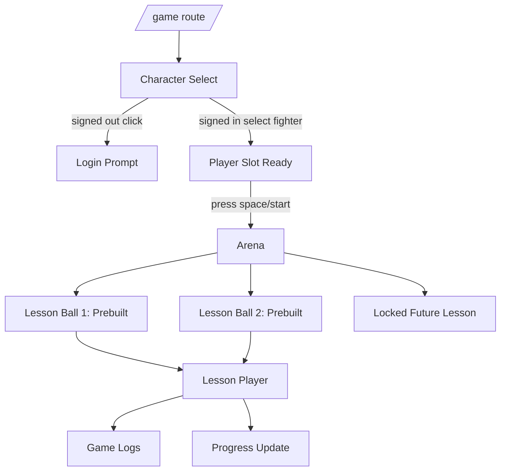

# Game Lesson Master Plan

## Goal Capsule

| Field | Value |
| --- | --- |
| Objective | Add a new `/game` experience to Quadratics that turns sixth-grade guided-notes worksheets into a fast, game-like instructional lesson flow with prebuilt demos, account progress, inspectable logs, and rendered worksheet videos. |
| Means | Build an isolated game route, asset manifest, level/progress model, worksheet template schema, worksheet lesson pipeline, handwriting-style reveal renderer, narration sync, Motion Canvas composition, and game-specific log surface. |
| Authority | Deterministic template/layout code owns worksheet placement and text correctness. LLMs may write concise teaching narration or student-friendly context only after template facts and answer keys exist. Provider calls remain behind adapters. |
| Stop Conditions | Stop after the plan is documented. The first implementation sprint should aim for a convincing `/game` demo with two prebuilt lessons and a reversible architecture, not arbitrary worksheet generation. |
| Execution Profile | Large, cross-cutting product addition across Next.js UI, API schemas/routes, Supabase persistence, Motion Canvas rendering, assets, fixtures, tests, and docs. |

---

## Product Contract

### Summary

The new feature is a separate game-inspired learning surface inside the existing Quadratics repo, mounted at `/game`. It should feel like an N64-era character select and arena experience, then transition into a worksheet lesson video where content is progressively filled in with animated handwriting and narration. It should be compelling enough for a sixth grader to watch, while staying technically grounded: deterministic layout and reusable animation should do the correctness-sensitive work, not expensive or unreliable generative video.

The first build should support two prebuilt demo lessons based on the task materials in `misc/task/`. A later locked lesson can become the path for generated or randomized worksheets, but that should be scaffolded rather than fully implemented in the first release.

### Problem Frame

Quadratics already proves a transparent artifact pipeline for generated math videos: deterministic math, LLM narration/planning, ElevenLabs audio, Motion Canvas rendering, private storage, and UI logs. The game feature should reuse that philosophy, but the domain is different. Instead of a quadratic equation, the input is a worksheet template and a lesson script for a sixth-grade guided-notes page. The product must support a much richer presentation layer without making the existing quadratic app harder to maintain.

The practical risk is scope explosion. Arbitrary worksheet understanding, Nintendo-like 3D assets, real-time game mechanics, generated random worksheets, and reusable character stroke libraries are all real work. The plan therefore starts template-constrained and demo-first, while keeping the architecture clean enough to swap assets, add worksheets, and deepen generation later.

### Key Decisions

- KD1. **Build `/game` as an isolated product surface** (session-settled: user-directed - chosen over replacing the current app because Quadratics must keep working as-is). Governs R1, R2, R55.
- KD2. **Use a few large implementation sprints** (session-settled: user-directed - chosen for speed, with clear module boundaries to keep changes reversible). Governs R63, R64.
- KD3. **Template-constrained worksheets first** (technical judgment - chosen over arbitrary worksheet recognition because V0 needs reliability and speed). Governs R12, R15, R20.
- KD4. **Deterministic handwriting/composition over generated video for text** (technical judgment - chosen because generated video is expensive and unreliable for exact math/text). Governs R24, R25, R30.
- KD5. **Reuse Motion Canvas for rendered lesson videos where it fits** (technical judgment - chosen over introducing a second video render stack before there is evidence Motion Canvas fights the desired output). Governs R28, R31, R34.
- KD6. **Use a separate game artifact/log namespace** (technical judgment - chosen over forcing worksheet stages into the existing quadratic stage enum too early). Governs R39, R41, R44.
- KD7. **Treat Smash-style assets as prototype/reference assets, not production-safe final assets** (risk management - The Models Resource pages confirm downloadable Master Hand and Smash Ball assets, but production usage needs licensed/original replacements). Governs R5, R8, R58.
- KD8. **Pre-render the first lessons and make generation explicit later** (cost/performance judgment - chosen so the public experience is fast and does not spend provider credits on every visitor). Governs R35, R47, R52.
- KD9. **Use read-only published demo snapshots before full game artifact reruns** (technical judgment - chosen to prove the learning experience quickly without overbuilding a second artifact engine before generated worksheets exist). Governs R41, R47, R55.
- KD10. **Use one Motion Canvas command with explicit scene dispatch** (technical judgment - chosen over a separate command so the existing render boundary remains stable while `renderKind` selects the quadratic or worksheet scene). Governs R28, R29, R33.

### Requirements

**Route and Product Isolation**

- R1. Add a new `/game` route that coexists with the current root Quadratics app without changing the current equation workflow.
- R2. Keep game-specific components, hooks, styles, fixtures, and tests under clearly named `game` or `worksheet` modules.
- R3. The route must share only stable platform primitives with the current app: auth helpers, API client patterns, storage signing, provider boundaries, and reusable UI tokens where helpful.
- R3a. The game route must keep the existing top Quadratics header/auth shell: logo/build/GitHub/account controls remain at the top, and the game experience renders below that shared chrome.
- R4. The game route must not import current quadratic-specific components such as `EquationForm` or `LessonResult` for core rendering.
- R5. Game assets must be referenced through manifests, not hardcoded throughout components, so copyrighted prototype assets can be replaced with original/licensed assets later.
- R6. The public page may render signed-out, but selecting/starting gated lessons and saving progress must respect auth rules.

**Game Experience**

- R7. The first screen should evoke an N64/Super Smash character select: character grid, a single player slot, hand cursor, login affordance, and "PRESS SPACE" start prompt after character selection.
- R8. The design may prototype from Smash references, but file names, code concepts, and docs should distinguish "prototype/reference" assets from production assets.
- R9. Signed-out users may browse the shell, but clicking a fighter should show a compact login-required prompt instead of starting progress-bearing gameplay.
- R10. Signed-in users can select a fighter, populate the single player slot, and press space or click/tap a start control.
- R11. The second screen should transition to a space/final-destination-inspired arena with the selected character, floating lesson balls, and clear locked/unlocked states.
- R12. The first two lesson balls represent prebuilt guided-notes lessons. A third locked ball is shown as a future/random lesson placeholder.
- R13. The third locked lesson must not trigger paid generation until a later sprint explicitly implements it.
- R14. The UX must work with keyboard, mouse, and touch. Keyboard controls should include arrow/wasd movement if an arena movement prototype ships, plus space/enter activation.
- R15. Visual polish should prioritize fluidity, readable text, fast load, and a fun classroom/game tone over full game-engine complexity.

**Worksheet Scope**

- R16. V0 supports template-constrained worksheets, not arbitrary worksheet ingestion.
- R17. The initial template is the sixth-grade guided notes page described by the user: Do Now with 3 questions, Vocabulary with 2 questions, and Guided Practice with a 4-by-4 table.
- R18. The task PDFs under `misc/task/task_document.pdf` and `misc/task/task_lesson.pdf` are local planning/fixture inputs. The current repo does not have PDF text extraction tooling installed, so extracting their exact text/coordinates is implementation work.
- R19. The worksheet template must be represented as structured data: page dimensions, named regions, region bounding boxes, writing lanes, answer slots, section order, and overflow constraints.
- R20. Each fillable item must have a stable ID so narration, writing animation, logs, and replay can all reference the same worksheet fact.
- R21. V0 content can be seeded manually from the sample worksheet after extraction. Later generated worksheets should use the same template schema rather than a separate path.
- R22. The worksheet renderer must be able to render a blank template, a partially filled page, and a completed page.
- R23. Every line of generated or seeded text must fit inside its target region or fail validation before video render.

**Handwriting and Video Composition**

- R24. The writing system must use deterministic text layout and handwriting-style reveal animation for correctness-sensitive worksheet text.
- R25. The first implementation may use a handwriting font plus stroke-reveal masks before investing in individually authored glyph animations.
- R26. Per-glyph stroke manifests are deferred until there is a second writing implementation that needs them; V0 should not add glyph interfaces ahead of the font/reveal path.
- R27. The animated hand is a visual follower of deterministic strokes. It must not be responsible for producing the real text.
- R28. The rendered lesson video should use Motion Canvas unless an implementation spike proves it cannot handle worksheet/paper composition cleanly.
- R29. The render scene should be data-driven like the current blackboard renderer: it consumes a worksheet lesson render input and does not call providers or decide pedagogy.
- R30. The rendered video target is 2-5 minutes for the assignment-style output, with checkpoints to avoid narration running too long.
- R31. The video should progressively fill worksheet content on screen from the guided notes while narration explains what is happening.
- R32. The first pass can use a paper-on-stage composition with a clean camera path. Page flipping, scrolling, and hand flourish animations are optional later polish.
- R33. Video output must include narration audio, deterministic writing timings, and a final MP4 stored in private or public-safe storage depending on whether it is demo content.
- R34. Prebuilt lesson videos should be generated once and reused for the public demo path.

**Narration, AI, and Guardrails**

- R35. Prebuilt lessons may use manually reviewed text and narration fixtures to avoid spending provider credits during public browsing.
- R36. Generated lesson narration must be concise, sixth-grade appropriate, and targeted at students learning volume with whole-number cubes.
- R37. LLM prompts must use structured worksheet facts and answer keys. They must not invent regions, answers, or worksheet text.
- R38. Any LLM-produced narration must validate against a word/time budget before it becomes current.
- R39. Provider usage must be logged for game-generation stages if paid OpenAI or ElevenLabs calls are made.
- R40. ElevenLabs can be reused for narration audio, but game narration should live behind a game/worksheet narration adapter or shared generic narration service, not the quadratic-specific lesson service.

**Logs and Inspectability**

- R41. `/game` must have its own internal/debug logs drawer for game lesson builds. The default student flow should focus on selecting, watching, and completing lessons.
- R42. Game logs should reuse concepts from the current pipeline UI: stage cards, status, version, provider/model metadata, signed media previews, errors, and input/output summaries. Run/rerun controls are deferred until generated worksheet stages exist.
- R43. Game logs must not alter the existing quadratic logs or stage order.
- R44. Proposed game stages are `worksheet_template`, `worksheet_content`, `lesson_script`, `speech_markup`, `narration_audio`, `writing_plan`, `resolved_writing_timeline`, `lesson_video_render`, and `published_game_video`.
- R45. A game log stage should explain its role in student-friendly/product-friendly terms. Public logs show redacted summaries only; raw JSON is owner/admin-only and must strip provider keys, bearer tokens, service-role keys, raw provider request bodies, and signed URLs unless freshly issued for an authorized viewer.
- R46. Expensive stages must require explicit action or use prebuilt artifacts; the UI must not accidentally call providers on hover, route load, or animation transitions.
- R47. The V0 game log model must support prebuilt/public demo artifacts as read-only published snapshots. User-owned generated artifacts become rerunnable entries only after the generated worksheet pipeline ships.
- R48. Log details should make it obvious how the worksheet was filled: region IDs, filled text, timings, narration segments, and render outputs.

**Data and Persistence**

- R49. Add game-specific shared TypeScript contracts in `packages/types` rather than duplicating shapes between API and web.
- R50. Store account progress separately from quadratic generation jobs. Selected fighter belongs on a user progress record; per-lesson completion/unlock state belongs in a normalized progress table keyed by `(user_id, lesson_id)`.
- R51. Provide a reset progress action for signed-in users.
- R52. Public prebuilt lesson metadata should be readable without auth so signed-out users can see the demo shell and preview content where intended.
- R53. Generation or progress mutations must require API authorization. Frontend-only gates are not sufficient.
- R54. If Supabase tables are added, include RLS policies that keep user-owned progress and generated artifacts scoped to the authenticated user.
- R55. The existing `generation_jobs` table should not be overloaded with worksheet/game data unless an explicit adapter proves it is the cleanest path.
- R55a. Public demo endpoints must return only `visibility = 'public_demo'` lesson metadata, published video refs, and redacted log summaries. Progress mutations, stage runs, private snapshots, private storage refs, and raw logs require authenticated ownership checks.

**Performance and Delivery**

- R56. The `/game` route must lazy-load heavy assets, large videos, and 3D/model code.
- R57. The first viewport should load quickly with poster images or lightweight sprites before any full video/model downloads.
- R58. Use sprite sheets, optimized images, or pre-rendered transparent assets where that gives the desired look without runtime 3D complexity.
- R59. Keep animation state local and predictable. Avoid global app remounts when toggling between route sections or log panels.
- R60. The experience should have explicit loading and failure states for asset manifests, progress, lesson metadata, and video playback.
- R60a. V0 must define states for character select, arena, lesson player, logs drawer, and reset: auth loading, signed out, no progress, metadata empty, manifest error, video loading, video error, completed, save failed, and reset confirm/cancel.
- R60b. V0 accessibility must include roving focus for fighter/lesson grids, visible focus states, ARIA labels/status messages for custom controls, minimum touch targets, and reduced-motion alternatives for transitions.

**Maintainability**

- R61. Each large sprint must leave the repo in a shippable state with tests/docs for the interfaces it adds.
- R62. New code should be easy to delete or replace: a future decision to remove Smash-style theming, replace Motion Canvas, or swap assets must not require rewriting auth or artifact logic.
- R63. Comments should explain non-obvious game/rendering math, coordinate transforms, template schemas, timing assumptions, and provider boundaries.
- R64. Avoid building a general game engine. Build only the interaction primitives needed for this route.

### Acceptance Examples

- AE1. Given a signed-out visitor opens `/game`, the character-select screen appears quickly and does not call paid provider APIs.
- AE2. Given a signed-out visitor clicks a fighter, the UI shows a login-required prompt and no progress mutation occurs.
- AE3. Given a signed-in user selects a fighter and presses space, the game transitions into the arena and preserves selected fighter state.
- AE4. Given a signed-in user enters the arena for the first time, two lesson balls are available and the future/random lesson ball is locked.
- AE5. Given a user completes a prebuilt lesson, progress records that completion and the locked lesson state can respond to that progress.
- AE6. Given progress is reset, the account returns to the initial locked/unwatched state without deleting prebuilt lesson artifacts.
- AE7. Given a prebuilt worksheet lesson, the video opens without triggering new OpenAI, ElevenLabs, or render calls.
- AE8. Given a worksheet template region is too small for generated text, validation fails before render and logs explain the failing region.
- AE9. Given a completed game lesson render, the game logs show the template, content, narration, writing timeline, and rendered video stages.
- AE10. Given a user opens the current Quadratics app after `/game` ships, equation submission, logs, latest video, instructors, and demo tab still work as before.
- AE11. Given a future generated worksheet run, paid stages record provider usage and remain independently rerunnable.
- AE12. Given a public visitor opens game logs, they see redacted stage summaries only; raw payload JSON and private storage refs are unavailable without owner/admin authorization.
- AE13. Given a user watches enough of a prebuilt lesson to count as complete, completion is saved; if saving fails, the UI reports the failure without falsely unlocking the next lesson.

### Scope Boundaries

#### In Scope For This Master Plan

- New `/game` product route.
- Game-style character select and arena shell.
- Two prebuilt lesson demos.
- Template-constrained worksheet schema.
- Published lesson snapshot model and future worksheet artifact/log model.
- Game progress model.
- Motion Canvas worksheet-video rendering path.
- Deterministic handwriting/writing-plan approach.
- Provider-boundary plan for narration and future content generation.
- Asset-risk plan and manifest strategy.

#### Deferred

- Fully arbitrary worksheet understanding.
- Production-safe original replacements for every Nintendo-inspired asset.
- Real-time multiplayer or full fighting-game mechanics.
- Truly random generated lessons.
- User-uploaded worksheet authoring UI.
- Full 3D hand physics.
- Automatically generating unique lesson templates with image generation.
- Billing, credits, or public account management beyond current internal auth.

#### Explicit Non-Goals

- Do not change the current Quadratics equation pipeline as part of the game work.
- Do not use an LLM as the source of worksheet answers or coordinate/layout truth.
- Do not make route load, hover, or idle animation trigger paid generation.
- Do not commit large downloaded third-party model ZIPs without an explicit asset decision.

---

## Technical Context

### Existing Repo Shape

- `apps/web` is a Next.js App Router app with the root product shell, auth, demo, equation form, lesson preview, and pipeline logs.
- `apps/api` is FastAPI with authenticated routes, deterministic math/lesson services, provider adapters, artifact lifecycle, Supabase repositories, usage logging, and render orchestration.
- `apps/video` is a Motion Canvas renderer with a command adapter used by the API.
- `packages/types` carries shared contracts.
- `infra/supabase` carries migrations.

### Existing Patterns To Reuse

- Auth helpers and server-side session resolution from the root page.
- API route style under `apps/api/app/api/routes`.
- Provider adapters under `apps/api/app/providers` and service boundaries under `apps/api/app/services`.
- Artifact lifecycle ideas: current/stale/completed/failed, input hashes, upstream IDs, storage references.
- Motion Canvas render command environment: `QUADRATICS_RENDER_INPUT_PATH` and `QUADRATICS_RENDER_OUTPUT_PATH`.
- Log card interaction style from the existing pipeline UI.

### Existing Patterns To Avoid Reusing Directly

- Quadratic-specific stage enum names for worksheet work.
- `EquationForm` as a generic game shell.
- `LessonResult` as a generic game lesson player.
- `generation_jobs.equation_input` as a catch-all for worksheet/video jobs.
- Current quadratic assumptions in prompts, math-line IDs, and animation planner primitives.

### Source Notes

- The task PDFs exist locally at `misc/task/task_document.pdf` and `misc/task/task_lesson.pdf`, but the current environment lacks `pdftotext`, `pypdf`, and `pdfplumber`. Sprint 2 should include a real extraction/inspection step.
- The Models Resource page for Master Hand lists a downloadable ZIP containing `.obj`, `.mtl`, and `.png` files for a Super Smash Bros. N64 asset.
- The Models Resource page for Smash Ball lists a downloadable ZIP containing `.dae`, `.obj`, `.mtl`, and texture PNG files for a Super Smash Bros. Brawl asset.
- These are useful prototype references, but they are not automatically production-safe assets.

---

## Architecture Overview

### Route-Level Flow



### Worksheet Video Pipeline

```text
worksheet_template
  -> worksheet_content
  -> lesson_script
  -> speech_markup
  -> narration_audio
  -> writing_plan
  -> resolved_writing_timeline
  -> lesson_video_render
  -> published_game_video
```

The first two demo lessons may ship with prebuilt artifacts for all stages. The pipeline still matters because it gives the logs a truthful production story and gives later sprints a path to regenerate individual stages.

V0 should not build a full rerunnable game artifact engine before generated worksheets exist. It should ship read-only published lesson snapshots that look like pipeline logs because they are backed by real fixture metadata and rendered videos. The full lifecycle service starts in Sprint 2 only after the worksheet template, render spike, and ownership model are concrete.

### Suggested Directory Layout

```text
apps/web/app/game/page.tsx
apps/web/components/game/
  character-select.tsx
  player-slot.tsx
  arena.tsx
  lesson-ball.tsx
  game-lesson-player.tsx
  game-logs.tsx
  game-login-prompt.tsx
apps/web/lib/game/
  assets.ts
  api.ts
  progress.ts
  state.ts

apps/api/app/api/routes/game_lessons.py
apps/api/app/api/routes/game_progress.py
apps/api/app/services/game/
  lessons.py
  logs.py
  progress.py
  publishing.py
apps/api/app/services/worksheet/
  templates.py
  content.py
  validation.py
  writing_plan.py
  timeline.py
apps/api/app/providers/openai/worksheet_lesson_provider.py

apps/video/src/game/
  scenes/worksheetLesson.tsx
  components/Paper.tsx
  components/StageBackdrop.tsx
  components/WritingLayer.tsx
  components/GameHand.tsx
  timeline/input.ts

packages/types/src/game.ts
packages/types/src/worksheet.ts

fixtures/game/
  templates/
  lessons/
  render-inputs/
  posters/
```

This layout is intentionally easy to reverse: deleting `/game`, `components/game`, `services/game`, `services/worksheet`, and `apps/video/src/game` should not touch the current quadratic workflow.

### Game Log Presentation

V0 logs live behind an internal/debug drawer:

- desktop: a right-side drawer that does not cover the lesson video controls by default
- mobile: a full-screen sheet with an obvious close control
- trigger: a small "logs" or terminal-style icon in the game HUD/lesson player
- focus: opening the drawer moves focus into it; closing returns focus to the trigger
- student path: logs are hidden unless explicitly opened
- public view: redacted stage summaries only
- owner/admin view: raw payload JSON is available after redaction and authorization

This keeps the sixth-grade-facing flow simple while preserving the inspectable pipeline story for demos and debugging.

### Lesson Player Lifecycle

```text
arena lesson ball selected
  -> lesson player loads metadata and poster
  -> video can be played/replayed
  -> completion threshold reached
  -> progress save attempted
  -> success unlocks eligible next state
  -> failure shows retry/save-failed state without falsely unlocking
  -> user can return to arena or open logs
```

The initial completion threshold can be pragmatic, such as video ended or at least 90% watched. The exact threshold belongs in the Sprint 1 implementation checklist so progress behavior is not guessed.

### Endpoint Auth Matrix

| Endpoint shape | Auth | Returns |
| --- | --- | --- |
| `GET /api/v1/game/lessons/public` | none | Public demo lesson metadata, posters, published video refs, redacted log summaries. |
| `GET /api/v1/game/lessons/{slug}` for public demo | optional user | Same public payload plus viewer progress if authenticated. |
| `GET /api/v1/game/me/progress` | required user | Selected fighter and per-lesson progress for `current_user.id`. |
| `POST /api/v1/game/me/progress/*` | required user | Mutates only `current_user.id` progress. |
| `GET /api/v1/game/lessons/{id}/logs/raw` | owner/admin only | Redacted raw artifact payloads and fresh signed URLs where authorized. |
| `POST /api/v1/game/lessons/{id}/stages/{stage}` | owner/admin only; future | Runs generated worksheet stages only after the paid/generation pipeline is implemented. |
| seeding/publishing | server-only CLI or migration | Uses service-role credentials outside browser/API user routes. |

If a route accepts optional auth, implement it with an optional-user dependency rather than the existing mandatory bearer dependency, which rejects missing credentials.

---

## Data Model

### Shared Types

Add shared contracts similar to:

```ts
export type GameLessonStage =
  | "worksheet_template"
  | "worksheet_content"
  | "lesson_script"
  | "speech_markup"
  | "narration_audio"
  | "writing_plan"
  | "resolved_writing_timeline"
  | "lesson_video_render"
  | "published_game_video";

export interface WorksheetTemplate {
  id: string;
  title: string;
  page: {width: number; height: number};
  regions: WorksheetRegion[];
}

export interface WorksheetRegion {
  id: string;
  label: string;
  kind: "section_title" | "prompt" | "answer_slot" | "table_cell" | "image_slot";
  bounds: {x: number; y: number; width: number; height: number};
  writing: {maxLines: number; maxCharsPerLine: number; baselinePx: number};
}

export interface GameLessonArtifact {
  id: string;
  lessonId: string;
  userId?: string | null;
  stage: GameLessonStage;
  status: "pending" | "running" | "completed" | "failed" | "stale" | "skipped";
  version: number;
  inputHash: string;
  payload?: Record<string, unknown>;
  storageObjects?: ArtifactStorageObject[];
}
```

The exact persistence can evolve, but the contract should separate game stages from existing quadratic `ArtifactStage`. For V0, this shape may live as static/seeded published snapshot JSON. A Supabase-backed `GameArtifactLifecycleService` should be introduced only when stage reruns or generated worksheets are implemented.

### Supabase Tables

Prefer new tables instead of overloading `generation_jobs`:

```text
game_lessons
  id uuid primary key
  slug text unique
  title text
  owner_user_id uuid null references auth.users
  visibility text check (visibility in ('public_demo', 'private'))
  worksheet_template_id text
  status text
  metadata jsonb
  created_at timestamptz
  updated_at timestamptz

game_published_lesson_snapshots
  id uuid primary key
  game_lesson_id uuid references game_lessons
  published_video_objects jsonb
  redacted_log_summary jsonb
  poster_object jsonb
  created_at timestamptz

game_lesson_artifacts
  id uuid primary key
  game_lesson_id uuid references game_lessons
  user_id uuid not null references auth.users
  stage text
  version integer
  status text
  input_hash text
  upstream_artifact_ids uuid[]
  provider text
  model text
  config_metadata jsonb
  payload_json jsonb
  storage_objects jsonb
  is_current boolean
  created_at timestamptz
  completed_at timestamptz

game_user_progress
  id uuid primary key
  user_id uuid references auth.users
  selected_fighter_id text
  metadata jsonb
  created_at timestamptz
  updated_at timestamptz

game_user_lesson_progress
  id uuid primary key
  user_id uuid references auth.users
  game_lesson_id uuid references game_lessons
  status text check (status in ('locked', 'unlocked', 'started', 'completed'))
  unlocked_at timestamptz
  completed_at timestamptz
  source text
  metadata jsonb
  unique (user_id, game_lesson_id)
```

Public demo lessons are published snapshots, not raw artifacts with `user_id = null`. User-generated artifacts remain owned and private by default.

### Asset Manifest

```ts
export interface GameAssetManifest {
  fighters: FighterAsset[];
  cursors: CursorAsset[];
  stageBackdrops: StageAsset[];
  lessonBalls: LessonBallAsset[];
  audioCues: AudioCueAsset[];
}

export interface FighterAsset {
  id: string;
  displayName: string;
  portraitUrl: string;
  spriteUrl?: string;
  modelUrl?: string;
  legalStatus: "prototype_reference" | "licensed" | "original";
}
```

Keep the manifest as the only place that knows whether an asset is prototype/reference, licensed, or original.

---

## Implementation Units

The user explicitly prefers as few sprints as practical. These are large sprints by design. Each ends with a usable checkpoint and a clean rollback boundary.

### Sprint 1: Vertical Slice Game Demo

**Objective:** Ship the first convincing `/game` demo slice: shared Quadratics header, character select, arena, at least one complete playable prebuilt lesson video, read-only redacted logs backed by real fixture metadata, and account progress for selected fighter/completion/reset.

**Primary Changes**

- Add `/game` route and game layout container under the existing top Quadratics header/auth shell.
- Add game component folder and route-local styles.
- Build character select:
  - fighter grid
  - single player slot
  - hand cursor or cursor-following visual
  - login prompt for signed-out selection attempts
  - "PRESS SPACE" start affordance after selection
- Build arena:
  - selected fighter visible
  - two unlocked lesson balls
  - one locked future lesson ball
  - simple keyboard/touch activation
- Add asset manifest:
  - neutral stable fighter IDs/display names, with Smash inspiration recorded only as replaceable manifest metadata
  - lesson ball assets
  - stage background placeholder
  - audio cues placeholders
  - legal status field for every asset
- Add minimum fixture selection and extraction:
  - confirm lesson 1 fixture from `misc/task/task_lesson.pdf`
  - choose whether lesson 2 is a real second worksheet fixture or an explicit coming-soon/locked lesson
  - create enough structured metadata for truthful logs and playback
- Add progress read/write API:
  - get progress
  - update selected fighter
  - mark lesson completed
  - reset progress
  - persist selected fighter separately from normalized per-lesson progress rows
- Add seed/prebuilt lesson metadata:
  - lesson 1: sample worksheet lesson
  - lesson 2: second real fixture if selected before Sprint 1 starts; otherwise a locked/coming-soon lesson
  - lesson 3: locked future/random placeholder
- Add one playable prebuilt video fixture:
  - can be a manually produced or temporary render fixture for Sprint 1
  - must have poster/metadata and not trigger provider calls
  - if two real lesson fixtures are ready, include two playable videos
- Add game logs panel:
  - shows stage cards for prebuilt artifacts
  - read-only first
  - redacted status, version, payload summary, storage preview, and published video details
  - desktop right-side drawer; mobile full-screen sheet
  - hidden unless explicitly opened from the game HUD/lesson player
- Add state and accessibility coverage:
  - auth loading, signed out, no progress, metadata empty, manifest error, video loading, video error, completed, save failed, reset confirm, reset cancel
  - roving focus for fighter/lesson grids, visible focus states, ARIA labels/status messages, minimum touch targets, reduced-motion alternatives
- Add route-level performance:
  - lazy load videos/models
  - use poster images
  - no provider calls on route load
- Add tests:
  - signed-out click prompts login
  - signed-in selection updates UI
  - video completion threshold saves progress
  - progress save failure does not unlock falsely
  - progress reset state
  - logs render redacted seeded stages
  - current root app smoke test remains unaffected

**Design Notes**

- Use CSS/DOM and lightweight canvas only if needed. Do not introduce Phaser or Three.js in Sprint 1 unless the shell cannot meet the interaction target.
- Keep visual assets local and optimized. Do not commit raw downloadable ZIPs by default.
- Put any third-party or prototype assets behind a manifest with `legalStatus: "prototype_reference"`.

**Exit Criteria**

- `/game` loads fast with no paid API calls.
- Signed-out behavior is clear.
- Signed-in users can select a fighter, start, enter arena, choose a playable prebuilt lesson, watch/replay it, save completion, reset progress, and inspect redacted logs.
- At least one prebuilt lesson video is real and playable. If the second fixture is not selected before Sprint 1 starts, it is intentionally locked/coming soon rather than a fake placeholder.
- Existing `/` route works unchanged.
- Branch includes focused web/API tests and docs for new game modules.

### Sprint 2: Worksheet Template, Render Spike, and Artifact Foundation

**Objective:** Turn the task worksheet into a structured, validated, inspectable lesson representation, prove the Motion Canvas worksheet render path early, and introduce the private game artifact foundation only where it is needed for generated/rerunnable work.

**Primary Changes**

- Add PDF/template inspection tooling:
  - choose a library/tool for extraction in the repo environment
  - inspect `misc/task/task_document.pdf`
  - inspect `misc/task/task_lesson.pdf`
  - capture page dimensions, text, images, and likely fill regions
- Create worksheet template schema:
  - page size
  - regions
  - answer slots
  - table cells
  - writing lanes
  - overflow constraints
- Create seeded worksheet templates:
  - blank template fixture
  - completed sample content fixture
  - partially filled fixture for render tests
- Add deterministic validators:
  - required region IDs exist
  - all content targets valid regions
  - line length/height fit
  - generated text does not overflow
  - section order is valid
  - renderer measurement is canonical, using the exact pinned font/assets that Motion Canvas loads
- Add worksheet lesson pipeline services:
  - load template
  - build content plan
  - build narration-ready lesson segments
  - create writing plan
  - resolve writing timeline
- Add early Motion Canvas render spike:
  - one real worksheet page
  - handwriting font/reveal
  - simple narration or silent timing fixture
  - camera framing readable on desktop and mobile
  - screenshot/MP4 check for overflow
  - pass/fail decision before building the full generated timeline path
- Add game artifact lifecycle:
  - create a separate `GameArtifactLifecycleService` and Supabase repository/table for private `game_lesson_artifacts`
  - do not refactor the existing quadratic artifact lifecycle in this sprint
  - current/stale/reuse semantics mirror the quadratic pipeline once generated stage reruns exist
- Add game logs as inspectable for safe/deterministic stages:
  - `worksheet_template`
  - `worksheet_content`
  - `writing_plan`
  - `resolved_writing_timeline`
- Add API endpoints:
  - list public game lessons
  - get game lesson snapshot
  - get game logs
  - private/owner raw logs
  - generated stage run endpoint may be scaffolded but should remain disabled or admin-only until generated lessons are implemented
  - no paid provider calls yet unless explicitly gated
- Add tests:
  - template validation
  - overflow failures
  - artifact cache reuse
  - stale propagation
  - public demo read access
  - user-owned generated artifact access denied across users

**Design Notes**

- Do not solve arbitrary PDFs. Create a precise template for the known worksheet family.
- Keep region IDs human readable: `do_now.q1.answer`, `vocabulary.q2.definition`, `guided_practice.row_1.volume`.
- A screenshot/PDF-to-image conversion may be useful as a background, but structured regions still own the semantic coordinates.
- All provider-facing prompts later should consume this structured worksheet object, not raw PDF text.

**Exit Criteria**

- The sample worksheet exists as a typed fixture.
- The app can display worksheet regions and planned fills in logs.
- The API has a separate game artifact foundation, or a documented reason why Sprint 2 stayed with published snapshots only.
- The Motion Canvas worksheet render spike passes before full render planning proceeds.
- No generated text can silently overflow a worksheet region.

### Sprint 3: Narration, Handwriting Video Renderer, and Prebuilt Demo Videos

**Objective:** Render the first polished worksheet lesson videos with narration, handwriting-style reveal, game stage presentation, and inspectable logs.

**Primary Changes**

- Add game narration provider boundary:
  - script generation provider for sixth-grade lesson narration
  - speech markup provider if needed
  - ElevenLabs narration adapter reuse where safe
  - development narration provider for fixture/local runs
- Add prompts and guardrails:
  - target sixth grader
  - concise language
  - explain guided notes clearly
  - no invented worksheet facts
  - strict word/time budget
- Add usage logging for paid game stages.
- Add Motion Canvas worksheet scene:
  - stage/space background
  - paper/worksheet placement
  - camera framing
  - writing layer
  - optional animated hand follower
  - section-by-section fills
  - captions if useful
- Add handwriting renderer:
  - Sprint 3A: handwriting font plus stroke reveal/masks
  - defer per-glyph stroke manifests until there is a second writing implementation that needs them
- Add render input contract:
  - worksheet template
  - worksheet content
  - narration segments and storage refs
  - writing timeline
  - assets manifest refs
  - render config/version
- Add render command support:
  - extend the current render command with `renderKind: "quadratic_lesson" | "worksheet_lesson"`
  - update Motion Canvas project scene dispatch based on `renderKind`
  - preserve existing quadratic fixture behavior as the default or with explicit `quadratic_lesson`
- Produce and seed two prebuilt demo videos.
- Add storage/public demo strategy:
  - public-safe signed/public URLs for demo playback
  - private storage for user-generated videos
- Expand game logs:
  - `lesson_script`
  - `speech_markup`
  - `narration_audio`
  - `lesson_video_render`
  - `published_game_video`
- Add tests:
  - prompt validator rejects invented region references
  - narration segments align to writing steps
  - render input validates
  - fixture render smoke produces MP4
  - web player opens prebuilt video without provider calls

**Design Notes**

- The animated hand should follow the known writing path. It should not generate the letters.
- Ship the font/reveal path first. Do not add glyph manifest interfaces until there is evidence they are needed.
- The rendered lesson should be good enough for the demo before it is fully general.
- Use prebuilt outputs for the public path. Regeneration belongs in logs and should be explicit.

**Exit Criteria**

- Two prebuilt lessons have playable video outputs from `/game`.
- Game logs show the full production path.
- Local fixture render can run without paid providers.
- Paid provider calls are explicit and logged when enabled.
- Current quadratic Motion Canvas render still passes its fixture/smoke checks.

### Sprint 4: Unlocks, Generated Lesson Scaffold, Polish, and Hardening

**Objective:** Turn the demo into a durable product surface with unlock-rule polish, generated-lesson scaffolding, server-only publishing tools, and production hardening.

**Primary Changes**

- Complete unlock behavior:
  - locked lesson unlock rule
  - completion source/rule metadata
  - reset remains the Sprint 1 progress reset path
  - concurrency-safe updates for normalized per-lesson progress rows
- Add mystery/random lesson scaffold:
  - locked until prerequisites complete
  - metadata and log placeholders
  - explicit "generation unavailable in this build" state if not fully implemented
- Add server-only admin/fixture seeding flow:
  - seed prebuilt lessons
  - update published video references
  - validate public demo metadata
  - run as CLI/migration with service-role credentials, not as a normal authenticated browser route
- Add visual polish:
  - transitions between character select, arena, and lesson
  - responsive layout
  - reduced motion handling
  - audio mute/volume controls
  - poster/loading states
  - error states
- Add production checks:
  - asset file sizes
  - route bundle inspection
  - storage URL behavior
  - Supabase RLS test coverage
  - Vercel/Railway env requirements
- Add documentation:
  - `/game` architecture
  - asset manifest rules
  - worksheet template authoring
  - game logs/pipeline
  - how to regenerate demo videos
  - asset legal/risk notes

**Design Notes**

- The random lesson can stay deferred behind a polished locked state. That is preferable to a brittle half-generator.
- Keep generation model-independent in naming. Avoid baking a single future provider into public contracts.
- Do not expose admin-only generation controls publicly unless auth and cost safeguards are complete.

**Exit Criteria**

- `/game` is production-deployable as a demo surface.
- Users can complete lessons, reset progress, and see unlock states respond correctly.
- Logs are useful for game lessons without interfering with the current app logs.
- Docs explain how to add/replace assets and worksheet templates.
- Bundle and media loading are acceptable on desktop and mobile.

---

## Verification Contract

### Static Validation

Run after relevant implementation changes:

```sh
pnpm lint
pnpm typecheck
pnpm test
uv run --project apps/api pytest
```

For game-specific work, add focused checks:

```sh
pnpm --filter @quadratics/web test
pnpm --filter @quadratics/video build
pnpm video:fixture
```

If a separate game render fixture is added:

```sh
pnpm --filter @quadratics/video render:game:fixture
```

### Browser QA

Check at least:

- `/game` signed out, desktop.
- `/game` signed out, mobile.
- `/game` signed in, desktop.
- `/game` signed in, mobile.
- character select keyboard and pointer interaction.
- arena lesson-ball activation.
- game logs open/close and do not cover critical controls unexpectedly.
- prebuilt video playback.
- progress reset.
- current `/` app still works.

### Render QA

For each prebuilt lesson video:

- worksheet/paper is readable.
- writing appears in the correct region.
- no generated text overflows.
- narration is audible and synced closely enough to writing.
- captions, if present, do not cover worksheet content.
- total length is in the 2-5 minute target.
- video loads from the public/demo route without route-wide reloading.

### Security and Cost QA

- Signed-out users cannot mutate progress or run game stages.
- User A cannot read User B generated game artifacts.
- Public demo artifacts are intentionally public or intentionally signed for read.
- No provider API keys or service-role keys reach browser bundles.
- No paid provider call is made on route load, hover, character select, or video open.
- Force/regeneration controls name the paid stage before running.

---

## Risk Register

| Risk | Impact | Mitigation |
| --- | --- | --- |
| Copyright/asset reuse risk | Public launch could be blocked or require redesign. | Use manifest legal status, keep prototype assets isolated, plan original/licensed replacements before public marketing. |
| Scope creep into arbitrary worksheet understanding | Delays MVP and creates unreliable outputs. | V0 is template-constrained. Arbitrary worksheet support is deferred. |
| Handwriting glyph system takes too long | Delays visible demo. | Ship font plus stroke reveal first, and defer glyph manifest contracts until a second writing implementation needs them. |
| Runtime game assets make `/game` slow | Bad UX and poor demo. | Lazy load, use posters/sprites, avoid heavy 3D unless proven necessary. |
| Game stages pollute quadratic pipeline | Existing app becomes harder to maintain. | Separate route, contracts, tables, stages, and components. Reuse patterns, not quadratic-specific code. |
| Provider calls become accidental or expensive | Unexpected charges. | Prebuilt demos by default, explicit run controls, usage logging, no generation on load. |
| Worksheet text overflow | Render looks broken and harms trust. | Region validation before render, fixture screenshots, render tests. |
| Motion Canvas cannot handle desired game-like composition | Sprint 3 render may stall. | Run the worksheet render spike in Sprint 2 before committing to the full generated render path. |
| Public logs expose private build data | Sensitive provider payloads or signed URLs could leak. | Publish redacted snapshots for public demos; keep raw artifacts owner/admin-only with explicit DTO redaction. |
| Progress arrays become brittle | Unlock/reset logic can race or lose audit context. | Use normalized per-lesson progress rows with uniqueness and timestamps. |

---

## Open Questions

- OQ1. Should the first build use real referenced Smash assets locally, generated/original lookalike assets, or simple placeholders with the manifest ready for replacement?
- OQ2. Before Sprint 1 starts, should V0 ship one complete lesson plus locked/coming-soon slots, or do we have enough worksheet material to ship two complete prebuilt lessons?
- OQ3. Should prebuilt demo videos be public storage objects, signed URLs from a public endpoint, or committed lightweight demo assets?
- OQ4. Do we want the lesson video to show a full worksheet page the entire time, scroll down the page, or cut between enlarged regions?
- OQ5. Which teacher voice/instructor persona should narrate the sixth-grade lesson demos?
- OQ6. When the random lesson is eventually unlocked, should it generate a new worksheet, pick from a fixture pool, or accept an uploaded worksheet?

---

## First Implementation Prompt

Use this for Sprint 1:

```text
Create the first `/game` vertical slice for Quadratics without changing the existing root app workflow. Keep the existing top Quadratics header/auth shell, then build a signed-out/signed-in character select, one-player slot, login-required prompt, arena screen, at least one complete playable prebuilt lesson video, neutral asset manifest, normalized progress API, completion/reset behavior, and a read-only internal logs drawer backed by redacted fixture metadata. Keep all code isolated under game/worksheet modules, avoid paid provider calls on route load or playback, and add focused tests for routing, auth gating, progress state, video completion, redacted logs, accessibility basics, and root app regression.
```

---

## References

- Local task files: `misc/task/task_document.pdf`, `misc/task/task_lesson.pdf`
- Current architecture: `docs/reference/architecture.md`, `docs/reference/video-pipeline.md`, `docs/reference/auth-and-usage.md`
- Current app guides: `apps/web/AGENTS.md`, `apps/api/AGENTS.md`, `apps/video/AGENTS.md`
- Master Hand reference: https://models.spriters-resource.com/nintendo_64/ssb/asset/283437/
- Smash Ball reference: https://models.spriters-resource.com/wii/ssbb/asset/292971/
- User-provided video reference: https://www.youtube.com/watch?v=w-53zv1NdWo
