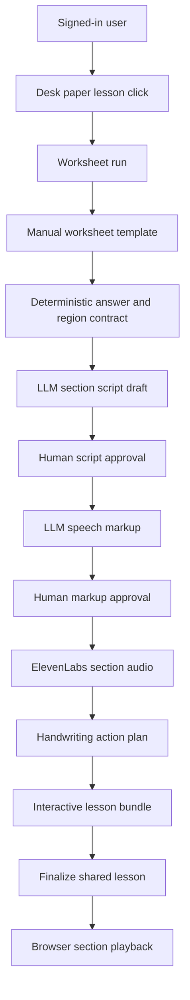
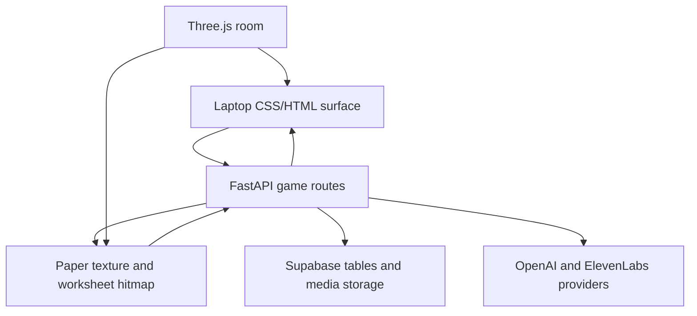
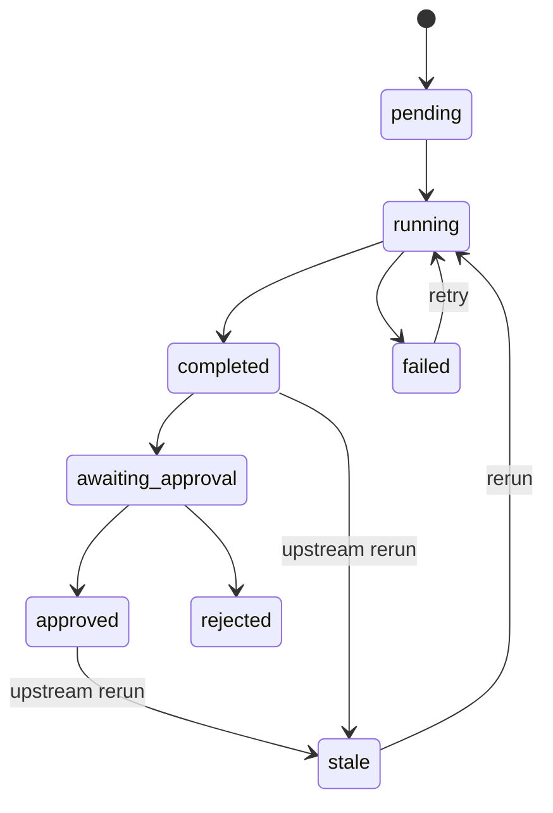
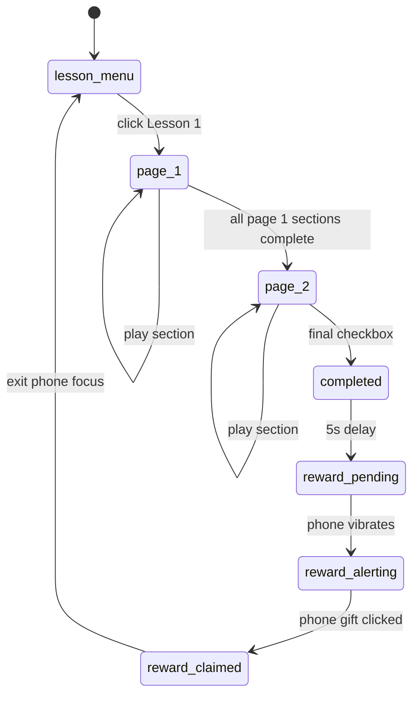

# Build Game Worksheet Lesson Pipeline

## Goal Capsule

- **Objective:** Turn `/game` from a visual study-room prototype into a signed-in interactive worksheet lesson system where Lesson 1 can be generated, inspected, approved, published, narrated, and played section by section on the desk paper.
- **Means:** Add a game-specific worksheet pipeline, laptop pipeline/cost controls, manual PDF region mapping, approved major-section narration, and browser-side handwriting playback while preserving the existing quadratic equation pipeline as a separate system.
- **Authority:** User direction in this planning conversation, `misc/task/task_document.pdf`, `misc/task/task_lesson.pdf`, existing repo docs, then existing implementation patterns.
- **Execution profile:** Deep, cross-cutting feature touching API, Supabase, providers, web game UI, asset handling, and browser QA.
- **Stop conditions:** Do not start implementation until this plan is approved. During implementation, stop before any product behavior that would make Lesson 2 dynamic, export MP4s, broaden the worksheet format, merge game costs into original Quadratics costs, or remove existing Quadratics functionality.
- **Tail ownership:** The branch should remain isolated until the game pipeline, docs, migrations, and browser QA pass.

---

## Product Contract

### Summary

The `/game` route will host an interactive worksheet lesson for the Modern Classrooms task. A signed-in user clicks Lesson 1 on the desk paper, the worksheet transforms into the mapped two-page PDF lesson, and the laptop exposes a logs-style pipeline where the user can inspect and approve each generated artifact before paid narration runs. The final output is not a video export; it is a playable instructional worksheet where clicking major sections plays narration and progressively fills in handwritten answers. Once Lesson 1 is finalized, the published lesson artifacts are reusable for every user, while each user's lesson completion and Easter egg progress stay account-specific.

### Problem Frame

The current game route has a strong environment: a desk, laptop, timer, music, map, paper, and pointer-lock interaction model. It does not yet have the actual learning pipeline required by the task. The original Quadratics app solved this class of problem with an artifact-backed pipeline, logs, provider isolation, and cost tracking. This plan applies those lessons to a new worksheet domain without coupling it to quadratic equations or Motion Canvas rendering.

The task asks for a 2-5 minute instructional video that teaches "Volume with Whole-Number Cubes" from guided notes. The product direction intentionally pivots from exported video to an interactive instructional game. To satisfy the spirit of the task, the interaction must still progressively fill guided notes, generate narration, sync narration to writing actions, and demonstrate strong technical judgment.

### Actors

- A1. **Signed-in learner or demo operator:** Uses `/game`, starts Lesson 1, reviews pipeline output, and plays the interactive worksheet lesson.
- A2. **Developer/demo builder:** Runs the pipeline repeatedly while tuning prompts, layout maps, voice selection, cost tracking, and animation quality.
- A3. **API service:** Owns authentication, artifact persistence, provider calls, cost events, and deterministic worksheet contracts.
- A4. **Browser game client:** Owns the room, focus modes, laptop UI, worksheet hit testing, narration playback, and handwriting animation.

### Requirements

**Access and lesson selection**

- R1. `/game` lessons require authentication before any lesson can start or any paid pipeline stage can run.
- R2. When a signed-out user clicks a lesson on the paper, the app shows an in-world message directing them to sign in on the laptop.
- R3. Lesson 1 is the only playable lesson in this plan; Lesson 2 remains locked and has no generation path.
- R4. The existing room, laptop, clock, music, phone, map, and paper interactions must remain intact unless a requirement below changes them.

**Worksheet model and deterministic layout**

- R5. Lesson 1 uses a manually defined worksheet template for the current PDF format rather than automatic PDF or vision layout detection.
- R6. The template must include accurate normalized regions for pages, sections, questions, fill targets, click targets, and explanatory metadata.
- R7. Deterministic template and answer data must be tested because it is the primary context supplied to LLM stages.
- R8. The implementation must keep the worksheet model extensible for future worksheets with the same structure, while not attempting dynamic worksheet generation now.

**Pipeline, approvals, and published lesson state**

- R9. The game pipeline is separate from the quadratic generation pipeline and uses game-specific runs, artifacts, cost events, and stage names.
- R10. The laptop includes tabs for `Demo`, `Pipeline`, `Costs`, `Music`, and `Settings`.
- R11. The `Pipeline` tab shows artifact-backed stage boxes that closely mimic the original app's vertical logs view: colored stage cards, status text, run buttons, loading indicators, stale/failed/completed states, and hoverable info icons.
- R12. Human approval is required before expensive downstream stages run, including approving the instructional script and provider-ready speech markup before ElevenLabs audio generation.
- R13. The pipeline can be run and inspected stage by stage during this build phase.
- R14. Rerunning an upstream game artifact marks dependent downstream game artifacts stale rather than deleting them.
- R15. Each pipeline stage must show an output preview after it runs, such as generated section script text, speech markup, audio references, handwriting actions, or bundle metadata.
- R16. The `Pipeline` tab includes a lesson-template link that opens the source worksheet PDF for quick reference without using the old room-blocking PDF modal.
- R17. Lesson 1 has a publish/finalize path that marks the approved interactive bundle as the shared canonical lesson output.
- R18. Pipeline reset and user progress reset are separate controls; resetting a user's progress must not delete published lesson artifacts.

**Instructional content**

- R19. The first target content is `misc/task/task_lesson.pdf`, covering the Do Now, Vocabulary, and Guided Practice table across pages 1-2.
- R20. Narration is generated per major section, not per individual micro-question.
- R21. LLM-generated scripts should target a total lesson narration length under roughly 3 minutes, treated as a prompt goal rather than a hard validator in this plan.
- R22. Speech markup is a distinct stage that converts approved script text into ElevenLabs-friendly wording and pause tags.
- R23. LLMs may produce instructional language and timing suggestions but must not redefine deterministic worksheet regions or answer keys.

**Narration and instructors**

- R24. Game narration reuses the existing instructor infrastructure and voice IDs.
- R25. The laptop shows instructor/voice selection for the game pipeline without exposing provider secrets.
- R26. ElevenLabs audio is generated per major section after approval, stored as a game artifact, and synchronized to section playback.
- R27. The default game voice is the existing male instructor voice unless the user selects another available voice.

**Interactive lesson playback**

- R28. The final output is an interactive lesson bundle, not an MP4 export.
- R29. Clicking a worksheet section in play mode triggers that section's narration and handwriting animation.
- R30. Completed sections visibly check off or otherwise show completion state.
- R31. Page 1 completion reveals a bottom navigation arrow to page 2; page 2 completion reveals a final completion checkbox or button.
- R32. Completing Lesson 1 returns the user to the lesson-selection paper and marks Lesson 1 complete for that account.
- R33. The browser renders a convincing handwritten ink reveal using a natural pen-like font or stroke treatment; exact pen-tip tracing can be approximate for this iteration.
- R34. The ballpoint pen object from the Office Pack acts as the focused-paper pointer, with the pen tip aligned to the click point.

**Costs and observability**

- R35. Game cost averages are separate from the original Quadratics averages.
- R36. Game average cost is calculated per completed full worksheet run, not from partial section attempts alone.
- R37. The `Costs` laptop tab shows total spend and stage/provider breakdowns for game runs.
- R38. OpenAI and ElevenLabs game usage events must be recorded with enough metadata to explain stage, provider, model, unit type, quantity, unit cost, and run association.

**Music, timer, and controls**

- R39. The `Music` tab provides three selectable YouTube-backed streams: Lo-Fi Girl at `https://www.youtube.com/watch?v=0muHFBSiybw`, techno at `https://www.youtube.com/watch?v=G-u5OhIeln4`, and classical at `https://www.youtube.com/watch?v=y6TZHLAzg5o`.
- R40. The `Music` tab includes a mute control and must preserve the single-player behavior that prevents duplicate overlapping audio.
- R41. The timer menu is named `Pomodoro Timer`, not `Desk Timer`.
- R42. When a Pomodoro timer reaches zero, the app plays `assets/alarm_sound.wav`.
- R43. `Space` pauses or resumes seated look mode and releases pointer lock when paused.
- R44. `Escape` only exits the current focused object back to the room view; it must not pause the app or release pointer lock.
- R45. After `Escape` exits a focused object, the user returns to room view still in the active look-mode state instead of needing to click again to reacquire pointer lock.

**Easter eggs and account progress**

- R46. Completing the interactive Lesson 1 flow starts a phone reward sequence five seconds later.
- R47. The phone reward vibrates continuously in room view using `assets/mobile-phone-vibration.mp3` until the user clicks the phone, signs out, or resets Lesson 1 progress.
- R48. If a signed-in user has an unclaimed Lesson 1 reward, the phone reward resumes after they sign back in.
- R49. The phone reward focus view shows a congratulations message, a wrapped gift prompt, and then plays `https://www.youtube.com/watch?v=dQw4w9WgXcQ` after the gift is clicked.
- R50. Leaving the phone focus stops the reward video and returns the phone to the normal deep-work quote behavior after the reward is claimed.
- R51. Clicking the golden egg on the mug opens an aerial coffee focus view that displays dynamic Easter egg progress.
- R52. Easter egg counts are persisted in Supabase and start with one available Easter egg: the Lesson 1 phone reward.

### Acceptance Examples

- AE1. Given a signed-out visitor in `/game`, when they click Lesson 1 on the paper, then no pipeline run is created and the UI points them to laptop sign-in.
- AE2. Given a signed-in user, when they click Lesson 1, then the paper becomes the manually mapped worksheet and the laptop `Pipeline` tab shows a run for that worksheet.
- AE3. Given an unapproved script artifact, when the user attempts to generate ElevenLabs audio, then the API refuses and explains that script and speech markup approval is required.
- AE4. Given an approved section with generated narration and handwriting actions, when the user clicks that worksheet section, then audio plays once, ink reveals progressively in the correct region, and the section becomes completed.
- AE5. Given a completed worksheet run, when the `Costs` tab loads, then the run contributes to the game average once as a full worksheet completion.
- AE6. Given the user is focused on the laptop, when they open `Music`, select techno, then classical, then Lo-Fi Girl, then mute, only one stream is active and the muted state is reflected.
- AE7. Given the user is focused on the paper, laptop, phone, clock, or map, when they press `Escape`, focus returns to room view while pointer lock remains active.
- AE8. Given the Pomodoro timer reaches zero, then `assets/alarm_sound.wav` plays and the timer visibly enters a finished state.
- AE9. Given a published Lesson 1 bundle, when a signed-in user completes page 1, then a page-advance control appears; when they complete page 2, then a final completion control appears and returns them to the lesson menu.
- AE10. Given Lesson 1 completion, when five seconds pass in room view, then the phone vibrates and shows an alert until the user focuses the phone.
- AE11. Given the user claims the phone gift, when the Rickroll video starts, then leaving phone focus stops the video and marks the Easter egg found.
- AE12. Given the user focuses the mug egg, then the coffee view shows the current Easter egg count such as `0 out of 1 Easter eggs found`.

### Scope Boundaries

#### In Scope

- Manual Lesson 1 template and region map.
- Game-specific persistence, artifacts, approvals, and usage events.
- Laptop tabs for demo, pipeline, costs, music, and settings.
- Reuse of existing instructor voice records.
- Browser playback with section clicks, narration, handwriting reveal, and completion state.
- Music selector and Pomodoro alarm changes.
- Pointer-lock control fixes.
- Phone reward and mug Easter egg progress infrastructure.

#### Deferred to Follow-Up Work

- Automatic PDF or vision-based worksheet layout extraction.
- Dynamic generated worksheets for Lesson 2.
- MP4 export or recording of the interactive lesson.
- Full pen-tip tracing for every glyph if the first implementation uses approximate text reveal.
- Multi-user classroom progress dashboards.
- Any new provider beyond OpenAI and ElevenLabs for this worksheet pipeline.
- Additional Easter eggs beyond the Lesson 1 phone reward.

#### Outside This Plan

- Changing the original quadratic equation pipeline stages.
- Replacing the current room aesthetic or reworking the desk/map/phone features unrelated to this pipeline.
- Adding avatars or talking heads to the task lesson.

### Sources

- `misc/task/task_document.pdf` - task requirements and evaluation framing.
- `misc/task/task_lesson.pdf` - Lesson 1 worksheet content and page structure.
- `README.md`, `docs/architecture.md`, `docs/video-pipeline.md`, `docs/auth-and-usage.md` - current product and architecture constraints.
- `apps/api/app/api/routes/generations.py`, `apps/api/app/services/artifacts`, `apps/api/app/services/usage/costs.py`, `apps/api/app/api/routes/instructors.py` - existing patterns for authenticated artifact stages, usage events, and instructor voices.
- `apps/web/components/game/game-shell.tsx` - current `/game` room, focus, laptop, music, timer, and interaction surface.
- `assets/alarm_sound.wav`, `assets/mobile-phone-vibration.mp3` - user-provided game audio assets.

---

## Planning Contract

### Key Technical Decisions

- KTD1. **Create a game-specific pipeline namespace.** Use new worksheet run and game artifact concepts rather than forcing worksheet work through `generation_jobs` and `generation_artifacts` as-is. The existing artifact lifecycle is a pattern to reuse, but the domain needs different template, approval, and playback semantics.
- KTD2. **Manual layout first.** Use a hand-authored, normalized Lesson 1 template because accuracy matters more than automation for the first task and the user explicitly prefers deterministic steps that can be tested.
- KTD3. **Approval gates are first-class artifacts.** Store approved script and speech markup state on artifacts or artifact approvals so the API can enforce "inspect before paid calls" instead of relying on frontend discipline.
- KTD4. **Major-section audio.** Generate audio by Do Now, Vocabulary, and Guided Practice. This keeps the number of paid calls small while giving the interactive lesson enough granularity for section playback. (session-settled: user-directed — chosen over per-question narration: it keeps the interaction granular enough without multiplying ElevenLabs calls.)
- KTD5. **Interactive bundle instead of MP4.** The final game artifact is a browser-playable bundle containing worksheet pages, region data, handwriting actions, audio references, and completion state. Rendering and export stay out of scope. (session-settled: user-directed — chosen over Motion Canvas or MP4 export: the deliverable is an interactive lesson, not a video file.)
- KTD6. **Reuse instructor voices, not avatar/media settings.** The game pipeline should use global instructor records for voice selection but should not inherit HeyGen avatar behavior or original video output choices.
- KTD7. **Game costs are isolated and completion-based.** Record raw game usage events per paid call, then compute average cost from completed worksheet runs. Partial test generations remain inspectable but do not skew the headline average as if they were full lesson completions.
- KTD8. **One persistent music player.** The laptop can switch between Lo-Fi Girl, techno, and classical streams, but the implementation must preserve the current single-player discipline so clicking out of focus does not spawn duplicate audio or stop unexpectedly.
- KTD9. **Pointer lock is controlled by Space, not Escape.** Escape is a local focus-back action. This keeps focused laptop/paper/clock/map/phone views usable without unintentionally leaving the immersive scene.
- KTD10. **Published lesson artifacts are shared, progress is per-user.** The expensive finalized Lesson 1 bundle should be reusable for all users, while completion, reward, and Easter egg states remain user-owned. (session-settled: user-directed — chosen over regenerating Lesson 1 per account: shared artifacts avoid repeated provider spend.)
- KTD11. **Laptop pipeline mirrors original logs.** The game pipeline UI should reuse the proven vertical logs language from the quadratic app instead of inventing a new compact dashboard. (session-settled: user-directed — chosen over a new game-only layout: visual parity makes stage state and stale behavior understandable.)

### High-Level Technical Design

#### Data Flow



#### Runtime Surfaces



#### Stage Lifecycle



#### User Playback And Reward Lifecycle



#### Laptop Pipeline Surface

```text
Laptop / Pipeline tab
  Header: Lesson 1, instructor selector, template PDF link, reset controls
  Stage card: template
  Stage card: section_script
  Stage card: speech_markup
  Stage card: narration
  Stage card: handwriting
  Stage card: interactive_bundle
  Stage card: lesson_publish
```

Each card follows the main logs card pattern: colored border, info icon, status row, run or retry button, stale/failed text, and an output preview area. The laptop viewport scrolls vertically instead of compressing the cards.

### Output Structure

The exact file names may shift during implementation, but the implementation should trend toward this shape:

```text
apps/api/app/api/routes/game_lessons.py
apps/api/app/schemas/game_lessons.py
apps/api/app/services/game_lessons/
apps/api/app/services/game_lessons/templates/
apps/api/app/services/game_lessons/pipeline/
apps/api/app/providers/openai/game_lesson_script_provider.py
apps/api/app/providers/openai/game_speech_markup_provider.py
apps/web/components/game/laptop/
apps/web/components/game/worksheet/
apps/web/lib/game/
apps/web/public/game/assets/audio/mobile-phone-vibration.mp3
apps/web/tests/game-lesson-pipeline.test.tsx
apps/web/tests/game-shell-interactions.test.tsx
apps/web/tests/e2e/game-lesson-pipeline.spec.ts
infra/supabase/migrations/0010_game_worksheet_pipeline.sql
```

### Assumptions

- The first implementation can use extracted page images from `misc/task/task_lesson.pdf` as the rendered worksheet base while storing the original source path in the template metadata.
- The existing API can continue using service-role Supabase access behind authenticated FastAPI routes, with RLS added for user-owned game tables where practical.
- The first handwriting implementation can use browser-rendered text with a handwritten font and progressive reveal masks if full glyph path tracing is too expensive for the first pass.
- The game pipeline can initially support one template ID, `volume-cubes-lesson-1`, while schemas and table constraints allow future template IDs.
- The existing phone, mug, clock, laptop, and map focus framework can be extended without another room-scale scene refactor.
- YouTube embeds can use the same privacy and no-sign-in mitigation already used on the laptop music/demo surfaces.

### Sequencing

Build the backend contracts before the high-polish playback. The important dependency chain is: persistence and template contract, then stage APIs and approvals, then laptop pipeline UI, then paid provider integration, then interactive playback, then costs/music/timer polish and full browser QA.

---

## Implementation Units

### U1. Game Worksheet Persistence And Artifact Model

- **Goal:** Add Supabase and API storage primitives for worksheet templates, worksheet runs, game artifacts, approvals, and game usage events.
- **Requirements:** R1, R3, R5, R8, R9, R12, R14, R17, R18, R35, R36, R38, R46-R52.
- **Dependencies:** None.
- **Files:**
  - `infra/supabase/migrations/0010_game_worksheet_pipeline.sql`
  - `apps/api/app/schemas/game_lessons.py`
  - `apps/api/app/services/game_lessons/repository.py`
  - `apps/api/tests/test_game_lesson_repository.py`
  - `apps/api/tests/test_game_lesson_schema.py`
- **Approach:**
  1. Add tables for worksheet templates, worksheet runs, game artifacts, artifact dependencies, artifact approvals, published lesson bundles, user lesson progress, Easter egg definitions, user Easter egg progress, and game usage events or a scoped extension of usage events.
  2. Make authoring worksheet runs user-owned, but make published Lesson 1 artifacts globally readable through authenticated API routes once finalized.
  3. Store stage status, version, input hash, payload JSON, storage references, approval state, and stale metadata in game artifacts.
  4. Preserve existing `game_user_progress` and `game_user_lesson_progress`; either reference worksheet runs from progress metadata or add explicit nullable foreign keys if the relationship is stable.
  5. Store user progress separately from pipeline artifacts so "reset lesson progress" does not erase published pipeline work.
- **Patterns to follow:** `infra/supabase/migrations/0003_generation_artifacts.sql`, `apps/api/app/services/artifacts/repository.py`, `apps/api/app/services/usage/costs.py`.
- **Test scenarios:**
  - Creating a worksheet run for user A does not allow user B to read it through authenticated API access.
  - Completing a new current artifact marks the previous current artifact for the same run and stage non-current.
  - Regenerating an upstream artifact marks dependent downstream artifacts stale with a reason.
  - An approval record can only approve the current artifact version it references.
  - Game usage events with incomplete runs do not count toward full worksheet average cost.
  - Resetting user progress clears completion and unclaimed rewards without deleting shared published Lesson 1 artifacts.
- **Verification:** The database migration is idempotent, API tests pass with in-memory and Supabase-style repositories, and existing generation artifact tests remain unchanged.

### U2. Manual Lesson 1 Worksheet Template

- **Goal:** Create a tested manual template for `misc/task/task_lesson.pdf` with normalized page regions, sections, questions, answer targets, and deterministic context.
- **Requirements:** R5, R6, R7, R8, R19, R23.
- **Dependencies:** U1.
- **Files:**
  - `apps/api/app/services/game_lessons/templates/volume_cubes_lesson_1.py`
  - `apps/api/app/services/game_lessons/templates/base.py`
  - `apps/api/tests/test_volume_cubes_lesson_template.py`
  - `apps/web/public/game/worksheets/volume-cubes-lesson-1/page-1.png`
  - `apps/web/public/game/worksheets/volume-cubes-lesson-1/page-2.png`
- **Approach:**
  1. Render the two PDF pages into stable image assets for the browser.
  2. Define page dimensions and normalized rectangles for Do Now, Vocabulary, Guided Practice rows, checkbox areas, and fill targets.
  3. Include deterministic answer data for every fillable item visible in pages 1-2.
  4. Include section summaries and LLM context strings that describe each region without letting the LLM infer geometry.
  5. Add test fixtures that assert every region is within page bounds, has a stable ID, belongs to a section, and has a valid role.
- **Patterns to follow:** Existing deterministic math-source discipline in `docs/video-pipeline.md` and existing schema tests in `apps/api/tests`.
- **Test scenarios:**
  - The template exposes exactly two pages for Lesson 1.
  - All regions have normalized coordinates between 0 and 1 and positive width and height.
  - Every fill target references an existing section and question.
  - The Do Now, Vocabulary, and Guided Practice sections are present with stable IDs.
  - The template serializes to the API schema without losing region IDs or answer metadata.
- **Verification:** A human can compare rendered page images with the JSON/template region overlay in a dev utility or test snapshot, and the API template tests prove deterministic coverage.

### U3. Game Lesson API Routes And Stage Orchestration

- **Goal:** Add authenticated routes to create/load worksheet runs, list pipeline artifacts, run stages, approve artifacts, and return interactive lesson bundles.
- **Requirements:** R1, R2, R9, R10, R11, R12, R13, R14, R15-R18, R28.
- **Dependencies:** U1, U2.
- **Files:**
  - `apps/api/app/api/routes/game_lessons.py`
  - `apps/api/app/main.py`
  - `apps/api/app/services/game_lessons/pipeline/service.py`
  - `apps/api/app/services/game_lessons/pipeline/lifecycle.py`
  - `apps/api/tests/test_game_lessons_api.py`
- **Approach:**
  1. Add `POST /api/v1/game/lessons/{template_id}/runs` to start or reuse a signed-in user's worksheet run.
  2. Add `GET /api/v1/game/lesson-runs/{run_id}` to return run snapshot, current artifacts, approval states, and costs.
  3. Add `POST /api/v1/game/lesson-runs/{run_id}/stages/{stage}` for stage execution.
  4. Add `POST /api/v1/game/artifacts/{artifact_id}/approve` and reject/update endpoints for human approval gates.
  5. Add `GET /api/v1/game/lesson-runs/{run_id}/bundle` for the browser-playable bundle once enough artifacts exist.
  6. Add a finalize/publish endpoint or stage that promotes an approved bundle into the shared Lesson 1 output.
- **Patterns to follow:** `apps/api/app/api/routes/generations.py` for authenticated stage routing and `apps/api/app/api/routes/instructors.py` for instructor access.
- **Test scenarios:**
  - Signed-out requests to create a worksheet run return authentication failure.
  - Signed-in user can create or reuse a Lesson 1 run.
  - Attempting to run an unknown stage returns a stable 404 or 400 response.
  - Attempting to run a downstream paid stage before approval returns 409 with a clear approval message.
  - User A cannot run stages against user B's run.
  - Rerunning a stage with `force` creates a new version and stales descendants.
  - Publishing a bundle makes it loadable for a different signed-in user without copying paid artifacts.
- **Verification:** API route tests cover auth, ownership, stage ordering, approval gates, stale behavior, and snapshot shape.

### U4. Script, Speech Markup, And Approval Stages

- **Goal:** Implement LLM-backed section script and ElevenLabs-ready speech markup stages with human approval before narration.
- **Requirements:** R12, R19, R20, R21, R22, R23.
- **Dependencies:** U2, U3.
- **Files:**
  - `apps/api/app/providers/openai/game_lesson_script_provider.py`
  - `apps/api/app/providers/openai/game_speech_markup_provider.py`
  - `apps/api/app/services/game_lessons/pipeline/script_stage.py`
  - `apps/api/app/services/game_lessons/pipeline/speech_markup_stage.py`
  - `apps/api/app/services/game_lessons/prompts/volume_cubes_script.md`
  - `apps/api/app/services/game_lessons/prompts/worksheet_speech_markup.md`
  - `apps/api/tests/test_game_lesson_script_stage.py`
  - `apps/api/tests/test_game_speech_markup_stage.py`
- **Approach:**
  1. Generate scripts per major section using the manual template, deterministic answer key, and section metadata.
  2. Require output to reference section and region IDs rather than inventing worksheet structure.
  3. Store script artifacts as inspectable JSON with section text, target duration estimates, and source prompt metadata.
  4. Convert approved script text into speech markup with spoken math phrasing and pause tags.
  5. Require approval of speech markup before narration.
- **Patterns to follow:** `apps/api/app/providers/openai/script_provider.py`, `apps/api/app/providers/openai/speech_markup_provider.py`, prompt-source metadata shown in existing pipeline info popovers.
- **Test scenarios:**
  - Script provider output missing a required section ID is rejected.
  - Script provider output introducing an unknown region ID is rejected.
  - Speech markup cannot run until script approval exists.
  - Speech markup output preserves the section segmentation needed for per-section audio.
  - OpenAI token usage is recorded as a game usage event associated with the worksheet run.
  - Development/test providers return deterministic outputs without calling OpenAI.
- **Verification:** Unit tests prove schema validation, approval gating, usage event recording, and deterministic development behavior.

### U5. ElevenLabs Narration Stage

- **Goal:** Generate, store, and expose per-section narration audio using existing instructor voice infrastructure.
- **Requirements:** R20, R24, R25, R26, R27, R35, R38.
- **Dependencies:** U3, U4.
- **Files:**
  - `apps/api/app/services/game_lessons/pipeline/narration_stage.py`
  - `apps/api/app/services/game_lessons/instructors.py`
  - `apps/api/app/schemas/game_lessons.py`
  - `apps/api/tests/test_game_narration_stage.py`
  - `apps/web/lib/game/api.ts`
- **Approach:**
  1. Resolve the selected instructor through the existing instructor repository.
  2. Reuse the existing ElevenLabs narration provider boundary where possible, with a game-specific request wrapper.
  3. Generate audio per major section and store media references in the artifact.
  4. Record ElevenLabs usage as game-specific usage events.
  5. Return signed URLs only through authenticated APIs; never expose provider keys client-side.
- **Patterns to follow:** `apps/api/app/services/narration/builder.py`, `apps/api/app/providers/elevenlabs/narration_provider.py`, `apps/api/app/api/routes/generations.py`.
- **Test scenarios:**
  - Narration cannot run without approved speech markup.
  - Missing instructor voice ID returns a clear 409 without making a provider call.
  - Generated audio artifacts include one media reference per major section.
  - ElevenLabs usage events include stage, model, credits or character units, and worksheet run ID.
  - Development/test provider returns fixture audio metadata without network calls.
- **Verification:** Tests prove gating, instructor reuse, media reference shape, and usage-cost recording.

### U6. Handwriting Action Plan And Interactive Lesson Bundle

- **Goal:** Convert approved worksheet content and narration metadata into a browser-playable bundle with handwriting actions and section completion state.
- **Requirements:** R28, R29, R30, R31, R32, R33, R34.
- **Dependencies:** U2, U5.
- **Files:**
  - `apps/api/app/services/game_lessons/pipeline/handwriting_stage.py`
  - `apps/api/app/services/game_lessons/pipeline/bundle_stage.py`
  - `apps/api/tests/test_game_handwriting_stage.py`
  - `apps/web/components/game/worksheet/interactive-worksheet.tsx`
  - `apps/web/components/game/worksheet/handwriting-layer.tsx`
  - `apps/web/lib/game/handwriting.ts`
  - `apps/web/tests/game-worksheet-playback.test.tsx`
- **Approach:**
  1. Generate deterministic handwriting actions from template fill targets and approved section scripts.
  2. Use a natural handwritten font or pen-stroke visual treatment and progressive reveal masks for the first implementation.
  3. Make each action reference a page, region, fill target, text payload, approximate start time, and duration.
  4. Bundle worksheet page images, region hitboxes, signed audio URLs, handwriting actions, page navigation rules, and section completion rules for browser playback.
  5. Keep the Office Pack ballpoint pen as the focused-paper pointer and keep the pen tip aligned to the current click point while sections play.
- **Patterns to follow:** Existing Three.js/CSS overlay split in `apps/web/components/game/game-shell.tsx`, existing artifact payload validation patterns.
- **Test scenarios:**
  - Clicking Do Now triggers only Do Now audio and Do Now handwriting actions.
  - Completed sections are visually marked and do not replay accidentally while audio is active.
  - Completing all page 1 sections reveals a page-advance arrow, and completing page 2 reveals a final completion control.
  - Handwriting actions render inside their referenced normalized regions at desktop and ultrawide sizes.
  - Missing audio for a section shows a clear "not generated yet" state instead of failing silently.
  - The bundle rejects unknown page or region references.
- **Verification:** Component tests prove playback state transitions, and Playwright visual checks confirm worksheet hit targets and writing overlays align.

### U7. Laptop Pipeline, Costs, And Settings UI

- **Goal:** Add the laptop UI for selecting instructor voice, inspecting pipeline stages, approving artifacts, viewing game costs, and managing settings.
- **Requirements:** R10, R11, R12, R13, R15, R16, R24, R25, R27, R35, R36, R37.
- **Dependencies:** U3, U4, U5, U6.
- **Files:**
  - `apps/web/components/game/laptop/laptop-browser.tsx`
  - `apps/web/components/game/laptop/game-pipeline-tab.tsx`
  - `apps/web/components/game/laptop/game-costs-tab.tsx`
  - `apps/web/components/game/laptop/game-settings-tab.tsx`
  - `apps/web/lib/game/api.ts`
  - `apps/web/tests/game-laptop-pipeline.test.tsx`
  - `apps/web/tests/e2e/game-laptop-pipeline.spec.ts`
- **Approach:**
  1. Keep the existing CSS3D laptop surface and swap in a React-controlled browser view with `Demo`, `Pipeline`, `Costs`, `Music`, and `Settings` tabs.
  2. Let the `Pipeline` tab show vertical logs-style stage cards, artifact status, approval actions, stale/failed states, info popovers, run buttons, loading states, and payload previews.
  3. Put the instructor selector, template PDF link, pipeline reset, and user-progress reset in the pipeline header.
  4. Let the `Costs` tab show full worksheet average cost and raw game usage events without mixing in the quadratic app's HeyGen or original video costs.
  5. Let the `Settings` tab include sign-out and any game-level preferences, reusing existing auth behavior.
  6. Preserve laptop click and typing behavior in focused mode through Playwright regression tests.
- **Patterns to follow:** Existing account/menu visual style, existing pipeline log card hierarchy in `components/lesson-result.tsx`, and game CSS3D event routing already debugged in `game-shell.tsx`.
- **Test scenarios:**
  - Signed-out laptop shows login and accepts typing in username/password.
  - Signed-in laptop tabs switch reliably between Demo, Pipeline, Costs, Music, and Settings.
  - Approving a script artifact updates the stage state without leaving laptop focus.
  - A completed stage preview displays the artifact payload without making the stage card unreadable in the laptop viewport.
  - Cost tab shows zero-state before paid calls and populated state after fixture usage events.
  - Sign-out clears user-only lesson state but does not crash the room.
- **Verification:** Playwright must cover signed-out login, signed-in tab switching, pipeline approval clicks, and sign-out.

### U8. Music Selector, Pomodoro Alarm, And Focus Controls

- **Goal:** Apply the requested laptop music, Pomodoro, alarm, and keyboard behavior changes without regressing existing room interactions.
- **Requirements:** R39, R40, R41, R42, R43, R44, R45.
- **Dependencies:** U7 can be parallel for some UI work, but final integration depends on the laptop tab structure.
- **Files:**
  - `apps/web/components/game/game-shell.tsx`
  - `apps/web/components/game/laptop/game-music-tab.tsx`
  - `apps/web/lib/game/music.ts`
  - `apps/web/public/game/assets/audio/alarm_sound.wav`
  - `apps/web/tests/game-shell-interactions.test.tsx`
  - `apps/web/tests/e2e/game-room-controls.spec.ts`
- **Approach:**
  1. Move or copy `assets/alarm_sound.wav` into the served game asset tree.
  2. Add music options for Lo-Fi Girl, techno, and classical, using the same embed/no-sign-in mitigation pattern already used for the demo page and current laptop player.
  3. Add mute state that controls the one persistent player rather than mounting a second iframe.
  4. Rename timer UI to `Pomodoro Timer` and play the alarm sound when the timer reaches zero.
  5. Change keyboard handling so `Space` owns pause/pointer-lock release and `Escape` only backs out from focused objects.
- **Patterns to follow:** Existing single YouTube player behavior in `game-shell.tsx`, existing Pomodoro persistence logic, and browser QA notes in `apps/web/AGENTS.md`.
- **Test scenarios:**
  - Switching music options does not create overlapping audio players.
  - Muting persists while switching focus in and out of the laptop.
  - Timer reaching zero calls the alarm playback path once.
  - Pressing `Escape` from laptop, paper, phone, map, or clock returns to room view without releasing pointer lock.
  - Pressing `Space` pauses and releases pointer lock from room view.
- **Verification:** Unit tests cover state reducers where possible, and Playwright covers focus, keyboard, and music-tab interactions.

### U9. Authenticated Paper Flow And Lesson Playback Integration

- **Goal:** Connect the paper lesson click flow to authentication, run creation, worksheet transformation, section playback, and completion persistence.
- **Requirements:** R1, R2, R3, R28, R29, R30, R31, R32.
- **Dependencies:** U3, U6, U7.
- **Files:**
  - `apps/web/components/game/game-shell.tsx`
  - `apps/web/components/game/worksheet/lesson-paper.tsx`
  - `apps/web/lib/game/state.ts`
  - `apps/web/tests/game-paper-flow.test.tsx`
  - `apps/web/tests/e2e/game-lesson-playback.spec.ts`
- **Approach:**
  1. In signed-out state, route lesson clicks to a non-blocking in-world sign-in prompt instead of a run creation call.
  2. In signed-in state, create or reuse a worksheet run, load the template, and replace the paper menu with the worksheet page view.
  3. Link worksheet section clicks to bundle playback only when the required artifacts exist.
  4. Support page 1 to page 2 navigation once all page 1 sections are complete.
  5. Persist per-section, per-page, and full-lesson completion to user progress.
  6. Keep Lesson 2 locked and non-generative.
- **Patterns to follow:** Current paper focus flow in `game-shell.tsx` and existing game progress routes for lesson started/completed state.
- **Test scenarios:**
  - Signed-out user clicking Lesson 1 sees "sign in on the laptop" messaging and no API run creation.
  - Signed-in user clicking Lesson 1 creates or reuses a run and renders the worksheet.
  - Clicking a section with no generated bundle opens or highlights the Pipeline tab instruction instead of doing nothing.
  - Clicking a generated section plays it, marks it complete, and persists completion.
  - Completing page 1 reveals page 2 navigation; completing page 2 reveals the final lesson completion control.
  - Lesson 2 remains locked and does not call run creation.
- **Verification:** Browser test proves the full signed-in happy path through lesson click, worksheet render, section click, and completion mark using fixture data.

### U10. Lesson Publishing, Progress Reset, And Shared Bundle Loading

- **Goal:** Add the final lesson publish path and the split between shared Lesson 1 artifacts and account-specific lesson progress.
- **Requirements:** R17, R18, R28, R31, R32, R35, R36.
- **Dependencies:** U1, U3, U6, U9.
- **Files:**
  - `apps/api/app/services/game_lessons/pipeline/publish_stage.py`
  - `apps/api/app/services/game_lessons/progress.py`
  - `apps/api/app/api/routes/game_lessons.py`
  - `apps/web/components/game/laptop/game-pipeline-tab.tsx`
  - `apps/web/lib/game/progress-client.ts`
  - `apps/api/tests/test_game_lesson_publish_stage.py`
  - `apps/web/tests/game-lesson-progress.test.tsx`
- **Approach:**
  1. Add a `lesson_publish` stage or equivalent explicit artifact that points at the approved interactive bundle and marks it canonical for `volume-cubes-lesson-1`.
  2. Let the browser load the published bundle for any signed-in user without rerunning paid stages.
  3. Add a pipeline reset control for the builder path and a separate user-progress reset control for replaying Lesson 1.
  4. Record completed full lesson attempts for cost-average aggregation only after the interactive lesson is completed, not merely after the bundle is published.
  5. Make reset copy explicit so the user understands whether they are resetting generated artifacts or only their local progress through the lesson.
- **Patterns to follow:** Existing stale-artifact behavior from the original generation pipeline, current `game_user_lesson_progress` routes, and the current laptop settings/action button styling.
- **Test scenarios:**
  - Publishing fails when the interactive bundle artifact is missing, stale, or unapproved.
  - A second signed-in user can load the published Lesson 1 bundle without creating new OpenAI or ElevenLabs usage events.
  - User progress reset clears section/page completion and unclaimed rewards without changing published artifacts.
  - Pipeline reset stales or clears authoring artifacts but does not silently delete user progress without explicit action.
  - Completing the interactive lesson records one full-worksheet completion cost sample.
- **Verification:** API tests prove publish/load/reset semantics; browser tests prove published Lesson 1 can be replayed after user-progress reset.

### U11. Phone Reward And Mug Easter Egg Tracking

- **Goal:** Implement the first account-aware Easter egg: the Lesson 1 completion phone reward, plus the mug egg progress view.
- **Requirements:** R46, R47, R48, R49, R50, R51, R52.
- **Dependencies:** U1, U9, U10.
- **Files:**
  - `apps/api/app/services/game_lessons/easter_eggs.py`
  - `apps/api/app/api/routes/game_progress.py`
  - `apps/web/components/game/game-shell.tsx`
  - `apps/web/components/game/phone-focus.tsx`
  - `apps/web/components/game/mug-focus.tsx`
  - `apps/web/public/game/assets/audio/mobile-phone-vibration.mp3`
  - `apps/web/tests/game-easter-eggs.test.tsx`
  - `apps/web/tests/e2e/game-easter-eggs.spec.ts`
- **Approach:**
  1. Copy or move `assets/mobile-phone-vibration.mp3` into the served game asset tree.
  2. Add an Easter egg definition for the Lesson 1 phone reward and a user progress record for found/unfound state.
  3. Trigger `reward_pending` five seconds after interactive Lesson 1 completion.
  4. In room view, show a subtle phone alert and loop the vibration sound until the phone is focused, the user signs out, or lesson progress is reset.
  5. In phone focus, show congratulations, a wrapped gift action, then the Rickroll embed after the gift is clicked.
  6. Stop the reward video on `Escape`, mark the Easter egg found, and return future phone focus sessions to the deep-work quote view.
  7. Add mug egg focus that shows dynamic progress text over the coffee surface after the focus animation completes.
- **Patterns to follow:** Existing phone focus, YouTube embed single-player behavior, Pomodoro audio playback, and existing Supabase-backed game progress.
- **Test scenarios:**
  - Completing Lesson 1 schedules the phone reward after five seconds.
  - Signing out stops vibration immediately; signing back in resumes an unclaimed reward.
  - Clicking the phone during reward opens the congratulations/gift state instead of the normal deep-work quote.
  - Clicking the gift starts the reward video and marks the Easter egg found only after claim.
  - Pressing `Escape` stops the reward video and restores normal phone behavior.
  - Mug egg focus displays `0 out of 1` before claim and `1 out of 1` after claim.
- **Verification:** Component tests cover the reward state machine, and Playwright covers room alert, phone focus, video stop-on-exit, and mug progress display.

### U12. Documentation, QA, And Regression Harness

- **Goal:** Update documentation and add visual/browser QA coverage so this large game feature stays maintainable.
- **Requirements:** R4, R7, R8, R23, R28, R35, R39, R43, R46-R52.
- **Dependencies:** U1-U11.
- **Files:**
  - `README.md`
  - `docs/architecture.md`
  - `docs/domain-model.md`
  - `docs/auth-and-usage.md`
  - `docs/video-pipeline.md`
  - `apps/web/AGENTS.md`
  - `apps/web/tests/e2e/game-lesson-pipeline.spec.ts`
  - `apps/web/tests/e2e/game-visual-regression.spec.ts`
- **Approach:**
  1. Document that `/game` now has a separate worksheet pipeline and does not export MP4s.
  2. Document the manual worksheet template approach and why automatic extraction is deferred.
  3. Document signed-in-only lesson execution, provider-key expectations, and game-specific cost events.
  4. Document shared published Lesson 1 artifacts versus account-specific progress and Easter eggs.
  5. Add browser QA guidance for laptop tabs, pointer lock, paper focus, worksheet overlays, music, timer alarm, reward flow, and visual inspection.
  6. Keep original Quadratics pipeline docs accurate and avoid implying the new game pipeline changes equation generation.
- **Patterns to follow:** Existing concise docs style and game visual QA requirements in `apps/web/AGENTS.md`.
- **Test scenarios:**
  - Documentation references match actual route names, tab names, and stage names after implementation.
  - Playwright visual checks capture room view, laptop pipeline tab, focused paper worksheet, section playback state, phone reward, and mug progress view.
  - A regression test confirms the original root app still loads and the game route stays on `/game` after refresh.
- **Verification:** Docs are updated with no stale references to game-as-Smash sprint direction, and validation commands pass.

---

## Verification Contract

| Gate | Applies to | Expected proof |
|---|---|---|
| `pnpm lint` | Web, shared types, docs-adjacent TypeScript | No TypeScript or lint regressions. |
| `pnpm typecheck` | Monorepo TypeScript | Game UI, laptop tabs, and shared API types compile. |
| `pnpm test` | Web/unit test suites | Game shell, laptop, music, worksheet playback, progress, Easter egg, and existing app tests pass. |
| `uv run --project apps/api pytest` | API and provider orchestration | Game repositories, schemas, stage gates, approvals, publishing, progress, usage events, and existing API tests pass. |
| Playwright game QA | `/game` browser behavior | Signed-out lesson prompt, laptop login, signed-in tabs, pipeline approval, music switching, pointer lock, paper focus, worksheet playback, phone reward, and mug progress work visually. |
| Supabase migration dry run or local push | Persistence changes | New game tables, policies, constraints, and indexes apply cleanly. |

Browser QA must include at least desktop and ultrawide screenshots because this route is strongly visual and has previously regressed through camera and CSS3D interaction changes.

---

## Definition of Done

- Lesson 1 is signed-in-only and creates or reuses a game worksheet run.
- The manual Lesson 1 template is tested and accurately maps pages, sections, click regions, and fill targets.
- The laptop has working `Demo`, `Pipeline`, `Costs`, `Music`, and `Settings` tabs in focused mode.
- The laptop `Pipeline` tab visually matches the original logs pattern closely enough to show stage status, info, output preview, approval, retry, loading, stale, and failure states.
- Script and speech markup stages require human approval before ElevenLabs audio can run.
- ElevenLabs narration uses existing instructor voice infrastructure and records game-specific usage costs.
- The interactive Lesson 1 bundle can play page 1 and page 2 sections with narration, progressive handwriting, page navigation, and completion state.
- Publishing Lesson 1 creates a shared canonical bundle, while user lesson progress can be reset independently.
- Game cost averages are separate from original Quadratics usage costs and computed per completed worksheet run.
- Music selector includes Lo-Fi Girl, techno, and classical options; mute works; duplicate audio is prevented.
- Pomodoro timer uses the requested alarm asset and `Space`/`Escape` behavior matches the control contract.
- Completing Lesson 1 triggers the phone reward sequence, the Rickroll claim flow, and dynamic mug egg progress.
- Existing root Quadratics app behavior remains intact.
- Documentation explains the new game pipeline, manual template strategy, auth/cost boundaries, and verification workflow.
- Abandoned experimental code, temporary generated files, and unused prototype branches are removed from the final diff.
